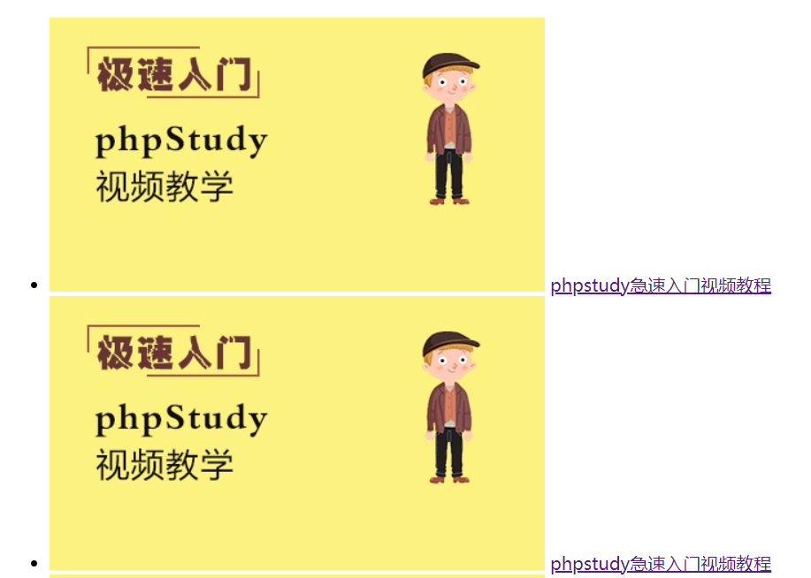

# html 中的列表、表格和表单

## 一、列表

| 类别       | 构成(标签)        |
| ---------- | ----------------- |
| 有序列表   | \<ul>+\<li>       |
| 无序列表   | \<ol>+\<li>       |
| 自定义列表 | \<dl>+\<dt>+\<dd> |

1. 有序列表
   有序列表的文字图象是可以变的，默认是一个小黑点
   通过修改\<ul>标签的 type 属性可以修改:
   type="disc"是一个小黑点
   type="circle"是一个小空心圆
   type="square"是一个小实心正方形

```html
<h3>购物车</h3>
<ul>
  <li>苹果</li>
  <li>手机</li>
  <li>玩具</li>
  <li>零食</li>
</ul>
```

浏览器效果如下


2. 无序列表

```html
<h3>购物车</h3>
<ol>
  <li>土豆</li>
  <li>香蕉</li>
  <li>梨</li>
</ol>
```

浏览器效果如下


3. 自定义列表

```html
<h3>尾页</h3>
<dl>
  <dt>名称</dt>
  <dd>pHp中文网</dd>
  <dt>地址</dt>
  <dd>xxxxxxxx</dd>
  <dt>联系方式</dt>
  <dd>电话:<a href="tel: 16512****">16512****</a></dd>
  <dd>邮箱:<a href="mailto:admin@php.com">admin@php.com</a></dd>
</dl>
```

浏览器效果如下


- 导航

```html
<div class="menu">
  <!-- ul对于语义化非常友好，自定义div视觉效果更好一些 -->
  <li><a href="">首页</a></li>
  <li><a href="">教学视频</a></li>
  <li><a href="">社区问答</a></li>
  <li><a href="">资料下载</a></li>
  <li><a href="">登录</a></li>
</div>
```

浏览器效果如下


- 图文列表

```html
<ul class="list">
  <li>
    <a href=""
      ></a>
    <a href="">phpstudy急速入门视频教程</a>
  </li>
  <li>
    <a href=""
      ></a>
    <a href="">phpstudy急速入门视频教程</a>
  </li>
</ul>
```

浏览器效果如下



## 二、表格

表格由 \<table> 标签来定义。每个表格均有若干行（由 \<tr> 标签定义，每行被分割为若干单元格（由 \<td> 标签定义）。字母 td 指表格数据（table data），即数据单元格的内容。数据单元格可以包含文本、图片、列表、段落、表单、水平线、表格等等。
\<table>标签拥有 border 属性，这个是表格的边框属性，一般不设置，是用 css 来美化表格的时候顺便设置的。

- 表格的行/列的合并
  |方式|实现|
  |:---------:|:---------:|
  |行合并|rowspan="value"|
  |列合并|colspan="value"|
  其中 value 的值是需要合并的行或者列数
  实例演示

```html
<!DOCTYPE html>
<html>
  <head>
    <meta charset="UTF-8" />
    <title>表格</title>
    <link rel="stylesheet" href="style/table.css" />
  </head>
  <body>
    <table class="life">
      <caption>
        某人的生活作息表
      </caption>
      <thead>
        <tr>
          <th colspan="2"></th>
          <!-- <th></th> -->
          <th>星期一</th>
          <th>星期二</th>
          <th>星期三</th>
          <th>星期四</th>
          <th>星期五</th>
        </tr>
      </thead>
      <tbody>
        <tr>
          <td rowspan="4">上午</td>
          <td>6:30</td>
          <td>起床洗漱</td>
          <td>起床洗漱</td>
          <td>起床洗漱</td>
          <td>起床洗漱</td>
          <td>起床洗漱</td>
        </tr>
        <tr>
          <!-- <td>上午</td> -->
          <td>7:30</td>
          <td>学习</td>
          <td>学习</td>
          <td>学习</td>
          <td>学习</td>
          <td>学习</td>
        </tr>
        <tr>
          <!-- <td>上午</td> -->
          <td>9:30</td>
          <td>休息30分钟</td>
          <td>休息30分钟</td>
          <td>休息30分钟</td>
          <td>休息30分钟</td>
          <td>休息30分钟</td>
        </tr>
        <tr>
          <!-- <td>上午</td> -->
          <td>12:30</td>
          <td>吃饭</td>
          <td>吃饭</td>
          <td>吃饭</td>
          <td>吃饭</td>
          <td>吃饭</td>
        </tr>
        <tr>
          <td class="rest" colspan="7">中午休息</td>
        </tr>
        <tr>
          <td rowspan="3">下午</td>
          <td>14:30</td>
          <td>练习</td>
          <td>练习</td>
          <td>练习</td>
          <td>练习</td>
          <td>练习</td>
        </tr>
        <tr>
          <!-- <td>下午</td> -->
          <td>16:30</td>
          <td>休息30分钟</td>
          <td>休息30分钟</td>
          <td>休息30分钟</td>
          <td>休息30分钟</td>
          <td>休息30分钟</td>
        </tr>
        <tr>
          <!-- <td>下午</td> -->
          <td>18:30</td>
          <td>吃饭</td>
          <td>吃饭</td>
          <td>吃饭</td>
          <td>吃饭</td>
          <td>吃饭</td>
        </tr>
        <tr>
          <td colspan="2">晚上19:30</td>
          <td colspan="5">上课</td>
        </tr>
      </tbody>
    </table>
  </body>
</html>
```

浏览器效果如下(这里用到了 css 来装饰)


## 三、表单

form 表单的作用是向 web 服务器提交信息，它所拥有的几个常用属性及作用如下：

- action 属性

处理表单提交的 URL。

- method 属性

浏览器使用这种 HTTP 方式来提交 表单. 可能的值有：
POST: 指的是 HTTP POST 方法；表单数据会包含在表单体内然后发送给服务器。
GET: 指的是 HTTP GET 方法；表单数据会附加在 action 属性的 URL 中，并以 '?' 作为分隔符，没有副作用时使用这个方法。在有隐密信息或者所传信息较大时不推荐使用。
dialog: 如果表单在 \<dialog> 元素中，提交时关闭对话框。

- enctype

当 method 属性值为 post 时，enctype 就是将表单的内容提交给服务器的 MIME 类型 。可能的取值有：
application/x-www-form-urlencoded: 未指定属性时的默认值。
multipart/form-data: 当表单包含 type="file" 的\<input> 元素时使用此值。
text/plain: 出现于 HTML5，用于调试。

- name

表单的名称。该值必须是所有表单中独一无二的，而且不能是空字符串。

实例: 用\<form>表单设计一个用户提交信息的简单页面

```html
<!DOCTYPE html>
<html>
  <head>
    <meta charset="UTF-8" />
    <title>用户信息提交</title>
    <link rel="stylesheet" href="style/form.css" />
  </head>
  <body>
    <h3 class="title">用户注册</h3>
    <form
      action=""
      method="POST"
      class="register"
      enctype="multipart/form-data"
    >
      <label for="username">账号:</label>
      <input
        type="text"
        id="username"
        name="username"
        value=""
        placeholder="username"
        required
      />
      <label for="email">邮箱:</label>
      <input
        type="email"
        id="email"
        name="email"
        value=""
        placeholder="admin@email.com"
        required
      />
      <label for="psd">密码:</label>
      <input
        type="password"
        id="psd"
        name="password"
        value=""
        placeholder="不少于6位"
        required
      />
      <label for="secret">性别:</label>
      <div>
        <input type="radio" name="gender" value="male" id="male" /><label
          for="male"
          >男</label
        >
        <input type="radio" name="gender" value="female" id="female" /><label
          for="female"
          >女</label
        >
        <input
          type="radio"
          name="gender"
          value="secret"
          id="secret"
          checked
        /><label for="secret">秘密</label>
      </div>
      <label for="#">兴趣:</label>
      <div>
        <input type="checkbox" name="hobby[]" value="game" id="game" /><label
          for="game"
          >游戏</label
        >
        <input
          type="checkbox"
          name="hobby[]"
          value="program"
          id="program"
        /><label for="program">编程</label>
        <input type="checkbox" name="hobby[]" value="music" id="music" /><label
          for="music"
          >音乐</label
        >
        <input
          type="checkbox"
          name="hobby[]"
          value="exercise"
          id="eercise"
        /><label for="exercise">运动</label>
      </div>
      <label for="edu">学历:</label>
      <select name="edu" id="edu">
        <!-- 修改默认项用selected属性 -->
        <option value="1">初中</option>
        <option value="2">高中</option>
        <option value="3">本科</option>
        <option value="4">研究生</option>
        <!-- label属性的优先级大与option内部的文本 -->
        <option value="5" label="老司机">自学成才</option>
      </select>
      <label for="user-pic">头像:</label>
      <input type="hidden" name="MAX_FILE_SIZE" value="80000" />
      <input type="file" name="user_pic" id="user-pic" />
      <div class="user-pic" style="grid-column: span 2"></div>
      <label for="user-resume">简历:</label>
      <input type="hidden" name="MAX_FILE_SIZE" value="80000" />
      <input type="file" name="user_resume" id="user-resume" />
      <div class="user-resume" style="grid-column: span 2"></div>
      <label for="comment">备注:</label>
      <textarea name="comment" id="comment" cols="30" rows="5"></textarea>
      <button>提交</button>
    </form>
  </body>
</html>
```

浏览器效果如下


- \<form>表单控件的 form 属性

可以在书写表单时，将表单的控件书写在表单的范围之外，然后用表单控件的 form 属性来将其与对应的 form 表单绑定起来。但是绝不提倡这样做，一是影响布局，二是代码混乱，好处是 js 中获取数据很方便。

示例如下

```html
<!DOCTYPE html>
<html>
  <head>
    <meta charset="UTF-8" />
    <title>表单控件的form属性</title>
  </head>
  <body>
    <h3 class="title">用户注册</h3>
    <form action="check.php" method="GET" id="register"></form>
    <!-- 使用form属性，将控件与它所属的表单进行关联/绑定 -->
    <div class="box">
      <label for="username">账号:</label>
      <input
        type="text"
        name="username"
        id="username"
        placeholder="不能为空"
        required
      />
      <label for="email">邮箱:</label>
      <input
        type="email"
        name="email"
        id="email"
        placeholder="admin@email.com"
        required
      />
      <label for="psd">密码:</label>
      <input
        type="password"
        name="password"
        id="psd"
        placeholder="不少于6位"
        required
      />
      <button>提交</button>
    </div>
  </body>
</html>
```
