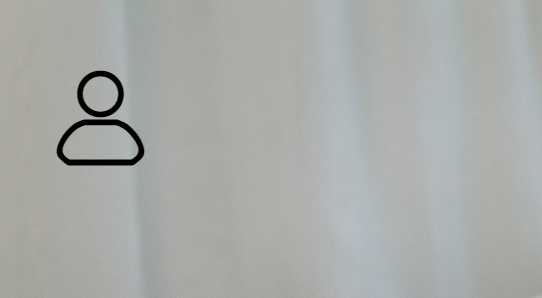

# css 选择器组合提权与盒模型常用属性缩写

## 一、动态伪类选择器

- 超链接标签\<a>的四种状态（按照先后顺序，顺序固定）

| 伪类表示 |       效果       |
| :------- | :--------------: |
| :link    |     默认状态     |
| :visited | 已经访问过的状态 |
| :hover   |   鼠标悬停状态   |
| :active  |   鼠标点击状态   |

样式案例（在本篇中，所有的 css 样式表代码均写在 style 标签中）：

```html
<!DOCTYPE html>
<html>
  <head>
    <meta charset="UTF-8" />
    <title>a标签状态匹配</title>
    <style>
      /* 1. 默认状态：link */
      a:link {
        color: violet;
        text-decoration: none;
      }
      /* 2. 已经访问过状态:visited */
      a:visited {
        color: lightblue;
      }
      /* 3. 悬停状态：hover */
      a:hover {
        color: orange;
        /* 添加下划线 */
        text-decoration: underline;
      }
      /* 4. 点击(激活)状态：active */
      a:active {
        color: red;
      }
    </style>
  </head>
  <body>
    <a href="https://www.php.cn/index.php">php中文网</a>
  </body>
</html>
```

注:在 visited 状态下，只能设置 color 属性。

- 表单中的几种状态

| 伪类表示 |   效果   |
| :------- | :------: |
| readonly | 只读属性 |
| required | 不能为空 |
| disabled | 此项禁用 |
| :focus   |   聚焦   |

样式案例：

```html
<!DOCTYPE html>
<html>
  <head>
    <meta charset="UTF-8" />
    <title>input标签状态匹配</title>
    <style>
      input:read-only {
        background-color: orange;
      }
      input:required {
        background-color: lightblue;
      }
      input:disabled {
        background-color: lightgreen;
      }
      input:focus {
        background-color: #aaa;
      }
    </style>
  </head>
  <body>
    <form action="" method="">
      <p>
        <!-- readonly只读属性 -->
        <label for="username">用户名:</label
        ><input
          type="text"
          name="username"
          id="username"
          value="admin"
          placeholder="username"
          readonly
        />
      </p>
      <p>
        <!-- required不能为空 -->
        <label for="email">邮箱:</label
        ><input
          type="email"
          name="email"
          id="email"
          value=""
          placeholder="admin@email.com"
          required
        />
      </p>
      <p>
        <!-- disabled禁用此选项 -->
        <label for="psd">密码:</label
        ><input
          type="password"
          name="password"
          id="psd"
          value="123456"
          placeholder="不少于6位"
          disabled
        />
      </p>
      <p><button>提交</button></p>
    </form>
  </body>
</html>
```

在表单的状态匹配中，仅列举出了四个常用的状态。

我们知道在 css 基础选择器中，权重高低如下：
id(id 选择器) > class(类选择器) > tag(标签选择器)
它的基础权重比较遵循：

1. 当选择器相同时，与书写顺序有关，后面样式覆盖前面样式；

2. 当选择器类型不同时，与优先级相关，级别高的覆盖级别低的。

当不再是简单的单一 tag 或者是 id 又或者是 calss，而是多种选择器的组合时，我们假设有规则：
规则设置：[0, 0, 0] ==> [id, calss, tag]
同级权重可以相加，但是永远不能进位，也就是说无限个 tag 相加也不能往 class 进一位。
提权应用场景：在不修改原始的样式表的情况下，可以用自己的样式表去更新页面，以达到自己的目的。
以下为提权示例：（style 标签中的权重关系是最上边的优先级最高，依次递减，这样写是为了过滤掉上下文同级，下文覆盖掉上文的情况）

```html
<!DOCTYPE html>
<html>
  <head>
    <meta charset="UTF-8" />
    <title>选择器组合提权</title>
    <style>
      /* [1,0,0] */
      #p {
        color: pink;
      }
      /* [0,2,0] */
      .p.pp {
        color: brown;
      }
      /* [0,1,3] */
      html body p.p {
        color: lightcoral;
      }
      /* [0,1,2] */
      body p.p {
        color: orange;
      }
      /* [0,1,1] */
      p .p {
        color: lightskyblue;
      }
      /* [0,1,0] */
      .p {
        color: green;
      }
      /* [0,0,3] */
      /* 也可以用:root表示html，不过:root是一个伪类，这样的操作会使权重直接进位。 */
      html body p {
        color: red;
      }
      /* [0,0,2] */
      body p {
        color: skyblue;
      }
      /* [0,0,1] */
      p {
        color: violet;
      }
    </style>
  </head>
  <body>
    <p class="p pp" id="p">测试小段落</p>
  </body>
</html>
```

## 二、盒模型常用属性的缩写

1.字体属性的缩写

- 字体属性

| 属性        |   含义   |
| :---------- | :------: |
| font-family | 字体名称 |
| font-size   | 字体大小 |
| font-style  | 字体样式 |
| font-weight | 字体粗细 |

具体实例：

```html
<!DOCTYPE html>
<html>
  <head>
    <meta charset="UTF-8" />
    <title>字体属性简写</title>
    <style>
      h1.title {
        /* 字体名称 */
        font-family: sans-serif;
        /* 字体大小 */
        font-size: 24px;
        /* 字体样式 */
        /* italic斜体 */
        font-style: italic;
        /* 字体粗细 */
        font-weight: border;
      }
      h1.title {
        /* 属性简写：先是字体样式，再是字体粗细，接下来是字体大小，最后是字体名称 */
        /* 这个顺序应该是不能变的，我尝试变过，样式也跟着变了 */
        font: italic border 24px sans-serif;
      }
    </style>
  </head>
  <body>
    <h1 class="title">这是一个大标题</h1>
  </body>
</html>
```

- 字体图标的引用

在平时的网页中，我们经常会看到一些具有代表意义的字体图表，这些图表是可以通过 link 的方式引入的。

首先可以直接去[阿里巴巴矢量图标库](https://www.iconfont.cn/)点击里边的一个项目，选中你需要的图标，添加入库，然后下载代码。
代码下载好之后，就可以将源代码文件夹的链接通过 link 标签导入到你的 html 页面中。
以下是字体图标引入示例：（在这里，我是把我下载好的代码文件夹放在了和我的 html 文件同级的文件夹下）

```html
<!DOCTYPE html>
<html>
  <head>
    <meta charset="UTF-8" />
    <title>字体图表引入</title>
    <style></style>
    <link rel="stylesheet" href="iconfont/iconfont.css" />
  </head>
  <body>
    <span class="iconfont icon-weibiaoti-4"></span>
  </body>
</html>
```

浏览器显示效果：（在这里我将页面放大到了 500 才得到这个图片）



你还可以通过修改它的样式来得到你想要的结果，例如：你可以修改字体大小属性 font-size 来修改图标的大小，可以修改 color 属性来更改为你喜欢的颜色，也可以修改 box-shadow 属性来给图表添加一个阴影等等。

2.盒子边框，内边距，外边距的属性缩写

- 边框
  边框是 border 属性定义的，我们可以将一个盒子的边框分为上、右、下、左四个边。

| 边  |     定义     |
| :-- | :----------: |
| 上  |  border-top  |
| 右  | border-right |
| 下  |    bottom    |
| 左  |     left     |

每个边框可以设置三个属性：宽度（weight）、颜色（color）、样式（style）

示例如下：

```html
<!DOCTYPE html>
<html>
  <head>
    <meta charset="UTF-8" />
    <title>边框属性缩写</title>
    <style>
      /* 先定义一个盒子的样式 */
      .box {
        width: 200px;
        height: 200px;
        background-color: lightblue;
        box-sizing: border-box;
      }
      .box {
        /* 边框 */
        /* 每个边框可以设置三个属性：宽度、颜色、样式 */
        /* 宽度 */
        border-top-width: 3px;
        /* 颜色 */
        border-top-color: red;
        /* 样式(solid 实线； dashed 虚线) */
        border-top-style: solid;
        /* 简写 */
        border-top: 3px red solid;

        /* border-top上边框；border-right右边框；border-bottom下边框；border-left左边框 */
      }
      .box {
        /* 简写 */
        /* border-top: 3px red solid; */
        border: 3px #111 solid;
      }
    </style>
  </head>
  <body>
    <div class="box"></div>
  </body>
</html>
```

- 内边距属性的缩写

内边距是用属性 padding 定义的，同样的，我们可以将其分为上、右、下、左四个边距，四个边距可以都不相同，也可以是左右相等，上下不等的情况，还可以是上下相等，左右相等的情况，也可以是都相等的情况。

```html
<!DOCTYPE html>
<html>
  <head>
    <meta charset="UTF-8" />
    <title>边框属性缩写</title>
    <style>
      /* 先定义一个盒子的样式 */
      .box {
        width: 200px;
        height: 200px;
        background-color: lightblue;
        box-sizing: border-box;
      }
      .box {
        /* 内边距 */
        /* padding：顺时针方向，上右下左 */
        padding: 5px 10px 15px 20px;
        /* 页面中看不到是因为padding是透明的，且背景色会自动延伸扩展到padding，
          将背景色裁切到内容区就可以看到padding */
        /* 背景色裁切 */
        background-clip: content-box;
        /* 三值语法：上下不相等，左右相等(排在第二个的是左右) */
        padding: 10px 15px 20px;
        /* 二值语法：上下相等，左右相等 */
        padding: 10px 20px;
        /* 单值语法：四个方向都相等 */
        padding: 10px;
      }
    </style>
  </head>
  <body>
    <div class="box"></div>
  </body>
</html>
```

- 外边距属性的缩写

内边距是用属性 margin 定义的，同样的，我们可以将其分为上、右、下、左四个边距，四个边距可以都不相同，也可以是左右相等，上下不等的情况，还可以是上下相等，左右相等的情况，也可以是都相等的情况。

```html
<!DOCTYPE html>
<html>
  <head>
    <meta charset="UTF-8" />
    <title>边框属性缩写</title>
    <style>
      /* 先定义一个盒子的样式 */
      .box {
        width: 200px;
        height: 200px;
        background-color: lightblue;
        box-sizing: border-box;
      }
      .box {
        /* 外边距 */
        /* margin：顺时针方向，上右下左 */
        margin: 5px 10px 15px 20px;
        /* 三值语法：上下不相等，左右相等(排在第二个的是左右) */
        margin: 10px 15px 20px;
        /* 二值语法：上下相等，左右相等 */
        margin: 10px 20px;
        /*单值语法：四个方向都相等 */
        margin: 10px;
      }
    </style>
  </head>
  <body>
    <div class="box"></div>
  </body>
</html>
```
