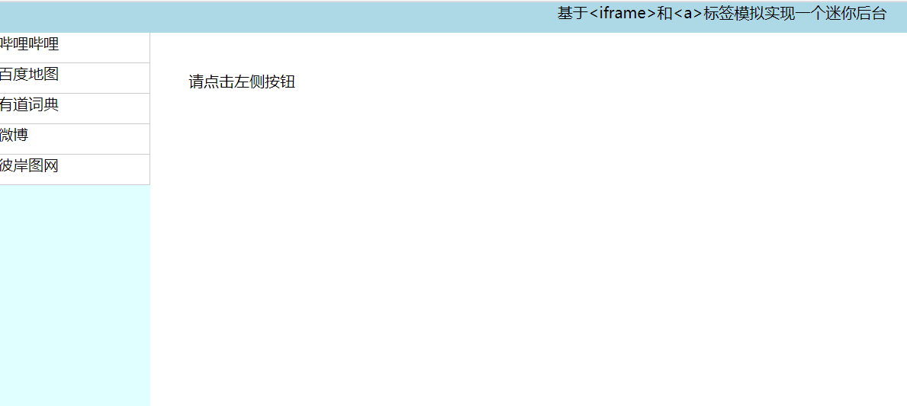
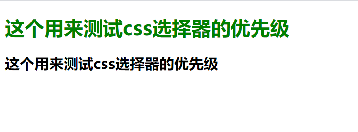
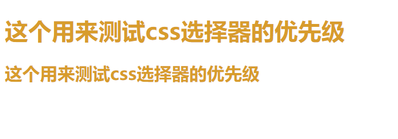
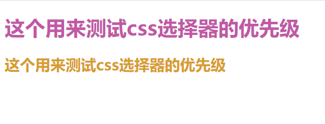
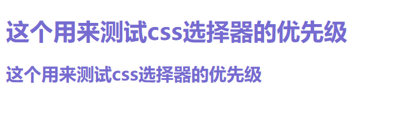

# \<iframe>内联框架的应用与 css 层叠样式表初探

## 一、\<iframe>标签

\<iframe>标签的作用是嵌入，它能将另一个 HTML 页面嵌入到当前 HTML 页面中，也就是常见的一种页面画中画效果。理论上在一个页面中可写入的\<iframe>标签是无限多的，不过考虑到页面上的每一个\<iframe>标签都会增加内存和其他的计算机资源，还是希望不要过多的去在一个页面中多次引用\<iframe>标签。

- 常见属性

  - name 属性: 用于定位嵌入的浏览器上下文的名称，该名称可用作\<a>标签和\<form>标签的 target 属性值。

    > \<iframe src="" name="title">\</iframe>
    > \<a href="" target="title">\<h1>这是一个标题\</h1>\</a>

  - src 属性:被嵌套的页面的 URL 地址。

    > \<iframe src="https://www.baidu.com">\<iframe>

  - srcdoc 属性:在当前 iframe 块，由程序员写的描述信息，一般是用作介绍和简介。

    > \<iframe srcdoc="这是一段提示信息">\</iframe>

  - sandbox 属性:用于为\<iframe>框架中的内容启用一些额外的限制条件，可以为空。
    |值|效果|
    |:---:|:---:|
    |allow-forms|允许嵌入的浏览器上下文提交表单|
    |allow-models|允许嵌入的浏览器上下文打开模态窗口|
    |allow-popups|允许弹窗|

- \<iframe>标签除了嵌入页面画中画之外，还可以和\<a>标签来模拟一个小后台。
  实例如下:

  ```html
  <!DOCTYPE html>
  <html>
    <head>
      <meta charset="UTF-8" />
      <title>迷你小后台</title>
      <style>
        body {
          margin: 0;
          display: grid;
          grid-template-columns: 10em 1fr;
        }
        header {
          grid-column: span 2;
          height: 2em;
          background-color: lightblue;
          text-align: center;
        }

        .aside {
          display: grid;
          grid-template-rows: repeat(auto-fit, 2em);
          background-color: lightcyan;
        }
        .main iframe {
          width: 100%;
          height: 42em;
          background-color: #fff;
          border: none;
          padding: 2em;
        }

        .aside a {
          text-decoration: none;
          color: rgb(14, 12, 12);
          background-color: #fff;
          border-bottom: 1px solid #ccc;
          border-right: 1px solid #ccc;
        }
        .aside a:hover {
          background-color: rgb(173, 184, 187);
        }
      </style>
    </head>
    <body>
      <header>基于&lt;iframe&gt;和&lt;a&gt;标签模拟实现一个迷你后台</header>
      <div class="aside">
        <a href="https://www.bilibili.com/" target="content">哔哩哔哩</a>
        <a href="https://map.baidu.com/" target="content">百度地图</a>
        <a href="http://www.youdao.com/" target="content">有道词典</a>
        <a href="https://weibo.com/" target="content">微博</a>
        <a href="http://pic.netbian.com/" target="content">彼岸图网</a>
      </div>
      <div class="main">
        <iframe srcdoc="请点击左侧按钮" name="content"></iframe>
      </div>
    </body>
  </html>
  ```

  浏览器效果如下:
  

## 二、css 层叠表中基本选择器的优先级

|       类型       |       表现形式        |
| :--------------: | :-------------------: |
| 元素(标签)选择器 | elementname(元素名称) |
|     类选择器     |   .classname(类名)    |
|    ID 选择器     |    #idname(ID 名)     |
|    属性选择器    |      \[属性=值]       |

测试一下以上四种选择器的优先级:

测试样本

> \<h1 id="class" class="title" name="h1">这个用来测试 css 选择器的优先级\</h1>
> \<h2 id="class" class="title" name="h2">这个用来测试 css 选择器的优先级\</h2>

元素选择器

> \<style>
> h1 {
> color: green;
> }
> \</style>

浏览器效果如下



元素选择器 + 类选择器

> \<style>
> h1 {
> color: green;
> }
> .title {
> color: rgb(216, 156, 44);
> }
> \</style>

浏览器效果如下



可以看出来属性选择器的优先级是要大于元素选择器的(这与代码的位置没有关系，不论是 h1{}在前还是.title{}在前，效果都是一样的，在这里只是按照优先级的次序往下写，以便于理解)

元素选择器 + 类选择器 + 属性选择器

> \<style>
> h1 {
> color: green;
> }
> .title {
> color: rgb(216, 156, 44);
> }
> \[name="h1"] {
> color: rgb(194, 88, 167);
> }
> \</style>

浏览器效果如下



元素选择器 + 类选择器 + 属性选择器 + id 选择器

> \<style>
> h1 {
> color: green;
> }
> .title {
> color: rgb(216, 156, 44);
> }
> \[name="h1"] {
> color: rgb(194, 88, 167);
> }
> \#class {
> color: rgb(118, 107, 209);
> }
> \</style>

浏览器效果如下



从以上的演示可以看出，在基本的选择器中优先级次序依次是:  
元素选择器 < 类选择器 < 属性选择器 < id 选择器
