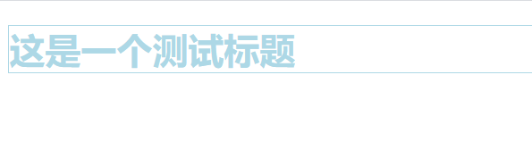
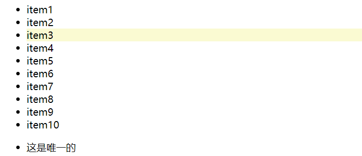
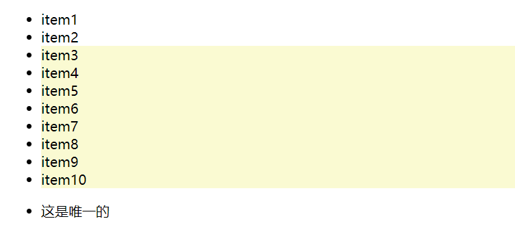
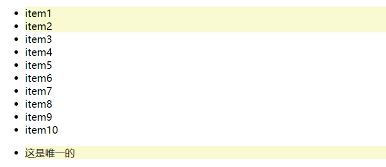
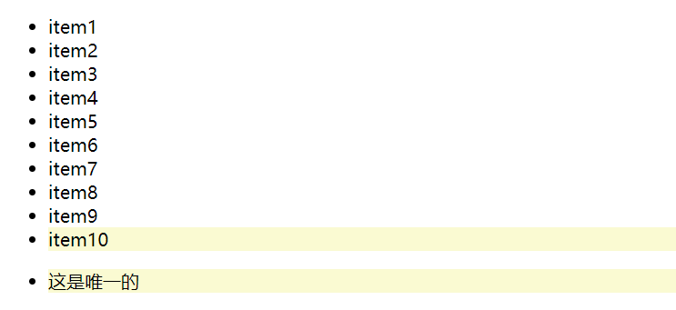
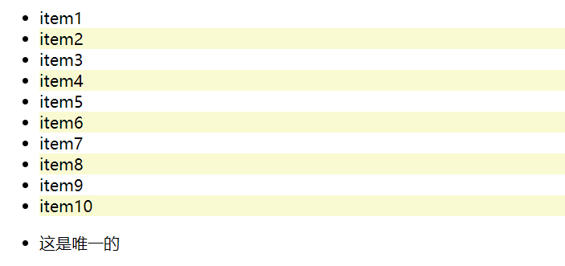
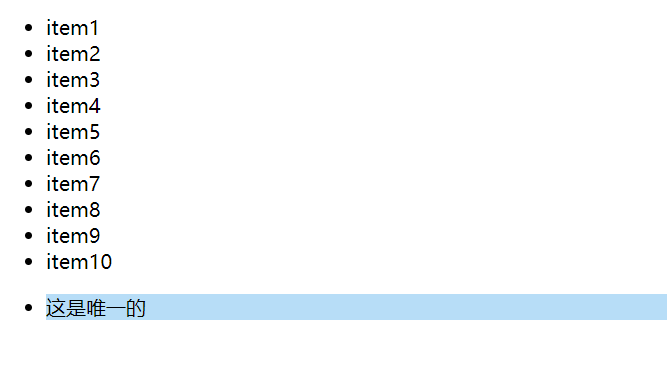

# css 规则的三种导入方式以及几类基础的选择器

## 一、css 规则的三种导入方式

### 1. 内部样式

内部样式是通过 style 标签引入的，这种样式导入仅在当前页面适用，一旦跳转到其他页面，想要引入当前页面的样式还得重新用 style 标签导入重新写一遍，这样会形成代码冗余。
页面样式示例：

```html
<h1>这是一个测试标题</h1>
```

> \<style>
> h1 {
> color: lightblue;
> border: 1px solid;
> }
> \</style>

浏览器效果如下：



### 2. 外部样式

外部样式是使用 link 标签引入的已经写好的 css 样式表。它适用于所有引入了这个 css 样式表的 html 文档。

使用同一个页面样式示例，仅是将 style 标签中的 css 样式代码重写到一个 css 文件中，然后使用 link 标签导入就好。
示例：

> \<link rel="stylesheet" href="style/style.css" />

### 3. 行内样式

行内样式的话，它有点类似私人定制的意思。它的使用范围是仅限于当前页面的特定元素，使用 style 属性去定义。

样式示例：

> \<h1 style="border: 1px solid #000">这是一个测试标题\</h1>

## 二、css 的几类基础选择器

### 1. 简单选择器

- 标签选择器

样式案例：

> p {
> background-color: lightblue;
> }

- 类选择器

样式案例：(此处的 class 是 class 属性的值)

> .calss {
> color: lightblue;
> }

- id 选择器

样式案例：(此处的 id 是 id 属性的值)

> #id{
> border: 1px solid #000;
> }

### 2. 上下文选择器

- 后代选择器（关键字：空格符）

选择范围是：所定位的标签下的所有后代标签

样式案例：

> ul li {
> background-color: lightgoldenrodyellow;
> }

- 子元素选择器（关键字：“>”）

选择范围是:所定位标签的子标签

样式案例：

> ul > li {
> color: red;
> }

- 同级之后紧邻选择器（关键字：“+”）

选择范围是：与所定位标签紧邻的之后的第一个兄弟元素

样式案例：

> .a + li {
> background-color: lightgreen;
> }

- 同级之后所有选择器（关键字：“~”）

选择范围是：与所定位标签紧邻的之后的所有兄弟元素

样式案例：

> .a ~ li {
> background-color: yellow;
> }

### 3.伪类选择器

使用 “:nth-of-type(an+b)” 以及其衍生物可以匹配到页面内任意一个位置的元素（an: 起始点； b：偏移量）

以以下 html 代码为示例

```html
<!DOCTYPE html>
<html>
  <head>
    <meta charset="UTF-8" />
    <title>伪类选择器</title>
  </head>
  <body>
    <ul>
      <li>item1</li>
      <li>item2</li>
      <li>item3</li>
      <li>item4</li>
      <li>item5</li>
      <li>item6</li>
      <li>item7</li>
      <li>item8</li>
      <li>item9</li>
      <li>item10</li>
    </ul>
    <ul>
      <li>这是唯一的</li>
    </ul>
  </body>
</html>
```

- 匹配到单个元素

此时的 a 为 0，b 是要匹配到的位置

示例：（匹配到第三个 li 元素）

> ul li:nth-of-type(3) {
> background-color: lightgoldenrodyellow;
> }

浏览器效果：



- 匹配多个元素

此时 a 不为 0，按照所选择的规则适当的改变 a 的值

示例：（匹配第三个及之后的所有元素）

> ul li:nth-of-type(n + 3) {
> background-color: lightgoldenrodyellow;
> }

浏览器效果：



如果想只选中前两个元素，除了用添加 class 属性以外还可以用 nth-of-type(an+b),此时的 a 为-1，所选取的内容为偏移量之前的所有内容

示例：（匹配前两个元素）

> ul li:nth-of-type(-n + 2) {
> background-color: lightgoldenrodyellow;
> }

浏览器效果：(此处的唯一元素会被包含是因为它属于 ul 下第一个 li 的位置，同时也是最后一个 li 的位置)



- 反向获取元素位置 （nth-last-of-type(an+b)）

当一列元素特别多无法知道具体数值，但是想定位到尾部元素的时候用这个方法，原理和 nth-of-type(an+b)相同，不过是要反过来理解。

示例：（匹配最后一个元素）

> ul li:nth-last-of-type(-n + 2) {
> background-color: lightgoldenrodyellow;
> }

浏览器效果：



匹配最后一个元素还可以用:last-of-type 来定义，相同的,匹配第一个元素也可以用:first-of-type 来定义，这都是:nth-of-type()的语法糖

- 匹配元素位置为偶数/奇数的元素（关键字：even 代表偶数，odd 代表奇数）

示例：(选择偶数位置的元素)

> ul li:nth-of-type(even) {
> background-color: lightgoldenrodyellow;
> }

浏览器效果：



当然这个偶数位置还可以用 2n 表示，奇数位置也可以用 2n+1 或者 2n-1 表示

- 匹配父元素中唯一子元素（only-of-type）

> ul li:only-of-type {
> background-color: rgb(183, 221, 247);
> }

浏览器效果：

