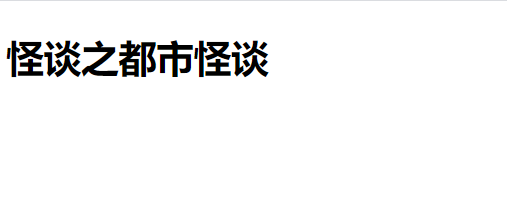
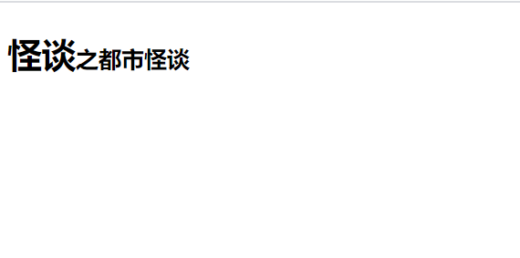
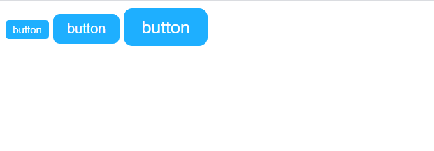
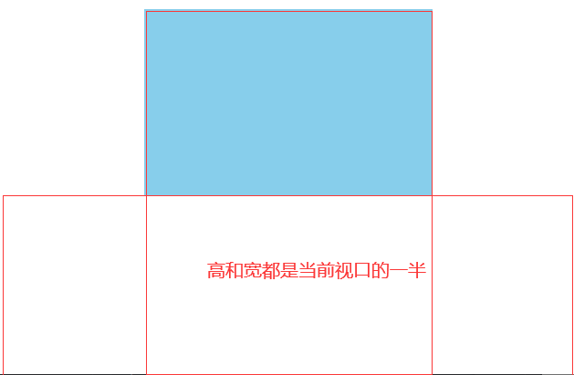

# css 响应式布局所对应的几个基本属性单位详解（rem / em / vh / vw）

## 一、em 与 rem 的原理与应用

在编写页面的时候，我们经常会对元素的字体大小进行设置，以达到自己想要的效果。而在 css 中设置字体的几个常用的基本单位有三个，分别是：px / em / rem。
其中 px 是一个绝对单位，一旦使用 px 对字体进行定义，那么页面就会按照精确的像素进行展示。同时，px 与 em 和 rem 可以进行换算。
em 和 rem 是一个相对的单位，使用 em 和 rem 单位可以让我们的页面变得更加的灵活，它们允许用户调整浏览器的大小来达到最佳的显示效果。
既然是一个相对的单位，那 em 和 rem 都必定会有一个参考物。

- em

em 的参考物就是它父级元素中的 font-size 属性的大小，rem 的参考物则来自根元素，也就是 html 的 font-size 属性的大小。
我们可以知道的是在现在的所有浏览器中，html 元素的 font-size 的默认值都是 16px，也就是说此时 body 中的 1em = 1 \* 16px，如果不在 body 中重新设置 font-size 属性的话，那么 body 就会继承它的父元素 html 中的 font-size 属性，当然，既然这么说了，我们可以自己再重新设置 font-size 属性值，html 中的 font-size 属性值也同样可以由我们自一开始就重新定义，没有定义的就是默认值，也就是 16px。如果在一开始定义了 font-size 属性，那么这个元素的子元素就会继承它的 font-size，同理往后延伸。

- rem

如果说 em 是一个比较活泼的小可爱，那么 rem 就是一个比较刻板的小可爱了。你可以把它看成是以一个“固定的” em 值，因为它的参考物只有根元素，也就是 html 设置成什么，它就是什么。
拿个案例来说明吧。比如说，当一个页面的 html 中的 font-size 为默认值 16px 时，它的子元素 body 又不想用这个值，重新定义了个 2em，而 body 中的子元素 p 也叛逆起来，重新定义了个 1.5em，而 p 的子元素 span 就有些刻板了，它决定追随 html 的脚步，它给自己设置了个 1.5rem。此时 body 中的 2em = 2 x 16px = 32px（因为 em 的参考对象是它的父元素），而 p 中的 1.5em = 1.5 x 32px = 48px（此时 p 中的 em 参考对象是 body 中的 font-size，所以在 p 元素中，1em = 1 x 32px = 32px），span 中的 1.5rem = 1.5 x 16px = 24px（因为 rem 是直接继承自 html 元素的 font-size）。
我们来通过一个案例来了解 em / rem 的原理。
我们来设置一个同时拥有大小字号的标题
html 中的内容如下：

```html
<!DOCTYPE html>
<html>
  <head>
    <meta charset="UTF-8" />
    <title>em和rem的原理</title>
  </head>
  <body>
    <h2>怪谈<span>之都市怪谈</span></h2>
  </body>
</html>
```

浏览器效果如下：



在这里，我们想要将这个“之都市怪谈”给变成小一号的字体。我们之前说过，可以使用 px 直接设置成死的，不过这样会出现不好的体验：当浏览器的大小变化时，“之都市怪谈”这几个字不会随着变化，浏览效果极差。这个时候 rem 的作用就显现出来了。

```css
html {
  /* 在这里重置了根元素的字号大小，1.25em = 1.25 * 16px = 20px */
  font-size: 1.25em;
}
h2 {
  /* 在设置font-size的时候不建议使用em为单位 */
  font-size: 1.5rem;
}
h2 span {
  font-size: 1rem;
}
```

这样，我们就能得到一个想要的结果，而且不论是浏览器的大小如何变化，它也能给你想要的效果。



em 的应用场景：em 单位经常被用于设置盒子的 padding 属性，margin 属性，width 属性，border-radius 属性之类的，这样等盒子继承不同大小的字号时，盒子会随着均匀的放大或者缩小。

我们可以将 em 单位应用在盒子的设置中，示例：

```html
<!DOCTYPE html>
<html>
  <head>
    <meta charset="UTF-8" />
    <title>em的应用</title>
  </head>
  <body>
    <button class="btn small">button</button>
    <button class="btn normal">button</button>
    <button class="btn large">button</button>
  </body>
</html>
```

我们设计三个不同大小的按钮。

```css
.btn {
  background-color: #1eafff;
  color: #fff;
  border: none;
  outline: none;
  padding: 0.5em 1em;
  border-radius: 0.5em;
}
.btn:hover {
  /* 透明度 */
  opacity: 0.8;
  /* 将鼠标设置为手型 */
  cursor: pointer;
  /* 设置阴影，外发光效果 */
  box-shadow: 0 0 3px #888;
  /* 增加延时效果 */
  transition: 0.3s;
}
/* 如果想设置三个不同大小的按钮,只需要为这三个按钮指定不同的自豪就可以了 */
.small {
  font-size: 0.5em;
}
.normal {
  font-size: 1em;
}
.large {
  font-size: 1.25em;
}
```

显示效果如下：



当你缩小或者放大浏览器时，这些按钮会随着均匀的改变。

## 二、视口单位：vh / vw

视口：指的是浏览器的可视区域，视口不包含地址栏，菜单栏，工具条，状态栏。

可以使用的四种视口单位：

| 单位 | 解释                                         |
| ---- | -------------------------------------------- |
| vw   | 视口宽度(视口的“初始包含块”的宽度的百分之一) |
| vh   | 视口高度(视口的“初始包含块”的高度的百分之一) |
| vmin | 视口宽度或高度，选择小的那个                 |
| vmax | 视口宽度或高度，选择大的那个                 |

vh 和 vw 俩单位也是相对的单位，这个相对的是视口，也就是浏览器的可视区域，1vh 表示的就是当前浏览器所展示的可视区域的高度 1%，1vw 同理表示当前浏览器可视区域宽度的 1%。

示例：

```html
<!DOCTYPE html>
<html>
  <head>
    <meta charset="UTF-8" />
    <title>vh/vw的演示</title>
  </head>
  <body>
    <div class="box"></div>
  </body>
</html>
```

定义一个盒子，让它的宽度和高度始终分别占据视口的 50%。

```css
html {
  margin: 0;
  padding: 0;
  box-sizing: border-box;
}
box {
  background-color: skyblue;
  width: 50vw;
  height: 50vh;
  margin: auto;
}
```

效果如下：



可以看到的是，此时的宽和高都是当前视口的一半，但是并不是一个正方形，而要得到一个正方形就必须使得当前视口的宽和高都一样，这时候就引出了 vmax 和 vmin 这两个单位。

```css
html {
  margin: 0;
  padding: 0;
  box-sizing: border-box;
}
box {
  background-color: skyblue;
  width: 50vmin;
  height: 50vmin;
  margin: auto;
}
```

这样不管视口的大小如何变化，最后得到的 box 就一定会是一个正方形。vmin 是随着两者小的那个变化，vmax 则是随着两者大的那一方变化的。
