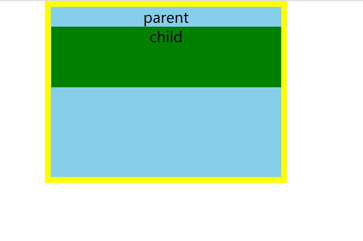
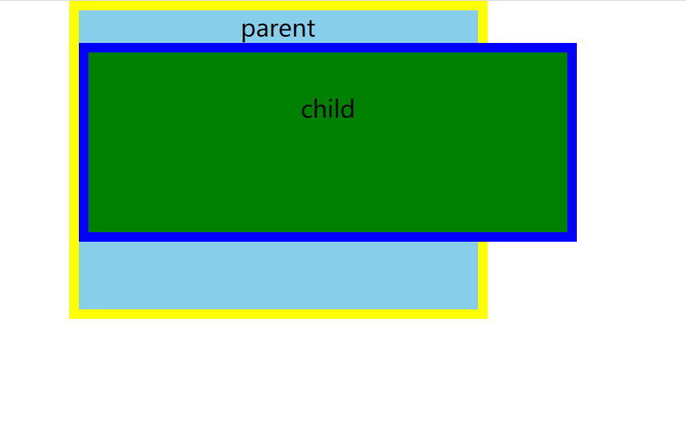
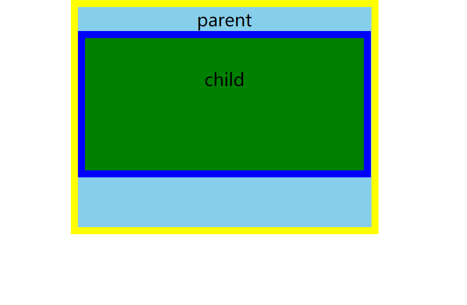
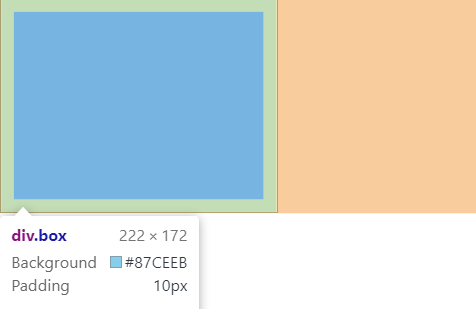
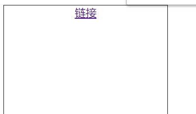
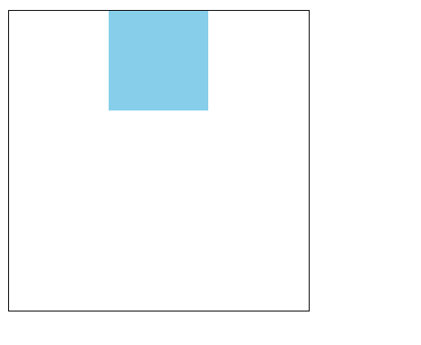
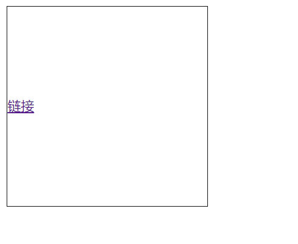
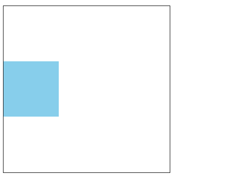
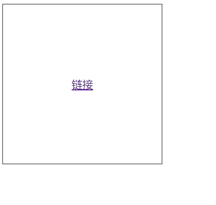
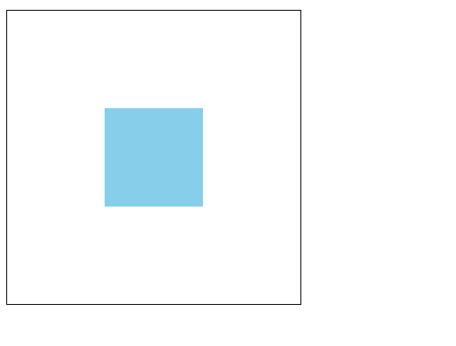

# css 盒模型的 box-sizing 属性以及仅用 css 完成元素居中的方法

## 一、box-sizing 属性

通常我们认为的盒子是由 width（宽）和 height（高）设置的，一旦两个属性设置好之后就不会变化了。但是在 html 中盒子不仅具有 width 和 height 属性，它的实际大小还会受到 padding（内边距）和 border（边框）的影响。
默认情况下，盒子的 width 和 height 是不包含 padding 和 border 的，所以当你不去刻意的设置的时候，你所得到的盒子大小总会与你想要的不符。我们可以设置两个盒子，来观察一下它们的实际表现。

演示：

```html
<!DOCTYPE html>
<html>
  <head>
    <meta charset="UTF-8" />
    <title>box-sizing</title>
  </head>
  <body>
    <div class="box">
      <div></div>
    </div>
  </body>
</html>
```

这里我们使用两个盒子来观察 padding 属性和 border 属性对盒子大小的影响。

```css
:root {
  font-size: 10px;
}
* {
  padding: 0;
  margin: 0;
}
.box {
  background-color: skyblue;
  border: 5px solid yellow;
  /* 宽 */
  width: 20em;
  /* 高 */
  height: 15em;
  /* 这里设置成水平居中，有利于观察 */
  margin: auto;
}
/* 设置子盒子的宽度为父盒子的100%，用来观察盒子大小的变化。 */
.box div {
  background-color: green;
  width: 20em;
  height: 5em;
}
```

效果如下：



我们可以看到的是 child 此时是占据了 parent 的内容区，之后我们在给它添加上 padding 和 border 看看效果。

```css
.box div {
  padding: 2em;
  border: 5px solid blue;
}
```

效果如下：



可以看到的是加上了 padding 和 border 之后，子盒子的大小瞬间就超出了父盒子，这就与我们所预期想要的结果不符了。我们想要的是第一种效果的样子。我们可以怎么解决这个问题呢?

1. 使用计算公式
   可以想到的是，既然它会自动的加上 padding 和 border 的值，那我们减去不就好了，我们可以试一下这种方法。此时盒子尺寸的计算方式：width/height + padding\*2 + border\*2。

```css
.box div {
  width: calc(20em - 50px);
  height: calc(5em - 50px);
}
```

显示效果如下：



可以看到的是，我们如愿以偿的让子元素的大小变成了我们希望的样子。这证明用这个方法是完全行的通的，不过每次都需要去计算大小，好麻烦的样子，这时候就引出了 box-sizing 属性。

2. 使用 box-sizing 属性

box-sizing 属性有两个值，分别是 content-box 和 border-box

- ontent-box
  这是 CSS 标准指定的初始值和默认值。width 和 height 属性包括的内容，但不包括填充，边框。例如，.box {width: 350px; border: 10px solid black;}渲染一个 370px 宽的框。
  在这里，元素的尺寸计算为：width =内容的宽度，height =内容的高度。（边界和填充不包括在计算中。）
- border-box
  width 和 height 属性包括内容，填充和边框。请注意，填充和边框将在框内。例如，.box {width: 350px; border: 10px solid black;}渲染一个 350px 宽的框，内容区域为 330px 宽。内容框不能为负，且底限为 0，因此无法使用 border-box 该元素使元素消失。
  在这里，元素的尺寸计算为：width =边框+填充+内容的宽度，height =边框+填充+内容的高度。

有了 box-sizing 属性，就可以不用那么麻烦的取计算了，以后就将 width: calc(20em - 50px);height: calc(5em - 50px);这两个值直接换成 box-sizing:border-box;就行了。

## 二、元素居中的实现

1. 行内和行内块元素的居中

- 水平居中

行内元素和行内块元素水平居中,设置盒子的 text-align 属性就行

示例：

```html
<!DOCTYPE html>
<html>
  <head>
    <meta charset="UTF-8" />
    <title>box-sizing</title>
  </head>
  <body>
    <div class="box">
      <a href="">链接</a>
      
      <div></div>
    </div>
  </body>
</html>
```

```css
.box {
  width: 15em;
  height: 15em;
  border: 1px solid #111;
}
.box {
  text-align: center;
}
```

效果如下：



可以看到的是，“链接”处在水平居中的位置。

块元素的水平居中要使用 margin 属性来对盒子进行挤压达到居中的效果。

```css
.box > div {
  width: 5em;
  height: 5em;
  background-color: skyblue;
}
.box > div {
  /* margin-right: auto;
        margin-left: auto; */
  margin: 0 auto;
}
```

可以看到效果如图：



- 垂直居中

行内元素不能设置自己的宽高,只能设置容器的宽高,所以设置盒子的 line-height 属性和盒子的高度一样,就可以实现居中效果。line-height 属性的值必须和 height 的值一样。

```css
.box {
  line-height: 15em;
}
```

效果如图：



行内块元素的垂直居中要按照块元素的水平居中处理，块元素的垂直居中问题是由 padding 解决的，通过不设置盒子的高度，使用 padding 属性撑开，就可以实现垂直居中。

例子：

```css
.box {
  width: 15em;
  /* 不要设置高度，高度由padding挤出来 */
  /* height: 15em; */
  border: 1px solid #111;
}
/* 行内元素不能设置自己的宽高,只能设置容器的宽高 */
.box a {
  /* 行内元素line-height属性的值和父级元素的行高一样,就可以实现居中 */
  line-height: 15em;
}
/* 行内块元素属于块元素范畴,line-height属性不起作用 */
.box {
  padding: 5em 0;
}
.box > div {
  background-color: skyblue;
  width: 5em;
  height: 5em;
  /* margin: auto; */
}
```

效果如图所示：



- 水平和垂直都居中

行内元素的水平且垂直居中通过设置 text-align 和 line-height 属性实现

示例：

```css
.box {
  text-align: center;
  line-height: 15em;
}
```

效果如图：



块元素的水平垂直居中，使用 margin 实现绝对定位。

示例：

```css
.box {
  /* 容器定位,转为定位元素 */
  position: relative;
}
.box div {
  /* 进行绝对定位(对块元素定位) */
  position: absolute;
  top: 0;
  left: 0;
  bottom: 0;
  right: 0;

  margin: auto;
}
```

效果显示：


