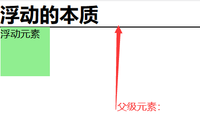
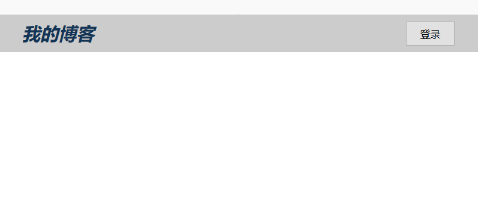
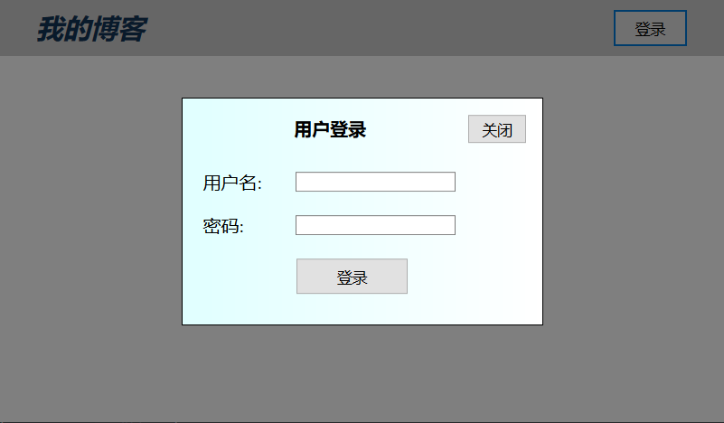
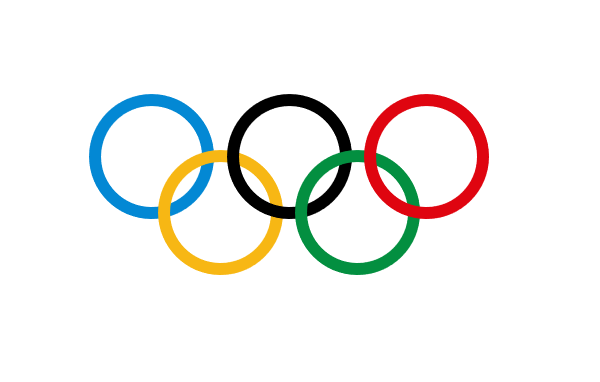

# css 布局之浮动与定位的应用

## 一、浮动（float）

浮动属性 float 是指定一个元素沿其所在的容器的左侧或者右侧放置。浮动的出现想解决的问题就是文字和图片的并排显示，不过一旦使用了浮动属性，该元素就会脱离网页正常流动（文档流）。
浮动的缺点：任何一个元素使用浮动属性之后都会脱离文档流，然后在父级元素计算高度的时候，就会忽略内部的浮动元素，造成父级元素高度塌陷。
示例：

```html
<!DOCTYPE html>
<html>
  <head>
    <meta charset="UTF-8" />
    <title>浮动的示例</title>
  </head>
  <body>
    <h1>浮动的本质</h1>
    <div class="box">
      <div class="child">浮动元素</div>
    </div>
  </body>
</html>
```

```css
* {
  padding: 0;
  margin: 0;
  box-sizing: border-box;
}

.box {
  /* padding: 1em; */
  border: 1px solid #000;
  background-color: lightcyan;
}
.child {
  width: 5em;
  height: 5em;
  background-color: lightgreen;
  float: left;
}
```

显示效果如下：



这样就可以看到，浮动后的元素是脱离了文档流的，直接造成了父级元素 box 的高度塌陷，这样的情况，我们可以有三种方法：

1. 添加一个附加元素，让它消除浮动影响（不建议使用）

2. 使用伪元素 “:after” 来消除浮动影响

3. 使用创建 BFC 容器的方法消除浮动影响

- 添加附加元素

这个就很简单了，就是在浮动元素同级下添加一个空的 div 元素，用来消除浮动影响。

```html
<body>
  <h1>浮动的本质</h1>
  <div class="box">
    <div class="child">浮动元素</div>
    <div calss="clear"></div>
  </div>
</body>
```

```css
.clear {
  clear: both;
}
```

- 使用伪元素

```css
.box:after {
  content: "";
  /* 使这个区域变成以一个块级元素 */
  display: block;
  clear: both;
}
```

- 创建 BFC 容器

> 创建 BFC 的方式：任何一个元素添加上以下任何一个属性后就是一个 BFC 容器
>
> 1. float：left / right，不能是 none;
> 2. overflow: hidden / auto / scroll, 不能是 visible；
> 3. display: flex / inline-flex;
> 4. display: grid / inline-grid;
> 5. display: inline-block / table-cell;
> 6. position: absolute / fiexed。

使用 overflow:hidden;将父元素转为 BFC 容器，使它的布局不受到内部浮动元素的影响

```css
.box {
  overflow: hidden;
}
```

## 二、定位（position）

定位属性：position

定位类型：

1. 静态定位（position:static;）：文档流定位；默认定位，元素的显示位置与它源码的位置一致

2. 相对定位（position:relative;）：相对于该元素在文档流中的原始位置进行定位（偏移）。

3. 绝对定位（position:absolute;）：相对于它的祖先中离它最近的 “定位元素” 的位置发生偏移（定位元素：只要这个元素中有 position: relative;或者 position:absolute;就称为定位元素，仅限这两种）。如果祖先元素中不存在定位元素，那它就参考根元素（html）进行定位，而且只有定位元素才有资格充当绝对定位元素的定位祖先元素（定位参考元素）。

4. 固定定位（position:fixed;）：它是绝对定位的一个特例，它始终相对于 html 定位。固定定位应用场景：在线客服，广告位等。

### 定位实战

1. 模态框实现

特点：点击“登录”按钮弹出登录框，同时登录框居于屏幕中央，背景半透明，点击“关闭”按钮时，登录框隐藏，页面恢复原来亮度。

```html
<!DOCTYPE html>
<html>
  <head>
    <meta charset="UTF-8" />
    <title>模态框</title>
    <link rel="stylesheet" href="style/demo6.css" />
  </head>
  <body>
    <!-- 页眉 -->
    <header>
      <h2>我的博客</h2>
      <button>登录</button>
    </header>
    <!-- 模态框 -->
    <div class="modal">
      <!-- 蒙板：用来盖住后面的内容，使它半透明 -->
      <div class="modal-coverback"></div>
      <!-- 主体 -->
      <div class="modal-body">
        <button class="close">关闭</button>
        <form action="" method="POST">
          <table>
            <caption>
              用户登录
            </caption>
            <tr>
              <td><label for="username">用户名:</label></td>
              <td>
                <input type="text" name="username" id="username" required />
              </td>
            </tr>
            <tr>
              <td><label for="psd">密码:</label></td>
              <td><input type="password" name="psd" id="psd" required /></td>
            </tr>

            <tr>
              <td></td>
              <td><button>登录</button></td>
            </tr>
          </table>
        </form>
      </div>
    </div>
  </body>
</html>
<script src="js/demo6.js"></script>
```

demo6.css 代码如下：

```css
* {
  margin: 0;
  padding: 0;

  box-sizing: border-box;
}
/* 页眉样式 */
header {
  background-color: #ccc;
  padding: 0.5em 2em;
  overflow: hidden;
  font-style: italic;
  color: #123456;
}
header h2 {
  float: left;
}
header button {
  float: right;
  width: 5em;
  height: 2.5em;
}

header button:hover {
  cursor: pointer;
  opacity: 0.8;
}
/* 模态框样式 */

/* 蒙版 */
/* 使用固定定位 */
.modal .modal-coverback {
  background-color: rgb(0, 0, 0, 0.5);
  position: fixed;
  top: 0;
  left: 0;
  right: 0;
  bottom: 0;
}
/* 主体 */
.modal .modal-body {
  padding: 1em;
  min-width: 20em;
  min-height: 10em;
  border: 1px solid #000;
  background: linear-gradient(to right, lightcyan, #fff);

  /* 固定定位 */
  position: fixed;
  /* top: 0;
  left: 0;
  right: 0;
  bottom: 0; */
  /* margin: auto; */
  /* 实现屏幕居中 */
  top: 50%;
  left: 50%;
  /* 向后平移以自身为基准的50% */
  transform: translate(-50%, -50%);
}
.modal form table {
  width: 80%;
}
.modal form table caption {
  font-weight: bold;
  margin-bottom: 1em;
}
.modal form table td {
  padding: 0.5em 0;
  margin-bottom: 2em;
}
.modal form table td:first-of-type {
  width: 5em;
}
.modal form table td input {
  width: auto;
  height: auto;
}
.modal form table button {
  width: 7.5em;
  height: 2.5em;
}
.modal form table button:hover {
  opacity: 0.8;
  cursor: pointer;
}

.modal-body {
  position: relative;
}
.modal .close {
  position: absolute;
  width: 4em;
  height: 2em;
  top: 1em;
  right: 1em;
}
.modal .close:hover {
  cursor: pointer;
  background-color: lightcyan;
  color: #000;
  box-shadow: 0 0 2px #eee;
}
/* 页面初始化时，模态框应该隐藏 */
.modal {
  display: none;
}
```

demo6.js 代码：

```javascript
const btn = document.querySelector("header button");
const modal = document.querySelector(".modal");
const close = document.querySelector(".close");

btn.addEventListener("click", setModal, false);
close.addEventListener("click", setModal, false);

function setModal(ev) {
  ev.preventDefault();
  let status = window.getComputedStyle(modal, null).getPropertyValue("display");
  modal.style.display = status === "none" ? "block" : "none";
}
```

显示效果如下：

点击前效果：



点击后效果：

 2. 使用定位制作一个五环

五环样式要求如下：

为了显示效果，将五环置于屏幕中央
示例代码如下：

```html
<!DOCTYPE html>
<html lang="en">
  <head>
    <meta charset="UTF-8" />
    <title>使用绝对定位实现五环效果</title>
    <link rel="stylesheet" href="style/five-ring.css" />
  </head>
  <body>
    <div class="body">
      <div class="circle1"></div>
      <div class="circle2"></div>
      <div class="circle3"></div>
      <div class="circle4"></div>
      <div class="circle5"></div>
    </div>
  </body>
</html>
```

five-ring.css 代码

```css
* {
  padding: 0;
  margin: 0;
  box-sizing: border-box;
}
html {
  font-size: 10px;
}
.body {
  width: 35em;
  height: 20em;
  /* border: 1px solid #000;
  background-color: lightcyan; */
}
.body {
  position: relative;
  /* overflow: hidden; */
  position: fixed;
  top: 50%;
  left: 50%;
  transform: translate(-50%, -50%);
}
.circle1,
.circle2,
.circle3,
.circle4,
.circle5 {
  position: absolute;
  width: 10em;
  height: 10em;
  border: 10px solid #0388d4;
  border-radius: 50%;
}
.circle1 {
  top: 0;
  left: 0;
  z-index: 1;
}
.circle2 {
  top: 0;
  left: 11em;
  border-color: #000;
  z-index: 3;
}
.circle3 {
  top: 0;
  left: 22em;
  border-color: #df0510;
  z-index: 5;
}
.circle4 {
  top: 4.5em;
  left: 5.5em;
  border-color: #f7b714;
  z-index: 2;
}
.circle5 {
  top: 4.5em;
  left: 16.5em;
  border-color: #038f40;
  z-index: 4;
}
```

显示效果如下：


