# CSS 弹性盒子（flexbox）常用的的容器属性与项目属性介绍

## 一、弹性盒子（flexbox）一些基本术语和简单介绍

- 介绍

  CSS 弹性盒子布局是 CSS 的模块之一，定义了一种针对用户界面设计而优化的 CSS 盒子模型。在弹性布局模型中，弹性容器的子元素可以在任何方向上排布，也可以“弹性伸缩”其尺寸，既可以增加尺寸以填满未使用的空间，也可以收缩尺寸以避免父元素溢出。子元素的水平对齐和垂直对齐都能很方便的进行操控。通过嵌套这些框（水平框在垂直框内，或垂直框在水平框内）可以在两个维度上构建布局。

- 术语

1. 容器: 具有`display:flex`属性元素，任何元素都可以通过添加`display:flex;`属性，转换为弹性盒元素,转换为 flex 元素后，它的内部的“子元素”就支持 flex 布局了。
2. 项目: flex 容器的"子元素"，容器中的项目自动转为行内块元素，不管之前是什么类型。
3. 主轴: 项目排列的轴线，一般默认情况下主轴为水平方向。
4. 交叉轴: 与主轴垂直的轴线，一般默认情况下，交叉轴为竖直方向。

## 二、 常用的容器属性

| 属性            | 描述                       |
| --------------- | -------------------------- |
| flex-flow       | 主轴方向与换行方式         |
| justify-content | 项目在主轴上的对齐方式     |
| align-items     | 项目在交叉轴上的对齐方式   |
| align-content   | 项目在多行容器中的对齐方式 |

1. `flex-flow`属性

`flex-flow`属性是`flex-direction`属性和`flex-wrap`属性的简写
`flex-direction` 属性指定了内部元素是如何在 `flex` 容器中布局的，定义了主轴的方向。它的默认值是`row`，默认水平方向为主轴。
flex-wrap 指定 flex 元素单行显示还是多行显示 。如果允许换行，这个属性允许你控制行的堆叠方向。它的默认值是`nowrap`，默认是不允许换行显示。

具体演示如下：

html 代码

```html
<!DOCTYPE html>
<html lang="en">
  <head>
    <meta charset="UTF-8" />
    <title>flex-flow属性演示</title>
    <link rel="stylesheet" href="style/demo4.css" />
  </head>
  <body>
    <div class="container">
      <div class="item">元素块1</div>
      <div class="item">元素块2</div>
      <div class="item">元素块3</div>
      <div class="item">元素块4</div>
      <div class="item">元素块5</div>
      <div class="item">元素块6</div>
      <div class="item">元素块7</div>
      <div class="item">元素块8</div>
    </div>
  </body>
</html>
```

css 代码

```css
* {
  box-sizing: border-box;
  margin: 0;
  padding: 0;
}

.container {
  /* 转换为flex弹性布局元素 */
  display: flex;
  padding: 1em;
  height: 15em;
  border: 1px solid #000;
  margin: 1em;
}

.container > .item {
  /* height: 2em; */
  width: 5em;
  background-color: lightcyan;
  border: 1px solid #000;
}
/* 1. 单行容器 */
.container {
  /* 控制主轴方向，默认值是row水平方向 */
  /* flex-direction: row; */
  /* 控制项目换行方式，默认值是nowrap不换行 */
  /* flex-wrap: nowrap; */
  /* 缩写方式flex-flow */
  flex-flow: row nowrap;
}
}
```

不允许换行显示效果如下：

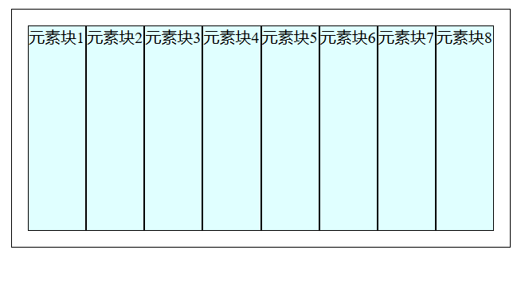

可以看到的是，所有的项目都挤在一块，哪怕是宽度不够也只会收缩，不会换行。
加上 css 代码

```css
.container {
  flex-flow: row wrap;
}
```

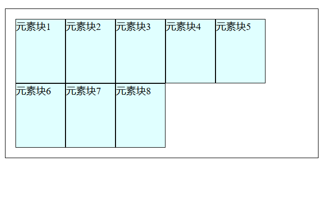

可以看到的是，在换行允许了之后，项目就不会收缩，而是换行显示。  
2. `justify-content`属性

`justify-content` 属性定义了浏览器之间，如何分配顺着弹性容器主轴的元素之间及其周围的空间。
在顺着主轴的方向空间分配分为两种情况
第一种是将容器下的所有项目看成是一个整体进行空间分配
第二种是将容器下的项目看成是一个个独立的个体进行空间分配

- 整体分配情况

一共有三种情况：

1. 沿起始位置对齐：`flex-start`

2. 沿终止位置对齐：`flex-end`

3. 居中对齐：`center`

示例演示：

html 代码

```html
<!DOCTYPE html>
<html lang="en">
  <head>
    <meta charset="UTF-8" />
    <title>flex-flow属性演示</title>
    <link rel="stylesheet" href="style/demo4.css" />
  </head>
  <body>
    <div class="container">
      <div class="item">元素块1</div>
      <div class="item">元素块2</div>
      <div class="item">元素块3</div>
      <div class="item">元素块4</div>
      <div class="item">元素块5</div>
      <div class="item">元素块6</div>
      <div class="item">元素块7</div>
      <div class="item">元素块8</div>
    </div>
  </body>
</html>
```

css 代码

```css
* {
  box-sizing: border-box;
  margin: 0;
  padding: 0;
}

.container {
  /* 转换为flex弹性布局元素 */
  display: flex;
  padding: 1em;
  height: 15em;
  border: 1px solid #000;
  margin: 1em;
}

.container > .item {
  /* height: 2em; */
  width: 5em;
  background-color: lightcyan;
  border: 1px solid #000;
}

.container {
  flex-flow: row nowrap;
  /* 左对齐 */
  justify-content: flex-start;
  /* 右对齐 */
  justify-content: flex-end;
  /* 居中对齐 */
  justify-content: center;
}
```

按照顺序，显示效果如下：

左对齐显示

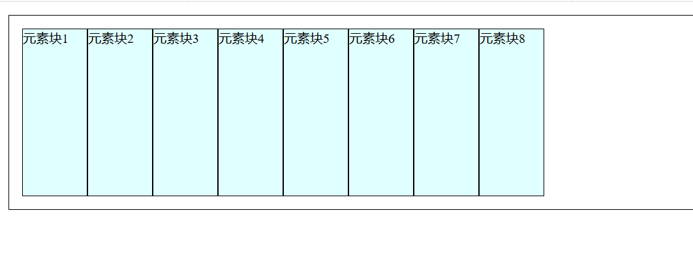

右对齐显示

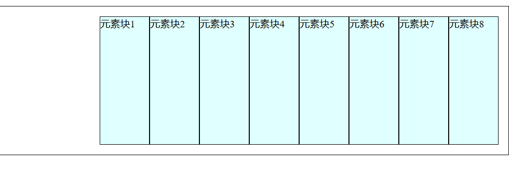

居中显示

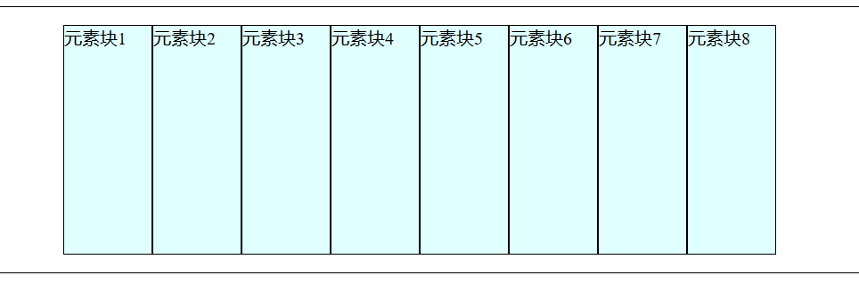

- 独立分配情况

一共有三种情况：

1. `space-between`:均匀排列每个元素，首个元素放置于起点，末尾元素放置于终点。

2. `space-around`:均匀排列每个元素，每个元素周围分配相同的空间。

3. `space-evenly`:均匀排列每个元素，每个元素之间的间隔相等。

示例演示：

上边的 html 代码不变，css 代码添加上如下：

```css
.container {
  /* 两端对齐,剩余空间在除了起始项目和终结项目的其他项目两端平均分布 */
  justify-content: space-between;
  /* 分散对齐，剩余空间在每个项目的左右两端平均分布 */
  justify-content: space-around;
  /* 平均对齐，剩余空间在每个项目之间平均分布 */
  justify-content: space-evenly;
}
```

显示效果依次如下：

两端对齐显示：
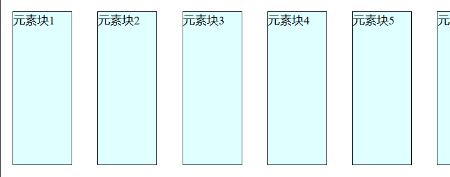

分散对齐显示：
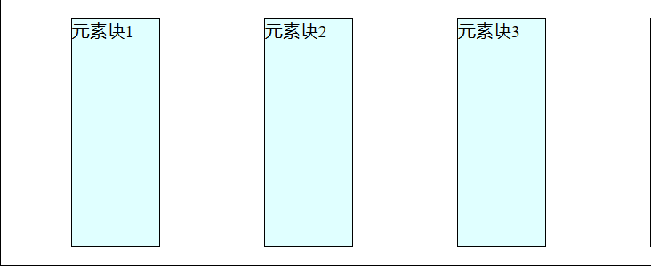

平均对齐显示：
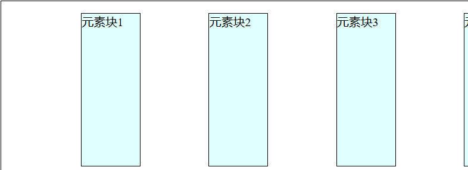  
3. `align-items`属性

`align-items`属性是项目在交叉轴上的对齐方式

它一共有四个常用的属性值，分别是：

1. 默认是拉伸的: `stretch`
2. 顶对齐: `flex-start`
3. 底对齐: `flex-end`
4. 居中对齐: `center`

示例演示：

html 代码用上边的，css 代码添加上下边的。

```css
.container {
  flex-flow: row wrap;
  /* 默认是拉伸的 */
  align-items: stretch;
  /* 顶对齐 */
  align-items: flex-start;
  /* 底对齐 */
  align-items: flex-end;
  /* 居中对齐 */
  align-items: center;
}
```

显示效果按顺序如下：

默认值显示：
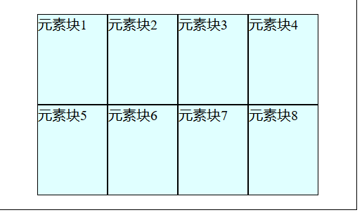
顶对齐显示：
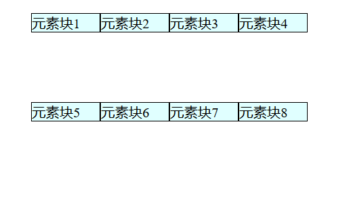
底对齐显示：
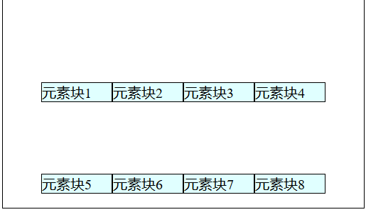
居中对齐显示：
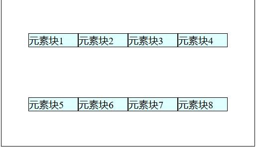  
4. `align-content`属性

`align-content` 属性设置了浏览器如何沿着弹性盒子布局的交叉轴在内容项之间和周围分配空间。

它一共有 7 个常用的值，分别是：

1. stretch（默认值）：拉伸所有行来填满剩余空间。剩余空间平均地分配给每一行。
2. flex-start：所有行从垂直轴起点开始填充。第一行的垂直轴起点边和容器的垂直轴起点边对齐。接下来的每一行紧跟前一行。
3. flex-end：所有行从垂直轴末尾开始填充。最后一行的垂直轴终点和容器的垂直轴终点对齐。同时所有后续行与前一个对齐。
4. center：所有行朝向容器的中心填充。每行互相紧挨，相对于容器居中对齐。容器的垂直轴起点边和第一行的距离相等于容器的垂直轴终点边和最后一行的距离。
5. space-between：所有行在容器中平均分布。相邻两行间距相等。容器的垂直轴起点边和终点边分别与第一行和最后一行的边对齐。
6. space-around：所有行在容器中平均分布，相邻两行间距相等。容器的垂直轴起点边和终点边分别与第一行和最后一行的距离是相邻两行间距的一半。
7. space-evenly：所有行沿垂直轴均匀分布在对齐容器内。每对相邻的项之间的间距，主开始边和第一项，以及主结束边和最后一项，都是完全相同的。

它的显示效果和 align-item 以及 justify-content 属性的几种显示方式相似，不过 align-content 属性对于仅限单行的项目不起作用。

## 三、常用的项目属性

| 属性         | 描述                         |
| ------------ | ---------------------------- |
| `flex`       | 项目的缩放比例与基准宽度     |
| `align-self` | 单个项目在交叉轴上的对齐方式 |
| `order`      | 项目在主轴上排列顺序         |

1. `flex`属性

`flex`属性是 flex-grow，flex-shrink，flex-basis 这三个属性的缩写
`flex-grow`属性设置了一个 flex 项主尺寸的 flex 增长系数。它指定了 flex 容器中剩余空间的多少应该分配给项目（flex 增长系数）。
`flex-shrink`属性指定了 flex 元素的收缩规则。flex 元素仅在默认宽度之和大于容器的时候才会发生收缩，其收缩的大小是依据 flex-shrink 的值。
`flex-basis`属性指定了 flex 元素在主轴方向上的初始大小。如果不使用 box-sizing 改变盒模型的话，那么这个属性就决定了 flex 元素的内容盒（content-box）的尺寸。

示例演示：

html 代码

```html
<!DOCTYPE html>
<html lang="en">
  <head>
    <meta charset="UTF-8" />
    <title>项目上的属性：flex</title>
    <link rel="stylesheet" href="style/demo7.css" />
  </head>
  <body>
    <div class="container">
      <div class="item">item1</div>
      <div class="item">item2</div>
      <div class="item">item3</div>
      <div class="item">item4</div>
    </div>
  </body>
</html>
```

css 代码

```css
* {
  box-sizing: border-box;
  margin: 0;
  padding: 0;
}

.container {
  /* 转换为flex弹性布局元素 */
  display: flex;
  padding: 1em;
  height: 15em;
  border: 1px solid #000;
  margin: 1em;
}
.container > .item {
  /* height: 2em; */
  width: 5em;
  background-color: lightcyan;
  border: 1px solid #000;
}

/* 项目属性flex */
.container .item {
  /* flex: flex-grow flex-shrink flex-basis;
  flex: 放大因子  收缩因子  项目在主轴上的基准宽度 */
  /* 默认值：flex：0 1 auto;或者是flex：initial; */
  /* 不放大，可以收缩，宽度取容器的width属性 */
  /* flex: 0 1 auto; */
  flex: initial;
  /* 允许放大和收缩 */
  /* flex: 1 1 auto; */
  flex: auto;
  /* 禁止放大和收缩 */
  /* flex: 0 0 auto; */
  flex: none;
  /* 如果只写一个数字，表示放大因子 */
  /* flex: 1;等价于 flex: 1 1 auto; */
  flex: 1;
  /* flex通常不会用来设置所有项目的默认选项，通常用来设置某一个项目的特征 */
}

/* ---------------------------------------------- */

/* 案例，要求第二个和第三个项目的宽度是第一个和第四个项目的2倍 */
.container > .item:first-of-type,
.container > .item:last-of-type {
  flex: 1;
}

.container > .item:nth-of-type(2),
.container > .item:nth-of-type(3) {
  flex: 2;
}
```

案例：有四个项目，要求第二个和第三个项目的宽度是第一个和第四个项目的 2 倍。
案例显示：

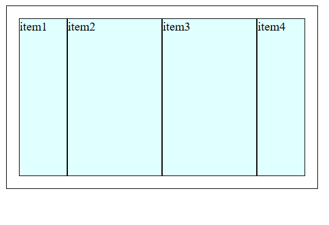  
2. `align-self`属性

`align-self`属性可以单独的去设置一个项目在交叉轴上的对齐方式
它也拥有四个属性，分别是：

1. align-self: stretch；默认值。
2. align-self: flex-start;顶对齐。
3. align-self: flex-end;底对齐。
4. align-self: center;居中对齐。

示例演示：

html 代码用 1 中的代码，css 代码示例如下：

```css
* {
  box-sizing: border-box;
  margin: 0;
  padding: 0;
}

.container {
  /* 转换为flex弹性布局元素 */
  display: flex;
  padding: 1em;
  height: 15em;
  border: 1px solid #000;
  margin: 1em;
}
.container > .item {
  /* height: 2em; */
  width: 5em;
  background-color: lightcyan;
  border: 1px solid #000;
}
/* 例如设置第二个项目与其他项目的对齐方式不一样 */

.container > .item:nth-of-type(2) {
  align-self: stretch;
  align-self: flex-start;
  align-self: flex-end;
  align-self: center;
}
```

显示效果按顺序如下:

默认显示：
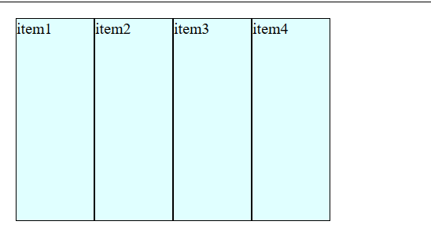
顶对齐显示：
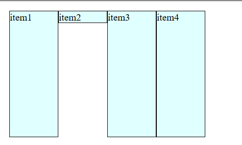
底对齐显示：
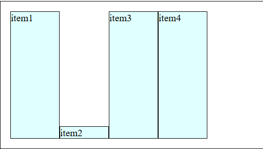
居中对齐显示：
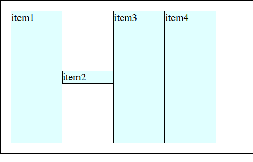  
3. `order`属性

`order`属性: 设置某个项目在主轴上的排列顺序。默认序号越小越靠前,越大越靠后。没有 border 属性就按照代码书写顺序来显示。

示例演示(让 4 号项目排在第一位)：

html 代码

```html
<!DOCTYPE html>
<html lang="en">
  <head>
    <meta charset="UTF-8" />
    <title>设置项目在主轴上的显示顺序</title>
    <link rel="stylesheet" href="style/demo9.css" />
  </head>
  <body>
    <div class="container">
      <div class="item">1</div>
      <div class="item">2</div>
      <div class="item">3</div>
      <div class="item">4</div>
    </div>
  </body>
</html>
```

css 代码

```css
* {
  box-sizing: border-box;
  margin: 0;
  padding: 0;
}

.container {
  /* 转换为flex弹性布局元素 */
  display: flex;
  padding: 1em;
  height: 15em;
  border: 1px solid #000;
  margin: 1em;
}
.container > .item {
  /* height: 2em; */
  width: 5em;
  background-color: lightcyan;
  border: 1px solid #000;
  font-size: 3em;
}
/* 显示顺序:默认按照源码的书写顺序排列 */
/* 默认序号越小越靠前,越大越靠后 */
/* 支持负值 */
.container > .item:first-of-type {
  background-color: yellow;
  order: 1;
}
.container > .item:nth-of-type(2) {
  background-color: lightgreen;
  order: 2;
}
.container > .item:nth-of-type(3) {
  background-color: lightcyan;
  order: 3;
}
.container > .item:last-of-type {
  background-color: #ccc;
  order: 0;
}
```

显示效果：

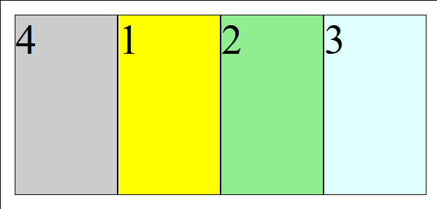
