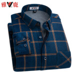
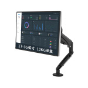

# 用 flex 布局尝试模拟一个静态的移动端京东页面

## 模拟静态的京东页面的总体思路

可以大致的将京东首页页面看成是由三部分组成，分别是页眉区、内容区还有页脚区。

页眉和页脚区的布局思路一样，它们的显示优先级都要大于内容区。然后可以注意到的是它的页眉和页脚区域都有许多的字体图标，这个可以在[阿里巴巴矢量图标库](https://www.iconfont.cn/)找到相似的下载下来引用就行了。

首先是一个整体的布局思路，可以将主页的整体先弄好，剩下的亿点点细节可以再去部署。页眉和页脚的宽度可以登录到[京东首页移动端](https://wqs.jd.com),然后使用元素查看器查看高度设置。

对于页眉，页脚还有主内容区位置这块我用了绝对定位去弄的，后期去写内容区的细节的时候不知道是什么原因，它老是被覆盖，只能重新去使用绝对定位去写，所以还得计算布局的位置，比较麻烦。

分内容去写 css，这样各个区出了问题，代码处理量就很少，方便去修改。

下边是所有的代码：

整个页面框架的 html 代码如下：(由于推荐内容区的东西结构一样且太多了，所以我就只在 html 中只写了四个，能看清效果就行)

```html
<!DOCTYPE html>
<html lang="en">
  <head>
    <meta charset="UTF-8" />
    <meta name="viewport" content="width=device-width, initial-scale=1.0" />
    <!-- 首页 -->
    <link rel="stylesheet" href="static/css/index.css" />
    <!-- 页眉 -->
    <link rel="stylesheet" href="static/css/header.css" />
    <!-- 字体图标 -->
    <link rel="stylesheet" href="static/iconfont/iconfont.css" />
    <!-- 幻灯片 -->
    <link rel="stylesheet" href="static/css/slide.css" />
    <!-- 导航区 -->
    <link rel="stylesheet" href="static/css/nav.css" />
    <!-- 正品直邮 -->
    <link rel="stylesheet" href="static/css/mail.css" />
    <!-- 秒杀 -->
    <link rel="stylesheet" href="static/css/ms.css" />
    <!-- 猜你喜欢 -->
    <link rel="stylesheet" href="static/css/xh.css" />
    <!-- 页脚 -->
    <link rel="stylesheet" href="static/css/footer.css" />
    <title>页脚</title>
  </head>
  <body>
    <!-- 页眉 -->
    <div class="header">
      <!-- 字体图标菜单 -->
      <a href=""><div class="menu iconfont icon-menu"></div></a>
      <div class="search">
        <div class="logo iconfont icon-jingdong"></div>
        <div class="zoom iconfont icon-sousuo"></div>
        <input type="text" class="words" value="oppo手机" />
      </div>
      <a href="" class="login">登录</a>
    </div>
    <!-- 主体 -->
    <div class="main">
      <!-- 幻灯片 -->
      <div class="slide">
        <div class="box"></div>
        <a href=""></a>
      </div>
      <!-- 跳转 -->
      <div class="jump">
        <a href=""><div class="jd iconfont icon-jingdongsaomazhifu"></div></a>
        <a href="">打开APP</a>
      </div>
      <ul class="nav">
        <li>
          <a href=""></a>
          <a href="">京东超市</a>
        </li>
        <li>
          <a href=""></a>
          <a href="">数码电器</a>
        </li>
        <li>
          <a href=""></a>
          <a href="">京东服饰</a>
        </li>
        <li>
          <a href=""></a>
          <a href="">京东生鲜</a>
        </li>
        <li>
          <a href=""></a>
          <a href="">京东到家</a>
        </li>
        <li>
          <a href=""></a>
          <a href="">充值缴费</a>
        </li>
        <li>
          <a href=""></a>
          <a href="">9.9拼</a>
        </li>
        <li>
          <a href=""></a>
          <a href="">领券</a>
        </li>
        <li>
          <a href=""></a>
          <a href="">借钱</a>
        </li>
        <li>
          <a href=""></a>
          <a href="">PLUS会员</a>
        </li>
      </ul>
      <ul class="zp">
        <li>
          <a href="">正品直邮</a>
          <a href=""></a>
        </li>
        <li>
          <a href="">来电好货</a>
          <a href="">3C大放价</a>
          <a href=""></a>
        </li>
        <li>
          <a href="">国潮风尚</a>
          <a href="">国货正当时</a>
          <a href=""></a>
        </li>
        <li>
          <a href="">都是你爱的</a>
          <a href=""></a>
        </li>
      </ul>
      <div class="ms">
        <!-- 头部区 -->
        <div class="ms-top">
          <div class="left">
            <div class="title">京东秒杀</div>
            <div class="notice">
              <div class="tips">22点专场</div>
              <div class="time">01:22:11</div>
            </div>
          </div>
          <div class="right">更多秒杀</div>
        </div>
        <!-- 秒杀主体区 -->
        <ul class="ms-body">
          <li class="item">
            <a href=""></a>
            <div class="iconfont icon-renminbi1688">338</div>
            <div class="iconfont icon-renminbi1688">558</div>
          </li>
          <li class="item">
            <a href=""></a>
            <div class="iconfont icon-renminbi1688">1338</div>
            <div class="iconfont icon-renminbi1688">1558</div>
          </li>
          <li class="item">
            <a href=""></a>
            <div class="iconfont icon-renminbi1688">2338</div>
            <div class="iconfont icon-renminbi1688">2558</div>
          </li>
          <li class="item">
            <a href=""></a>
            <div class="iconfont icon-renminbi1688">33</div>
            <div class="iconfont icon-renminbi1688">58</div>
          </li>
          <li class="item">
            <a href=""></a>
            <div class="iconfont icon-renminbi1688">138</div>
            <div class="iconfont icon-renminbi1688">158</div>
          </li>
          <li class="item">
            <a href=""></a>
            <div class="iconfont icon-renminbi1688">2238</div>
            <div class="iconfont icon-renminbi1688">2658</div>
          </li>
        </ul>
      </div>
      <!-- 推荐区 -->
      <h2>猜你喜欢</h2>
      <ul class="xh">
        <li class="item">
          <a href=""></a>
          <p>
            芝华仕 头等舱 转角科技布 布艺沙发 现代简约 组合家具 客厅小户型 50397
            玛雅灰面向沙发左脚位30-60天发货
          </p>
          <div class="price">
            <div class="iconfont icon-renminbi1688">4088</div>
            <div>看相似</div>
          </div>
        </li>
        <li class="item">
          <a href=""></a>
          <p>
            米家 小米电动牙刷 声波震动 进口纤密软毛 30天超长续航 IPX7防水 T100
            蓝色
          </p>
          <div class="price">
            <div class="iconfont icon-renminbi1688">38</div>
            <div>看相似</div>
          </div>
        </li>
        <li class="item">
          <a href=""></a>
          <p>飞利浦（PHILIPS）电动剃须刀刮胡刀自动研磨便携式胡须刀PQ182</p>
          <div class="price">
            <div class="iconfont icon-renminbi1688">88</div>
            <div>看相似</div>
          </div>
        </li>
        <li class="item">
          <a href=""></a>
          <p>
            超媛加绒加厚中长款打底衫女冬季新款显瘦大码女装上衣立领外穿连衣裙FF-A015-C#9916你
            黑色 S
          </p>
          <div class="price">
            <div class="iconfont icon-renminbi1688">188</div>
            <div>看相似</div>
          </div>
        </li>
      </ul>
    </div>
    <!-- 页脚 -->
    <div class="footer">
      <div>
        <a href=""><div class="iconfont icon-jingdong1"></div></a>
        <a href="">首页</a>
      </div>
      <div>
        <a href=""><div class="iconfont icon-2"></div></a>
        <a href="">分类</a>
      </div>
      <div>
        <a href=""><div class="iconfont icon-tx"></div></a>
        <a href="">京喜</a>
      </div>
      <div>
        <a href=""><div class="iconfont icon-gouwuche"></div></a>
        <a href="">购物车</a>
      </div>
      <div>
        <a href=""><div class="iconfont icon-lujingbeifen2"></div></a>
        <a href="">未登录</a>
      </div>
      </div>
    </div>
  </body>
</html>

```

样式初始化代码 reset.css

```css
/* 样式初始化 */
* {
  padding: 0;
  margin: 0;
  box-sizing: border-box;
}

/* 去掉列表的样式 */
li {
  list-style: none;
}
/* 去掉链接下划线 */
a {
  color: #7b7b7b;
  text-decoration: none;
}
/* 设置主题颜色 */
body {
  background-color: #f6f6f6;
}

html {
  font-size: 10px;
}

@media screen and (min-width: 480px) {
  html {
    font-size: 12px;
  }
}
@media screen and (min-width: 640px) {
  html {
    font-size: 14px;
  }
}
@media screen and (min-width: 720px) {
  html {
    font-size: 16px;
  }
}

@media screen and (min-width: 800px) {
  html {
    font-size: 18px;
  }
}
@media screen and (min-width: 880px) {
  html {
    font-size: 18px;
  }
}
@media screen and (min-width: 960px) {
  html {
    font-size: 20px;
  }
}
@media screen and (min-width: 1040px) {
  html {
    font-size: 22px;
  }
}
@media screen and (min-width: 1120px) {
  html {
    font-size: 24px;
  }
}
@media screen and (min-width: 1200px) {
  html {
    font-size: 26px;
  }
}
@media screen and (min-width: 1280px) {
  html {
    font-size: 28px;
  }
}
```

主体区代码 index.css

```css
/* 导入初始化样式表 */
@import "reset.css";

/* 页眉 */
.header {
  background-color: #e43130;
  color: white;
  height: 4.4rem;
  z-index: 100;
  position: fixed;
  top: 0;
  right: 0;
  left: 0;
}

/* body {
  position: relative;
} */
/* 主体 */
.main {
  position: absolute;
  top: 4.4rem;
  bottom: 4.4rem;
  left: 0;
  right: 0;
  /* background-color: rgb(58, 66, 58); */
  /* min-height: 100rem; */
  font-size: 1.4rem;
}

/* 页脚 */
.footer {
  background-color: #fafafa;
  height: 4.4rem;
  color: #666;
  z-index: 100;
  box-shadow: 0 0 3px #999;
  position: fixed;
  bottom: 0;
  right: 0;
  left: 0;
  font-size: 1.4rem;
}
```

页眉区的代码 header.css

```css
.header {
  display: flex;
  align-items: center;
}
.header a:first-of-type .menu {
  font-size: 2.5rem;
  flex: 1;
  color: white;
  /* 设置文本居中 */
  text-align: center;
}
/* 搜索框 */
.header .search {
  flex: 6;
  background-color: white;
  padding: 0.5rem;
  border-radius: 3rem;

  display: flex;
  align-items: center;
}

.header .search .logo {
  color: #e43130;
  flex: 0 1 4rem;
  /* margin-left: 1rem; */
  /* justify-content: flex-end; */
  /* 水平垂直居中 */
  text-align: center;
  line-height: 2rem;
  font-size: 1.5rem;
}

/* 放大镜 */

.header .search .zoom {
  font-size: 1.5rem;
  color: #ccc;
  flex: 0 1 4rem;
  border-left: 1px solid;
  text-align: center;
  line-height: 2rem;
}

/* 搜索框 */
.header .search .words {
  font-size: 1.5rem;
  flex: auto;
  outline: none;
  border: none;
  color: #aaa;
}
.header .login {
  font-family: Helvetica;
  font-size: 1.5rem;
  flex: 1;
  color: white;
  text-align: center;
}
```

幻灯片部分代码 slide.css(这个没有 js 处理，只能先做成静态的):

```css
/* 幻灯片，静态 */
.main .solide {
  background-color: white;
  min-height: 14rem;
}

.main .slide .box {
  height: 11rem;
  background-color: #e43130;
  border-bottom-left-radius: 5rem;
  border-bottom-right-radius: 5rem;
  z-index: 1;
}

.main .slide a {
  position: absolute;
  left: 50%;
  top: 0;
  transform: translateX(-50%);
}
.main .slide img {
  /* width: 35rem; */
  height: 14rem;
  border-radius: 1rem;
}

/* 跳转栏 */
.jump {
  height: 3rem;
  display: flex;
  background-color: #e43130;
  padding: 0.2rem;
  z-index: 3;
  position: fixed;
  right: 0;
  top: 5rem;
  border-top-left-radius: 2.5rem;
  border-bottom-left-radius: 2.5rem;
  justify-content: space-around;
  /* opacity: 0.8; */
}

.jump a:first-of-type {
  line-height: 2.5rem;
}

.jump .jd {
  width: 2.5rem;
  height: 2.5rem;
  font-size: 2.5rem;
  background-color: white;
  /* border: 1px solid #fff; */
  border-radius: 50%;
  color: #e43130;
  margin-right: 0.5rem;
}

.jump a:last-of-type {
  color: white;
  font-size: 1.5rem;
  line-height: 3rem;
}
```

主导航区代码 nav.css:

```css
/* 主导航区 */
.main .nav {
  /* background-color: white; */
  display: flex;
  flex-flow: row wrap;
  position: absolute;
  top: 14rem;
  justify-content: space-between;
}

.main .nav img {
  height: 4rem;
  width: 4rem;
}
.main .nav li {
  /* 每一行显示五个 */
  flex: 1 1 20%;
  display: flex;
  flex-flow: column nowrap;
  align-items: center;
}
```

正品直邮区代码 mail.css:

```css
.main .zp {
  display: flex;
  background-color: white;
  position: absolute;
  top: 29rem;
  left: 0;
  right: 0;
  padding: 1rem;
  margin: 1rem;
  justify-content: space-between;
  align-items: flex-end;
}

.main .zp img {
  height: 6rem;
  width: 6rem;
}

.main .zp li {
  display: flex;
  flex: 1 1 25%;
  flex-flow: column nowrap;
  align-items: flex-start;
}

.main .zip li a {
  color: #000;
}
.main .zp li:nth-of-type(2) a:first-of-type,
.main .zp li:nth-of-type(3) a:first-of-type {
  font-weight: bold;
  font-size: 1.8rem;
  color: #000;
}
```

秒杀区代码 ms.css：

```css
/* 秒杀区 */
.main .ms {
  background-color: white;
  position: absolute;
  top: 43rem;
  padding: 1rem;
  margin: 1rem;
  right: 0;
  left: 0;
  border-radius: 1rem;
}

.main .ms .ms-top {
  font-size: 1.3rem;
  height: 3rem;
  display: flex;
  justify-content: space-between;
}
.main .ms .ms-top .left {
  display: flex;
}
.main .ms .ms-top .left .notice {
  font-size: 1.1rem;
  height: 2rem;
  border: 1px solid #e43130;
  border-radius: 2rem;
  margin-left: 1rem;

  display: flex;
  justify-content: center;
  align-items: center;
}
.main .ms .ms-top .left .notice .tips {
  background-color: #e43130;
  color: white;
  border-radius: 2rem;
  padding: 0.3rem 0.5rem;
}
.main .ms .ms-top .left .notice .time {
  padding: 0.3rem 0.5rem;
}
.main .ms .ms-top .right {
  color: #e43130;
}

/* 主体区 */
.main .ms .ms-body {
  display: flex;
  justify-content: space-between;
}

.main .ms .ms-body img {
  height: 5.5rem;
  width: 5.5rem;
}

/* 秒杀价 */
.main .ms .ms-body .item div:first-of-type {
  color: #e43130;
  font-weight: bold;
}

/* 原价 */
.main .ms .ms-body .item div:last-of-type {
  text-decoration: line-through;
  color: #666666;
  text-decoration-color: #666;
}
```

推荐喜欢区的代码 xh.css:

```css
.main h2 {
  position: absolute;
  top: 58rem;
  left: 0;
  right: 0;
  text-align: center;
  line-height: 4rem;
  margin: 2rem 0;
  font-weight: 500;
}
.main .xh {
  position: absolute;
  font-size: 1rem;

  display: flex;
  flex-flow: row wrap;
  top: 64rem;
  left: 0;
  right: 0;
}
.main .xh .item {
  flex: 1 1 calc(50% - 3rem);
  background-color: white;
  border-radius: 1rem;
  overflow: hidden;
  display: flex;
  flex-flow: column nowrap;
  padding-bottom: 1rem;
  /* text-overflow: hidden; */
}
.main .xh .item:nth-of-type(odd) {
  margin-left: 1rem;
  margin-bottom: 1rem;
}
.main .xh .item:nth-of-type(even) {
  margin: 0 1rem;
  margin-bottom: 1rem;
}

.main .xh .item img {
  width: 100%;
  height: 100%;
  padding: 1rem;
}
.main .xh .item p {
  font-size: 1.3rem;
  height: 3rem;
  overflow: hidden;
  padding: 1rem;
}
.main .xh .item .price {
  height: 3rem;
  display: flex;
  justify-content: space-between;
  align-items: center;
}
.main .xh .item .price div:first-of-type {
  color: #e43130;
}
.main .xh .item .price div:last-of-type {
  height: 2rem;
  color: #666;
  background-color: #ddd;
  border-radius: 1rem;
  padding: 0.2rem 1rem;
}

.main .xh .item div:last-of-type {
  height: 1rem;
}
```

页脚区代码 footer.css:

```css
.footer {
  display: flex;
  justify-content: space-around;
}
.footer > div {
  display: flex;
  flex-flow: column nowrap;
  align-items: center;
  justify-content: flex-end;
}

.footer div a:first-of-type div {
  font-size: 1.5rem;
}
```

最后的显示效果如下：
显示效果 1：


显示效果 2：

