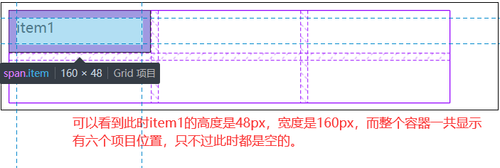
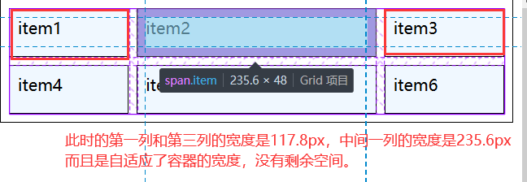
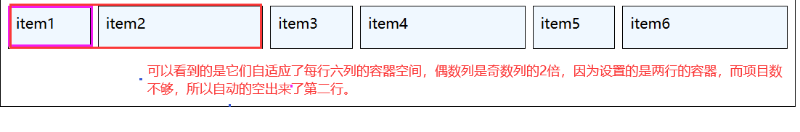
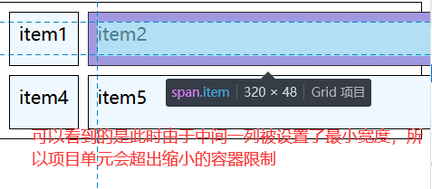
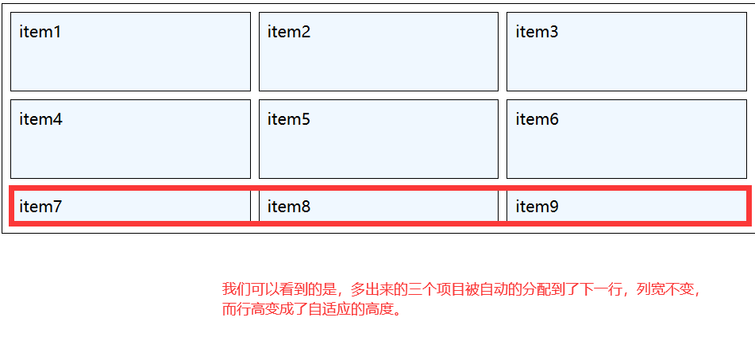
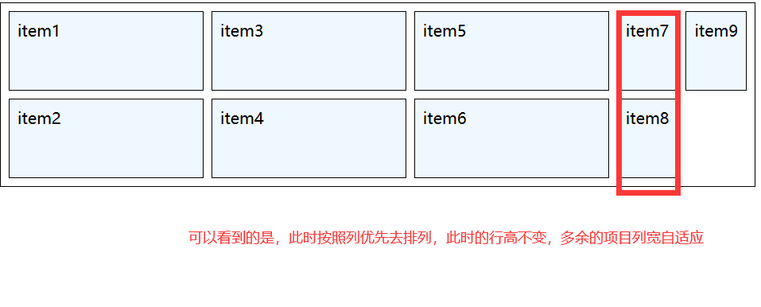
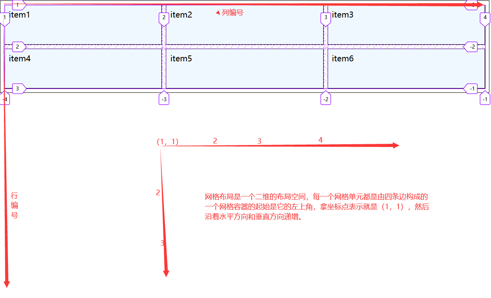
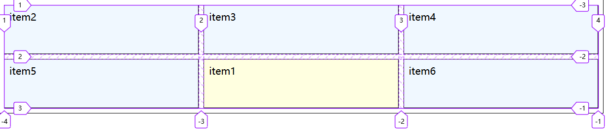
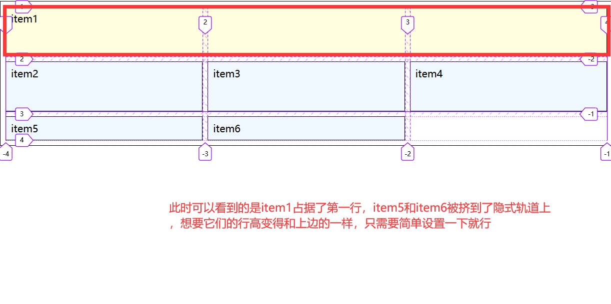

# css 中基于二维空间的 grid 网格布局

## 一、grid 网格布局中的专业术语

grid 网格布局是将一个父级元素变成网格容器，父元素的子元素变成网格项目的布局方式。grid 布局中的专用术语有以下几个：

| 术语名称 | 术语描述                                              |
| -------- | ----------------------------------------------------- | --- | -------- | ------------------------------------- |
| 网格容器 | 由若干个矩形网格单元构成                              |
| 网格单元 | 网格布局的组成部分,有"单元格"与"网格区域"两种表现形式 |     | 网格项目 | 网格容器的子元素,必须放在网格单元内部 |
| 网格轨道 | 由多个网格单元组成,根据排列方向有 "行轨"和 "列轨"之分 |
| 轨道间距 | 容器中轨道之间的间距,有 "行轨间距"和 "列轨间距        |

一个元素中使用了`display:grid;`那么它就会默认生成一个一列 N 行的容器（N 是容器中项目的数量）。子元素默认是块元素。

## 二、创建一个 grid 网格布局容器

创建一个网格容器之后最基本的三件事就是：

1. 创建轨道的列宽:`grid-template-columns`
2. 设置轨道的行高:`grid-template-rows`
3. 设置轨道的间距:`gap`

当你设置的是一个固定宽度或者固定高度的网格容器的时，而网格容器内部的项目数却不够填充满容器，这时，网格容器的空间会自动的将空余的项目位置空出来。例如，设置一个两行三列的网格容器，它内部的网格单元的高度是 3rem，宽度是 10rem，而此时它内部却只有一个项目.示例：

```html
<!DOCTYPE html>
<html lang="zh-CN">
  <head>
    <meta charset="UTF-8" />
    <title>示例：布局一个两行三列的容器</title>
    <style>
      .main {
        /* flex中子元素默认为行内块元素,grid中子元素默认为块元素 */
        display: grid;
        border: 1px solid #000;
        padding: 0.5em;

        /* 创建轨道的列宽 */
        /* 设置一个三列两行的布局空间 */
        grid-template-columns: 10em 10em 10em;

        /* 设置轨道的行高 */
        grid-template-rows: 3em 3em;
        /* gap:水平  垂直; */
        gap: 0.5em;
      }
      .main .item {
        background-color: aliceblue;
        border: 1px solid #000;
        padding: 0.5em;
      }
    </style>
  </head>
  <body>
    <div class="main">
      <span class="item">item1</span>
    </div>
  </body>
</html>
```

显示效果如下：


能设置网格单元的固定尺寸，那么相对应的也能设置它的自适应尺寸，这时就需要一个新的单位去表示它。这个单位就是 fr(fraction), 类似 flex 中的伸缩因子。我们知道的是，auto 也可以设置自适应行列，不过它的自适应性没有 fr 好，比如说你想要设置一个两行三列的容器，要求不管什么时候第二列的宽度是第一列和第三列的两倍，这时候 auto 就不起作用了。使用 fr 则可以达到这个效果。

示例：

```html
<!DOCTYPE html>
<html lang="zh-CN">
  <head>
    <meta charset="UTF-8" />
    <title>示例：布局一个两行三列的容器</title>
    <style>
      .main {
        /* flex中子元素默认为行内块元素,grid中子元素默认为块元素 */
        display: grid;
        border: 1px solid #000;
        padding: 0.5em;

        /* 创建轨道的列宽 */
        /* 设置一个三列两行的布局空间 */
        grid-template-columns: 1fr 2fr 1fr;

        /* 设置轨道的行高 */
        grid-template-rows: 3em 3em;
        /* gap:水平  垂直; */
        gap: 0.5em;
      }
      .main .item {
        background-color: aliceblue;
        border: 1px solid #000;
        padding: 0.5em;
      }
    </style>
  </head>
  <body>
    <div class="main">
      <span class="item">item1</span>
      <span class="item">item2</span>
      <span class="item">item3</span>
      <span class="item">item4</span>
      <span class="item">item5</span>
      <span class="item">item6</span>
    </div>
  </body>
</html>
```

显示效果：



除了 auto 和 fr 这两个相对单位之外，还有个%，它也是一个相对单位，不过在容器的宽度或者高度固定的情况下，它也是一个固定单位。对于相对单位来说，它们在使用的时候会触发自动计算机制，最好是不要混合使用，不过相对单位可以和固定单位一起混合使用，例如说是 em，rem，px 等。

## 三、设置网格单元尺寸的常用函数:repeat(),minmax()

1. `repeat()函数`

假设我们要设置一个网格容器，设置一个两行三列的容器。
我们使用常规的方法设置容器的行列宽高。

> grid-template-columns: 10rem 10rem 10rem;
> grid-template-rows: 5rem 5rem;
> 我们使用 repeat()函数来设置宽和高
> grid-template-columns: repeat(3, 10rem);
> grid-template-rows: repeat(2,5rem);

这两种设置的宽高显示出来的效果是一样的。这在一般列数和行数比较少的时候显示不出来优势，不过一旦行与列的数量非常大的时候，使用 repeat()函数就很便捷了。

`repeat()函数的第二个参数可以是多个值。`

repeat()函数的意义就相当于是第一个参数乘以第二个参数的个数就是它所设置的 “列数” 或者 “行数”，而第二个参数所提供的就是 “列宽” 或者 “行高” 的具体参数；也可以将第二个参数看成一个整体，第一个参数是第二个参数的系数，也就是第二个参数重复的次数，而第二个参数，就是设置 “行” 或者 “列” 的变化。

例如：我们设置一个 grid-template-columns:repeat(3, 1fr 2fr);
它的等价设置就是 grid-template-columns:1fr 2fr 1fr 2fr 1fr 2fr;
就是每行六列的设置，不过不同的是它的偶数列是奇数列的宽的两倍。

示例演示：

```html
<!DOCTYPE html>
<html lang="zh-CN">
  <head>
    <meta charset="UTF-8" />
    <title>示例：布局一个两行三列的容器</title>
    <style>
      .main {
        /* flex中子元素默认为行内块元素,grid中子元素默认为块元素 */
        display: grid;
        border: 1px solid #000;
        padding: 0.5em;

        /* 创建轨道的列宽 */
        grid-template-columns: repeat(3, 1fr 2fr);

        /* 设置轨道的行高 */
        grid-template-rows: 3em 3em;
        /* gap:水平  垂直; */
        gap: 0.5em;
      }
      .main .item {
        background-color: aliceblue;
        border: 1px solid #000;
        padding: 0.5em;
      }
    </style>
  </head>
  <body>
    <div class="main">
      <span class="item">item1</span>
      <span class="item">item2</span>
      <span class="item">item3</span>
      <span class="item">item4</span>
      <span class="item">item5</span>
      <span class="item">item6</span>
    </div>
  </body>
</html>
```

显示效果：
 2. `minmax()函数`

想要设置某一行高或者某一列宽的值为一个区间的时候可以使用 minmax()函数,
例如：想要设置一个 2 行 3 列中间一列的宽度最小值是 20em，最大值是左右两列宽度的 2 倍, 左右两列宽度相同.
示例演示：

```html
<!DOCTYPE html>
<html lang="zh-CN">
  <head>
    <meta charset="UTF-8" />
    <title>示例：布局一个两行三列的容器</title>
    <style>
      .main {
        /* flex中子元素默认为行内块元素,grid中子元素默认为块元素 */
        display: grid;
        border: 1px solid #000;
        padding: 0.5em;

        /* 创建轨道的列宽 */
        grid-template-columns: 1fr minmax(20em, 2fr) 1fr;

        /* 设置轨道的行高 */
        grid-template-rows: 3em 3em;
        /* gap:水平  垂直; */
        gap: 0.5em;
      }
      .main .item {
        background-color: aliceblue;
        border: 1px solid #000;
        padding: 0.5em;
      }
    </style>
  </head>
  <body>
    <div class="main">
      <span class="item">item1</span>
      <span class="item">item2</span>
      <span class="item">item3</span>
      <span class="item">item4</span>
      <span class="item">item5</span>
      <span class="item">item6</span>
    </div>
  </body>
</html>
```

显示效果：



## 四、网格单元的排列方式与隐式轨道

当一个容器设定完成之后，如果容器内部的项目不足时它会将空间空出来，但是如果项目超出了呢？这时就引出了隐式轨道的说法。

假设我们设置了一个两行三列的容器，内部的项目却有九个，此时的空间布局会是什么样子的呢？我们来看一下：

```html
<!DOCTYPE html>
<html lang="zh-CN">
  <head>
    <meta charset="UTF-8" />
    <meta name="viewport" content="width=device-width, initial-scale=1.0" />
    <title>隐式轨道</title>
    <style>
      .main {
        display: grid;
        border: 1px solid #000;
        padding: 0.5em;

        grid-template-columns: repeat(3, 1fr);
        grid-template-rows: 5em 5em;
        gap: 0.5em;
      }
      .main .item {
        background-color: aliceblue;
        border: 1px solid #000;
        padding: 0.5em;
      }
    </style>
  </head>
  <body>
    <div class="main">
      <span class="item">item1</span>
      <span class="item">item2</span>
      <span class="item">item3</span>
      <span class="item">item4</span>
      <span class="item">item5</span>
      <span class="item">item6</span>
      <span class="item">item7</span>
      <span class="item">item8</span>
      <span class="item">item9</span>
    </div>
  </body>
</html>
```



此时多余出来的项目被自动的分配到了下一列，行高变成了自适应，列宽不变。

`控制控制隐式轨道的行高：grid-auto-rows;`
`控制隐式轨道的列宽：grid-auto-columns;`

当你将隐式轨道中的列宽或者行高设置之后，以后的多出来的项目会依照网格单元的排列顺序进行排列，然后宽度或者高度就是设置的隐式轨道的宽度或者高度。

列宽不变的原因是：项目在容器中的默认排列方式是先行后列，执行“行优先”原则。

控制排列方式的属性是：grid-auto-flow;它的默认值是 rows，默认是行优先排列。我们可以看一下在列优先时排列情况：

代码还是上边的代码，不过在样式后边添加一句：`grid-auto-flow: column;`

我们来看看效果：



## 五、项目在容器中自定义位置

一个项目在容器中的位置并不是固定的，它是可以控制的，控制项目在容器中位置的属性是：`grid-area`.

网格布局是一个二维的布局空间，每一个网格单元都是由四条边构成的
一个网格容器的起始是它的左上角，拿坐标点表示就是（1，1），然后
沿着水平方向和垂直方向递增。



grid-area 属性有四个值，表示形式如下：
grid-area:起始行编号 / 起始列编号 / 结束行编号 / 结束列编号;
例如上述示例中的 item1 用 grid-area 表示为：`grid-area:1 / 1 / 2 / 2;`

你可以将它的位置设置成其他项目所在的位置。
例如将 item1 的位置变道 item5,只要使用语句`grid-area:2 / 2 / 3 / 3;`
给 item1 加个颜色以便于显示效果。



不过一般情况下并不会这样去变换一个项目的位置，更多考虑的是它的跨行或者跨列情况，比如说是要求 item1 跨一行三列,我们可以使用:`grid-area:1 / 1 / 2 / 4;`



这时候的四值语法就看上去比较麻烦了，因为默认的如果不改变项目的起始位置，可以不写起始行编号和起始列编号，只需要写跨的行数和列数，跨的行数和列数可以用 span 来表示，例如上边的`grid-area:1 / 1 / 2 / 4;`就和`grid-area: span 1 / span 3;`效果一样。
`总结：`

> grid-area: 参数不同，意义不同
>
> 1. 值中只有 span
>    1.1 单值：跨的行数
>    1.2 双值：跨的列数
> 2. 值中有 span 和行列编号
>    2.1 双值： 没有 span，默认跨越一行一列
>    2.2 三值： 省略了列结束编号，或者跨的列数，此时前面的值可使用 auto；
>    2.3 四值： 最完美的语法
