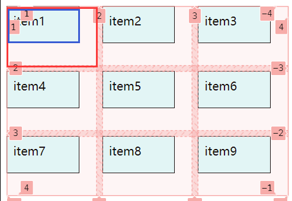
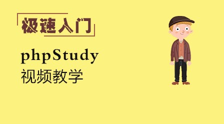

# grid 网格布局中的项目对齐属性与 gird 快速布局的示例

## 一、grid 网格布局中的项目对齐属性

提及 grid 网格容器中项目对齐我们首先要知道的是网格单元在容器中的对齐。我们需要知道的是，grid 网格布局时是否设置了网格单元的大小，因为如果没有设置网格单元的大小的话，也就是网格单元自适应，这时候就不会产生剩余空间。


如果没有剩余空间的话，那么网格单元的在容器中的对齐就没有了任何的意意义。

`一个有剩余空间的容器如下`


当一个容器中有了剩余空间之后才有必要和有去设置对齐方式的意义。

决定网格单元在容器中对齐方式的属性是`place-content`，这个属性是在容器中定义的。

它决定了网格单元是如何去分配容器的剩余空间的，是按照`所有网格单元看成一个整体`还是`每一个网格单元是一个独立的个体`去划分剩余空间的归属。

1. 所有网格单元看成一个整体

| 垂直方向 | 水平方向 | 解释                       |
| -------- | -------- | -------------------------- |
| start    | start    | (默认值)垂直向上，水平向左 |
| start    | center   | 垂直向上，水平居中         |
| satrt    | end      | 垂直向上，水平向右         |
| center   | start    | 垂直居中，水平向左         |
| center   | center   | 垂直水平居中               |
| center   | end      | 垂直居中，水平向右         |
| end      | start    | 垂直向下，水平向左         |
| end      | center   | 垂直向下，水平居中         |
| end      | end      | 垂直向下，水平向右         |

等于是将整个容器空间分成了 3\*3 的九宫格布局，容器中的所有网格单元看成一个整体，然后 place-content 属性控制这个整体的移动。(如果垂直方向和水平方向的值是一样的，那么就只需要写一个值就行，例如:`place-content:center center;`等价于 `place-content:center;`)

 2. 每个网格单元是一个独立的个体

`这个值的定义也是两值，和“1”中的定义方法一样，不过一般都是将它使用单值表示的，双值并不常用`

| 值            | 解释                   |
| ------------- | ---------------------- |
| space-between | (垂直水平方向)两端对齐 |
| space-around  | (垂直水平方向)分散对齐 |
| space-evenly  | (垂直水平方向)平均对齐 |

演示效果：

两端对齐


分散对齐


平均对齐
  
3. 项目在网格单元中的对齐方式

和网格单元在容器中的对齐很是相似，控制项目在网格单元中对齐方式的属性是`place-item`，这个属性是在容器中定义的。

`place-item`属性和`place-content`属性是一样的用法，同样的，项目要设置大小，不然网格单元中没有剩余空间，这样对齐就毫无意义。



蓝色框圈住的是项目大小，红色框圈住的是网格单元大小。

`place-item`也是单双值表示，单值表示垂直方向和水平方向值一样，双值则分别代表了垂直方向和水平方向的设置。不过它一般也是单值使用居多。

| 垂直方向 | 水平方向 | 解释                       |
| -------- | -------- | -------------------------- |
| start    | start    | (默认值)垂直向上，水平向左 |
| start    | center   | 垂直向上，水平居中         |
| satrt    | end      | 垂直向上，水平向右         |
| center   | start    | 垂直居中，水平向左         |
| center   | center   | 垂直水平居中               |
| center   | end      | 垂直居中，水平向右         |
| end      | start    | 垂直向下，水平向左         |
| end      | center   | 垂直向下，水平居中         |
| end      | end      | 垂直向下，水平向右         |

这里演示一下项目在网格单元中的居中：


可以看到的是此时所有项目都在网格单元中居中显示了。  
4. 容器中指定项目在单元格中的对齐方式

通过上述解释，我们知道了所有的项目在网格单元中的对齐方式，不过，有的时候我们仅仅只需要其中的某一个或者某几个去选择对齐方式，这时候就引出了控制指定项目在单元格中对齐方式的属性：`place-self`，这个属性是在项目中定义的。

place-self 属性的值和 place-item 的值是相同的，这里就不一一列举了，仅做个演示示例。
示例，将 item1 项目单个进行居中处理，其余的保持原样。


## 二、 grid 快速布局示例

1. 使用 grid 布局完成一个经典的栅格布局组件

栅格组件的效果如下


栅格布局系统分为两步:
第一步先创建一个行;
第二步在行中进行列的划分

具体实现：
html 代码

```html
<!DOCTYPE html>
<html lang="zh-CN">
  <head>
    <meta charset="UTF-8" />
    <title>模拟12列栅格布局</title>
    <link rel="stylesheet" href="css/grid.css" />
  </head>
  <body>
    <div class="container">
      <!-- 栅格布局系统分为两步:
        第一步先创建一个行;
        第二步在行中进行列的划分  -->
      <!-- 一等份 -->
      <div class="row">
        <div class="item col-12">12列</div>
      </div>
      <!-- 二等份 -->
      <div class="row">
        <div class="item col-6">六列</div>
        <div class="item col-6">六列</div>
      </div>
      <!-- 三等份 -->
      <div class="row">
        <div class="item col-4">4列</div>
        <div class="item col-4">4列</div>
        <div class="item col-4">4列</div>
      </div>
      <!-- 四等份 -->
      <div class="row">
        <div class="item col-3">3列</div>
        <div class="item col-3">3列</div>
        <div class="item col-3">3列</div>
        <div class="item col-3">3列</div>
      </div>
      <!-- 六等份 -->
      <div class="row">
        <div class="item col-2">2列</div>
        <div class="item col-2">2列</div>
        <div class="item col-2">2列</div>
        <div class="item col-2">2列</div>
        <div class="item col-2">2列</div>
        <div class="item col-2">2列</div>
      </div>
      <!-- 12等份 -->
      <div class="row">
        <div class="item col-1">1列</div>
        <div class="item col-1">1列</div>
        <div class="item col-1">1列</div>
        <div class="item col-1">1列</div>
        <div class="item col-1">1列</div>
        <div class="item col-1">1列</div>
        <div class="item col-1">1列</div>
        <div class="item col-1">1列</div>
        <div class="item col-1">1列</div>
        <div class="item col-1">1列</div>
        <div class="item col-1">1列</div>
        <div class="item col-1">1列</div>
      </div>
      <!-- 混合使用 -->
      <div class="row">
        <div class="item col-3">3列</div>
        <div class="item col-6">6列</div>
        <div class="item col-3">3列</div>
      </div>
    </div>
  </body>
</html>
```

css 代码

```css
* {
  padding: 0;
  margin: 0;
  box-sizing: border-box;
}

body {
  width: 100vw;
  height: 100vh;
  display: grid;
  place-content: center;
}
.container {
  /* border: 1px solid #000; */
  min-width: 80vw;
  display: grid;
  gap: 0.5rem;
}

.container > .row {
  display: grid;
  /* 将一行划分为12等份 */
  grid-template-columns: repeat(12, 1fr);
  min-height: 3rem;
  gap: 0.5rem;
}

.container > .row > .item {
  padding: 0.5rem;
  text-align: center;
  background-color: lightcyan;
  border: 1px solid;
  border-radius: 0.3rem;
}

.col-12 {
  /* 从当前行开始扩展12列 */
  grid-area: auto / span 12;
}
.col-11 {
  grid-area: auto / span 11;
}
.col-10 {
  grid-area: auto / span 10;
}
.col-9 {
  grid-area: auto / span 9;
}
.col-8 {
  grid-area: auto / span 8;
}
.col-7 {
  grid-area: auto / span 7;
}
.col-6 {
  grid-area: span 1 / span 6;
}
.col-5 {
  grid-area: auto / span 5;
}
.col-4 {
  grid-area: auto / span 4;
}
.col-3 {
  grid-area: span 1 / span 3;
}
.col-2 {
  grid-area: span 1 / span 2;
}
.col-1 {
  grid-area: auto / span 1;
}
```

2.使用 grid 快速布局实现 php.cn 首页面的主要组件

这里我们可以使用以前介绍过的绝对定位来实现登录界面，也就是一个模态框。

由于 js 还没有掌握，所以轮播图组件依旧是用一张照片代替，这里仅完成了部分组件的模拟，其中还有部分问题没有解决。这里我用的是 rem 单位进行字体大小设置，不过展示效果不是很好，建议如果不是做响应式布局，还是使用 px 单位比较好，另外，这里的各个组件的尺寸还有颜色都是量过的，并不是随便写的。

示例代码：

html 代码

```html
<!DOCTYPE html>
<html lang="zh-CN">
  <head>
    <meta charset="UTF-8" />
    <meta name="viewport" content="width=device-width, initial-scale=1.0" />
    <title>仿php中文网主页</title>
    <!-- 初始化 -->
    <link rel="stylesheet" href="css/demo8/reset.css" />
    <!-- 模态框 -->
    <link rel="stylesheet" href="css/demo8/modal.css" />
    <!-- 文字图标 -->
    <link rel="stylesheet" href="iconfont/iconfont.css" />
    <!-- 页眉 -->
    <link rel="stylesheet" href="css/demo8/header.css" />
    <!-- 菜单区 -->
    <link rel="stylesheet" href="css/demo8/menu.css" />
    <!-- 推荐课程 -->
    <link rel="stylesheet" href="css/demo8/course.css" />
    <!-- 页脚 -->
    <link rel="stylesheet" href="css/demo8/footer.css" />
  </head>
  <body>
    <!-- 页眉 -->
    <header>
      <div>
        <a href=""></a>
      </div>
      <div class="nav-top">
        <a href="">首页</a>
        <a href="">视频教程</a>
        <a href="">入门教程</a>
        <a href="">社区问答</a>
        <a href="">技术文章</a>
        <a href="">资源下载</a>
        <a href="">编程词典</a>
        <a href="">工具下载</a>
        <a href="">PHP培训</a>
      </div>
      <button class="button">登录</button>
    </header>
    <!-- 模态框 -->
    <div class="modal">
      <!-- 蒙板：用来盖住后面的内容，使它半透明 -->
      <div class="modal-coverback"></div>
      <!-- 主体 -->
      <div class="modal-body">
        <button class="close">关闭</button>
        <form action="" method="POST">
          <table>
            <caption>
              用户登录
            </caption>
            <tr>
              <td><label for="username">用户名:</label></td>
              <td>
                <input type="text" name="username" id="username" required />
              </td>
            </tr>
            <tr>
              <td><label for="psd">密&nbsp;&nbsp;&nbsp;&nbsp;码:</label></td>
              <td><input type="password" name="psd" id="psd" required /></td>
            </tr>

            <tr>
              <td></td>
              <td><button>登录</button></td>
            </tr>
          </table>
        </form>
      </div>
    </div>

    <!-- 菜单区 -->

    <div class="menu">
      <div class="menu-left">
        <div>
          <a href="">php开发</a>
          <a href=""><div class="iconfont icon-jiantou"></div></a>
        </div>
        <div>
          <a href="">前端开发</a>
          <a href=""><div class="iconfont icon-jiantou"></div></a>
        </div>
        <div>
          <a href="">服务端开发</a>
          <a href=""><div class="iconfont icon-jiantou"></div></a>
        </div>
        <div>
          <a href="">移动开发</a>
          <a href=""><div class="iconfont icon-jiantou"></div></a>
        </div>
        <div>
          <a href="">数据库</a>
          <a href=""><div class="iconfont icon-jiantou"></div></a>
        </div>
        <div>
          <a href="">服务器运维&下载</a>
          <a href=""><div class="iconfont icon-jiantou"></div></a>
        </div>
        <div>
          <a href="">在线工具箱</a>
          <a href=""><div class="iconfont icon-jiantou"></div></a>
        </div>
        <div>
          <a href="">常用类库</a>
          <a href=""><div class="iconfont icon-jiantou"></div></a>
        </div>
      </div>
      <div class="menu-top">
        <ul>
          <li><a href="">PHP头条</a></li>
          <li><a href="">独孤九贱</a></li>
          <li><a href="">学习路线</a></li>
          <li><a href="">在线工具</a></li>
          <li><a href="">趣味课堂</a></li>
          <li><a href="">社区问答</a></li>
          <li><a href="">课程直播</a></li>
          <li><input type="text" placeholder="输入关键字" /></li>
        </ul>
      </div>
      <div>
        <a href=""></a>
      </div>
      <div class="menu-bottom">
        <ul>
          <li>
            <a href=""></a>
          </li>
          <li>
            <a href=""></a>
          </li>
          <li>
            <a href=""></a>
          </li>
          <li>
            <a href=""></a>
          </li>
        </ul>
      </div>
    </div>

    <!-- 过渡区 -->

    <div class="transit">
      <a href=""></a>
    </div>

    <!-- 新闻区 -->

    <!-- 推荐课程 -->
    <div class="course">
      <h3><span>&lt;/&gt;</span>php入门精品课程<span>&lt;/&gt;</span></h3>
      <ul>
        <li>
          <a href=""></a>
        </li>
        <li>
          <a href=""></a>
        </li>
        <li>
          <a href=""></a>
        </li>
        <li>
          <a href=""></a>
        </li>
        <li>
          <a href=""></a>
        </li>
        <li>
          <a href=""></a>
        </li>
        <li>
          <a href=""></a>
        </li>
        <li>
          <a href=""></a>
        </li>
        <li>
          <a href=""></a>
        </li>
        <li>
          <a href=""></a>
        </li>
        <li>
          <a href=""></a>
        </li>
        <li>
          <a href=""></a>
        </li>
        <li>
          <a href=""></a>
        </li>
        <li>
          <a href=""></a>
        </li>
      </ul>
    </div>

    <!-- 页脚 -->

    <footer>
      <div class="main">
        <div class="main-left">
          <ul class="main-lefttop">
            <li><a href="">网站首页</a></li>
            <li><a href="">PHP视频</a></li>
            <li><a href="">PHP实战</a></li>
            <li><a href="">PHP代码</a></li>
            <li><a href="">PHP手册</a></li>
            <li><a href="">词条</a></li>
            <li><a href="">手记</a></li>
            <li><a href="">编程词典</a></li>
            <li><a href="">php培训</a></li>
          </ul>
          <p>php中文网：公益在线php培训，帮助PHP学习者快速成长！</p>

          <p>
            Copyright 2014-2020 https://www.php.cn/ All Rights Reserved |
            苏州跃动光标网络科技有限公司 | 苏ICP备2020058653号-1
            <a href=""></a>
            <span>
              <a href="">关于我们</a>
              <a href="">免责声明</a>
              <a href="">赞助与捐赠</a>
              <a href="">广告合作</a>
            </span>
          </p>
        </div>
        <div class="main-right">
          
          &nbsp;&nbsp;
          
        </div>
      </div>
    </footer>
  </body>
  <script src="js/modal.js"></script>
</html>
```

reset.css 代码

```css
* {
  padding: 0;
  margin: 0;
  box-sizing: border-box;
}

html {
  font-size: 10px;
}

a {
  color: #444;
  text-decoration: none;
}
a:hover {
  cursor: pointer;
}
li {
  list-style: none;
}

body {
  background-color: #f3f5f7;
}

/* 媒体查询 */
@media screen and (min-width: 480px) {
  html {
    font-size: 4px;
  }
}
@media screen and (min-width: 640px) {
  html {
    font-size: 6px;
  }
}
@media screen and (min-width: 720px) {
  html {
    font-size: 8px;
  }
}

@media screen and (min-width: 1280px) {
  html {
    font-size: 10px;
  }
}
```

header.css 代码

```css
header {
  /* padding: 0.5rem; */
  background-color: black;
  height: 6rem;
  display: grid;
  grid-template-columns: 14rem 8fr 3fr;
  place-items: space-between;
  margin-bottom: 3rem;
}

header img {
  width: 14rem;
  /* height: 6rem; */
}

header .nav-top {
  font-size: 1.5rem;
  display: grid;
  grid-template-columns: 6.8rem repeat(8, 1fr);
  place-items: center;
}

header .nav-top a {
  height: 6rem;
  color: #b3b3b3;
  line-height: 6rem;
}

header .nav-top a:hover {
  color: #fafafa;
  transition: 0.5s;
  border-bottom: 3px solid lightgreen;
}

header .button {
  background-color: black;
  color: #b3b3b3;
  padding-right: 3rem;
  font-size: 1.5rem;
  outline: none;
  border: none;
  place-self: center end;
}
header .button:hover {
  cursor: pointer;
  opacity: 0.8;
}
```

modal.css 代码

```css
/* 模态框样式 */

/* 蒙版 */
/* 使用固定定位 */
.modal .modal-coverback {
  background-color: rgb(0, 0, 0, 0.5);
  position: fixed;
  top: 0;
  left: 0;
  right: 0;
  bottom: 0;
}
/* 主体 */
.modal .modal-body {
  padding: 1rem;
  /* min-width: 20rem;
  min-height: 15rem; */
  border: 1px solid #000;
  /* 设置渐变色 */
  background: linear-gradient(to right, lightcyan, #fff);

  /* 固定定位 */
  position: fixed;
  /* top: 0;
  left: 0;
  right: 0;
  bottom: 0; */
  /* margin: auto; */
  /* 实现屏幕居中 */
  top: 50%;
  left: 50%;
  /* 向后平移以自身为基准的50% */
  transform: translate(-50%, -50%);
}
.modal form table {
  width: 80%;
}
.modal form table caption {
  font-weight: bold;
  margin-bottom: 2rem;
}
.modal form table td {
  padding: 0.5rem 0;
  margin-bottom: 3rem;
}
.modal form table td:first-of-type {
  width: 5rem;
}
.modal form table td input {
  width: auto;
  height: auto;
}
.modal form table button {
  width: 10rem;
  height: 3rem;
}
.modal form table button:hover {
  opacity: 0.8;
  cursor: pointer;
}

.modal-body {
  position: relative;
}
.modal .close {
  font-size: 1rem;
  position: absolute;
  width: 4rem;
  height: 2rem;
  top: 1rem;
  right: 1rem;
}
.modal .close:hover {
  cursor: pointer;
  background-color: lightcyan;
  color: #000;
  box-shadow: 0 0 2px #eee;
}
/* 页面初始化时，模态框应该隐藏 */
.modal {
  display: none;
}
```

menu.css 代码

```css
/* 菜单区 */

.menu {
  /* margin-bottom: 2rem; */
  width: 120rem;
  height: 51rem;
  /* background-color: #ccc; */
  margin: 2rem auto;
  display: grid;
  grid-template-columns: 21.6rem 1fr;
  grid-template-rows: 6rem 1fr 12rem;
}

.menu img {
  width: 100%;
}

.menu .menu-left {
  padding: 2rem 0;
  grid-area: span 3;
  background-color: #2b333b;
  display: grid;
  grid-template-rows: repeat(8, 1fr);
  border-top-left-radius: 1rem;
  border-bottom-left-radius: 1rem;
}

.menu .menu-left > div {
  padding: 1rem;
  display: flex;
  justify-content: space-between;
  align-items: center;
}

.menu .menu-left > div > a {
  font-size: 1.5rem;
  color: #b3b3b3;
}

.menu .menu-left > div:hover {
  background-color: #666;
  cursor: pointer;
}

.menu .menu-top {
  padding: 0.5rem;
  background-color: #fff;
  border-top-right-radius: 1rem;
}

.menu .menu-top > ul {
  height: 6rem;
  font-size: 1.5rem;
  display: grid;
  grid-template-columns: repeat(7, 8.3rem) 1fr;
  place-items: center;
}
.menu .menu-top > ul > li:last-of-type {
  place-self: center;
}

.menu .menu-top > ul > li:last-of-type input {
  padding: 1rem;
  background-color: #f1f0f0;
  font-size: 1.7rem;
  outline: none;
  border: none;
  box-shadow: 1px 1px #b3b3b3;
  border-radius: 0.5rem;
}

.menu .menu-top > ul > li:last-of-type input:hover {
  background-color: #f1f9f9;
  transition: 0.5s;
}

.menu .menu-bottom {
  padding: 0.5rem;
  background-color: #fff;
  border-bottom-right-radius: 1rem;
}

.menu .menu-bottom ul {
  display: grid;
  height: 12rem;
  grid-template-columns: repeat(4, 1fr);
  gap: 0.5rem;
  place-items: center;
}

.menu .menu-bottom ul li img {
  border-radius: 0.5rem;
}

.transit {
  /* background-color: lightgreen; */
  width: 120rem;
  height: 8rem;
  margin: 2rem auto;
}

.transit img {
  border-radius: 0.8rem;
}
```

course.css 代码

```css
.course {
  width: 120rem;
  height: 64.6rem;
  padding: 1.5rem 0;
  margin: 3rem auto;
  background-color: white;
  display: grid;
  grid-template-rows: 5rem 1fr;

  border-radius: 0.5rem;
}

.course h3 {
  width: 120rem;
  font-size: 2rem;
  color: #444;
  text-align: center;
  margin-bottom: 3rem;
}

.course h3 span {
  color: skyblue;
}

.course img {
  width: 100%;
  height: 100%;
  border-radius: 0.5rem;
}
.course ul {
  padding: 1.5rem;
  width: 120rem;
  height: calc(64.4rem - 7rem);
  display: grid;
  grid-template-columns: repeat(5, 1fr);
  grid-template-rows: repeat(3, 1fr);
  gap: 1rem;
}

.course ul li:first-of-type {
  grid-area: span 2;
}

.course ul li:hover {
  opacity: 0.8;
  transition: 0.5s;
}
```

footer.css 代码

```css
footer {
  height: 17.4rem;
  background-color: #333;
  padding-top: 2rem;
}

footer .main {
  width: 120rem;
  height: 15.4rem;
  margin: 1rem auto;
  padding: 1.5rem 0;
  display: grid;
  grid-template-columns: 90rem 30rem;
}

.main .main-left {
  height: 12.4rem;
  display: grid;
  grid-template-rows: 2.8rem 4.1rem 5.5rem;
}

.main .main-left .main-lefttop {
  width: 47.3rem;
  height: 2.8rem;
  display: grid;
  grid-template-columns: repeat(5, 5.9rem) 3.4rem 3.4rem 5.9rem 5.4rem;
  place-items: center end;
}

.main .main-left .main-lefttop li a {
  color: #c3c3c3;
  font-size: 1.3rem;
}

.main .main-left .main-lefttop li a:hover {
  color: #f3f3f3;
}

.main .main-left p {
  color: #666;
  font-size: 1.1rem;
}

.main .main-left p:first-of-type {
  padding-top: 2rem;
  /* place-content: end start; */
}

.main .main-left p:last-of-type {
  display: grid;
  padding-top: 2rem;
  grid-template-columns: 1fr 1.5rem 25rem;
  place-content: start;
}

.main .main-left p:last-of-type img {
  width: 1.5rem;
  margin-right: 1rem;
}

.main .main-left p:last-of-type span {
  display: grid;
  grid-template-columns: repeat(4, 1fr);
  place-items: start end;
  margin-right: 1rem;
}

.main .main-left p:last-of-type span a {
  color: #666;
}
.main .main-right img {
  width: 100px;
  height: 100px;
}
```

这里面没有解决的问题就是两个，一个是页眉区的 php 中文网的那个 logo 我不能将它直接给背景色隐藏在内容区。第二个问题是课程区的多余部分的那个文字弹框不知道怎么实现那样的动画设置,所以我就设置了个图片充满内容区。

效果如下：


