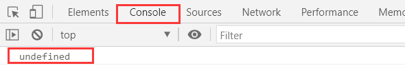
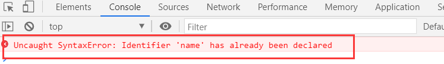
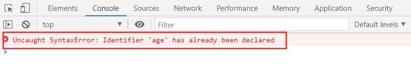

# js 中的常量、变量和数据类型以及 html 文档三种引入 js 的方式

js 是基于事件驱动的异步单线程的脚本编程语言，它的全称是 JavaScript，虽然里边有个 java 字样，但是和 java 编程语言一点关系都没有。它是一种脚本语言，基于解释器执行，它是边解释便执行的语言。浏览器控制台 Console 是一个浏览器内置的 JS 代码解释器。所以我们可以通过这个解释器来查看我们要展示的内容。调用语句为`Console.log()` 。

## 一、js 中的常量、变量和数据类型

1. 变量
   声明 （let）： 使用 let 声明一个变量，接下来的代码中不能再使用 let 对这个变量重复声明，但是这个变量在接下来的使用过程中，值可以重新更新。

例如：我们声明一个变量 name

> let name; (此时我们可以在浏览器的 Console 中看到它)
> console.log(name;)（此时我们可以看到的是它的默认值是 undefind）



此时你在对 name 进行声明

> let name;（再次声明）

可以看到的是，它会报错，说是已经声明



不过你可以对 name 进行赋值更新，这是被允许的。

> name = 'an';
> console.log(name);

2.常量

特殊的变量（只可以读取），常量声明后既不能删除，也不能更新，也不能二次声明。所以常量进行声明的话，必须进行初始化,而变量是可以将声明和初始化分开完成的。

声明常量所用到的是 const

例如：我们声明一个常量 age=18。

> const age = 18;

这时候一个常量就声明完成了，此时你既不可以对它进行赋值更新，也不能二次声明。

> const age = 20;



可以看到的是，二次声明之后，它会进行报错，说是已经定义了

3.数据类型

3.1 原始类型（数值,字符串,布尔,undefined,null,Symbol）

3.1.1 数值

数值类型数据可以是整数，也可以是小数。

定义一个数值类型的数据

> let age = 18;

3.1.2 字符串

定义一个字符串类型数据

> let str = 'haha';

字符串类型的数据是可以拼接的，使用 '+' 可以将两个字符串拼接起来，并且它和 python 中的不一样，python 中的拼接，必须是数据类型相同的，而 js 中则没有限制。它可以是数值和字符串的拼接。

3.1.3 布尔类型

布尔类型就只有 true 和 false 两个值

定义一个布尔类型的数据

> let isOpen = true;

3.1.4 undefined 类型

undefined 类型是所有未初始化变量的默认值

例如说你定义一个变量，它并没有初始化，这时候，这个变量就是一个 undefined 类型的数据

3.1.5 null（空对象）

定义一个 null 型数据

> let null_name = null;

3.1.6 符号(创建对象属性的唯一标识)

符号数据类型的创建是需要用到 Symbol()

> let sym = Symbol()

原始类型的数据所采用的都是“值传递”，举个例子来说明。

> let a = 100;
> let b = a;
> console.log(b);

此时在浏览器中可以看到的是 b = 100，

如果说将 a 的值改变，那么此时 b 的值会发生变化吗？我们来测验一下。

> a = 200;
> console.log(b);

在浏览器中查看 b 的值，可以看到的是，b 的值并没有发生变化，在对 b 进行赋值的时候，仅仅是将 a 的值传递给了它，所以当 a 的值发生变化时，b 的值并没有任何的变化。

3.2 引用类型(对象，数组，函数)

3.2.1 对象

对象有六种创建方式，这里只提一种：对象字面量，作为示例。
创建一个对象字面量

> let people = {
> // 创建一个对象的字面量的方式，和其他面向对象语言区创建一个类特相似
> // 对象中的属性：无序的键值对
> id: 1,
> name: "an",
> old: 12,
> "my email": "js@email.com",
>
>       // 对象中的方法：函数
>      getName() {
>       // this指当前对象,也就是类成员引用自身属性的时候的调用方式(当前上下文)
>      return "My name is:" + this.name;
>
> },
> };

对象访问的时候特别像实例化对象的访问方法

>      console.log(people.id);
>     //   当属性名是由 ''圈起来的时候,它的引用方式如下
>
> console.log(people["my email"]);
> console.log(people.getName());

3.2.2 数组

js 中的数组和 python 中的列表一样，和 c 语言不一样，它并不是说只能存同一类型的数据，它可以同时存放不同类型的数据。

比如说，我要定义一个数组，它里边的数据既有数值，也有字符串。

> let arr = [25, "an", 66];

这样在 js 中定义一个数组是完全没有问题的。

js 中的数组类型的数据访问是使用索引从 0 开始的。

3.2.3 函数

函数可以是 `function + 函数名 + () + {函数内容}`组成

也可以简化写成`函数名 + () + {函数内容}` 组成

有意思的是，当 const 定义的是一个引用类型的数据时,例如说数组，它只要是不整体进行更新,就不会报错,也会完成更新操作

例如，我们定义了一个数组常量，然后对这个数组常量中的某一项进行修改，它并不会报错，而当我们整体对它进行修改时就会报错。

引用类型是“引用传递”的，引用类型的传递对原数据修改后，引用后的数据也会随之变化。

例如：

> const list = [1, 2, 3];
> // 当 const 定义的是一个引用类型的数据时,例如说数组
> // 它只要是不整体进行更新,就不会报错,也会完成更新操作
> list[1] = 22;
> // 可以看到的是可以更新的
> console.log(list);
> // 整体更新时会报错,例如:
> // list = [4, 5, 6];
> const li = list;
> list[1] = "haha";
> // 可以看到的是,当 list 中的值变了之后,li 中的值也会随之变化
> console.log(li);
> // 引用传递就是传递内存地址,可以理解为指针

## 二、html 文档引入 js 的方式

html 文档引入 js 一共有三种方式

1. 直接写到 html 事件属性中
   事件属性：对事件定义它的回调方法，它的值是 js 代码
   事件属性： “on” + 事件名称， 例如点击事件：`onclick`

例如：我们创建一个按钮事件 button

> \<button
> onclick="console.log(this.innerHTML);this.style.background = 'yellow'">
> 按钮 1
> \</button>

这样设置是完全可以的，不过如果一旦事件变得多起来，这一行代码就会看起来非常的臃肿，而且不利于代码的复用。 2. js 代码量少,且仅在当前 html 页面使用,可以直接写在 script 标签中

我们继续创建一个按钮事件 button

> \<button class="botton4">
> 按钮 2</button> > \<script>
> const btns = document.querySelector(".botton4");
> btns.addEventListener("click", show_s);
> function show_s() {
> console.log(btns.innerHTML);
> btns.style.background = "green";
> }
> </script>

3.外部脚本：将 js 代码 保存为一个单独的 js 文件，再通过 script 标签引入到当前的 html 文档中

> \<button class="botton3">按钮 3</button> > \<script src="js/demo2.js"></script>

demo2.js 代码

```js
const btn = document.querySelector(".botton3");
btn.addEventListener("click", show);

function show() {
  console.log(btn.innerHTML);
  btn.style.background = "blue";
}
```
