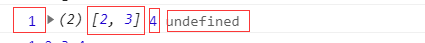

# 数组与对象的解构与常用的流程控制方法

## 一、 解构

理论上来说任何类型都可以解构,但是工作中基本上只会用到对象和数组，所以我们最关注的就是数组和对象的解构。

### 1.对象的解构

首先我们需要的是声明一个对象，这里我们使用 const 声明一个对象

> const user = {
> name: "zhuzhuxia",
> age: 18,
> };

我们可以在一个对象中可以声明的属性是很多的，当我们得到一个对象数据时，我们想要在外部声明一个变量或者多个变量，它的值是来自这个获得的对象时,我们可以直接使用对象进行引用。

> let name = user.name;
> let age = user.age;

但是如果对象中的属性名称不是一个单词时，例如：

> const user = {
> 'my name': "zhuzhuxia",
> age: 18,
> };

此时，我们可以看到的是对象 user 中的一个属性名称是'my name'，对于这样的属性，很明显是无法用对象直接引用的，这样会报错。

所以，解构就显得尤为重要，它不仅能帮助我们获得对象中的属性值，还能让工作变得简单。

解构一个对象数据，例如上边的 user 对象。

> ({ name, age } = { name: "zhuzhuxia", age: 18 });

解构时要求等号两边类型一致,而且两边的变量名也要相等。（这里使用的是一个自定义的对象，并没有引用 user 对象，只是为了强调说明两边的类型要一样，并且两边的变量名要相等。只是为了更加直观的显示。）

当等号两边的变量不相等时，左边的变量支持自定义值

例如说：

> ({ name, age, gender} = { name: "zhuzhuxia", age: 18 });

可以看到的是，左边的变量中多出来一个，此时是不匹配的，但是不会报错，只是此时多出来的变量的值是 undefined，这时候是支持对左边的值进行自定义的。对于相对应的变量，对它进行初始化自定义是没有意义的。

现在回到上边的难题，解决'my name'属性无法被引用的问题。对象的解构是支持别名设置的，所谓的别名设置如下

> ({ 'my name': name, age } = { 'my name': "zhuzhuxia", age: 18 });

此时对这个别名进行其他操作就是没有问题的了，对于这种不是一个单词组成的属性名，我目前就知道这一种方法从对象中引用出来。

对于上述的我们都是自定义的对象来进行解构的，只是为了强调说明和直观的显示，其简化写法如下：

> ({ name, age } = user);

这样的解构操作，是不是可以省下绝大的工作量。

### 2.数组解构

进行数组的解构,将等号左边部分看成是模板，它的解构和对象差不多,不过因为数组中只有值没有属性名,所以左边的模板名称可以任你取。你可以同时解构好些个数据项,也可以只解构一个,但左右两边的类型必须一致。

例如：我们定一个数组，我们知道的是数组是一个有序的集合体，所以在解构过程中，不能是想取哪个取哪个，是有顺序的解构。

> const pet = ['cat', 'dog', 'pig',];

我们定义了一组宠物数组，现在我们对它进行解构，

> let [pet1, pet2, pet3,] = pet;

你也可以只解构一个，或者两个

> let [pet1, pet2,] = pet;

这样的操作也是可以的。

再次进行强调的是等号左右的类型一定要一致。

例如：

> const arr = [1, [2, 3], 4];
> [arr1, arr2, arr3, arr4] = arr;

这样的解构就是错误的，因为原数组只有三项，第二项元素是一个数组，所以它解构出来的结果就是这样的

可以看到的是左边的值分别是 1，[2,3]， 4 ， undefined，这就是两边的类型不一致导致的结果。当然，数组的解构同样是支持左边自定义值的。

## 二、流程控制

### 1.流程控制之分支

`一个简单的分支 if`

if 条件语句应该是分支中见到的最多的了吧，平常使用最多的也就是 if 条件判断分支了，可以只有一个简单的单分支操作，也可以是稍微复杂一点的双分支操作，更复杂的就是多分支嵌套了。
if 语句就像是人生的岔路口一样，它是给程序以不同的选择，不同的走向，得到不同的结果。if 语句经常是和 else 搭配的，不过如果是单分支情况的话，就用不到 else，只用一个 if 就解决了。if 条件判断经常是对一个范围的值进行判断。例如说是给出一个数值，然后 if 条件去判断这个数值位于哪个区间，然后给出结果。对于需要判断的情况较多时，就变成了`if - else if - else;`多重分支条件判断。

对于双分支的`if - else;`语句，我们经常会使用三元运算的方式简化双分支条件判断。

例如：

> let grade = 50;
> if (grade >= 60) {
> console.log("及格了");
> } else {
> console.log("补考吧");
> }

对于上边的双分支条件判断，我们可以使用三元运算简化如下：

> let grade = 50;
> let score = grade >= 60 ? "及格了" : "补考吧";

`单值多分支判断神器switch`

switch 语句的结构是`switch(value){case value: result;break;...}`
一般情况下还有个默认值`default`，它是所有的 case 条件都匹配不到时所做出的响应。
例如：

> let response = "success";
> switch (response) {
> case "fail":
> console.log("请求失败");
> break;
> case "success":
> console.log("请求成功");
> break;
> case "error":
> console.log("参数错误");
> break;
> default:
> console.log("未知错误");
> break;
> }

### 3.流程控制之循环

`入口型循环：while语句`

循环中常用到的数据结构是数组。
我们来使用 while 循环来遍历一个数组。

> const arr = [1, 2, 3, 4];
> let i = 0;
> // 设置循环条件
> while (i < arr.length) {
> console.log(arr[i]);
> // 更新循环条件
> i++;
> }

`出口型循环：do - while语句`

`do - while`语句是很少使用的循环语句，因为作为出口型循环语句，它是不管条件合适与否，都会执行一次的，除非是那种必须强制执行的，不然`do - while`语句一般不用。

例如，我们继续引用上述数组，对它的条件进行小小改动，我们让 i>a.length;

> i = 0;
>
> do {
> console.log(i);
> i++;
>
> } while (i > arr.length);

这样它就会强制的执行一次。

`for循环语句`

for 循环语句的结构是：`for(初始化循环变量; 设置循环条件;更新循环条件){...}`

例如，我们使用 for 循环语句代替上边的 while 语句

> for (let i = 0; i < arr.length; i++) {
> console.log(arr[i]);
> }

for 循环语句不仅可以遍历数组，同样可以遍历对象

`for - in语句`

使用`for - in`语句遍历对象，打印对象中的键值对

> for (let key in user) {
> // 只输出值
> // console.log(user[key]);
> // 输出键值对
> console.log(`${key}:${user[key]}`);
> }

`for - of语句`

'for - of'语句是一种遍历迭代器结构的数据（例如数组）来进行遍历（更加通用）

> for (let value of arr) {
> // 只输出值
> console.log(value);
> // 输出键值对
> // console.log(`${key}:${user[key]}`);
> }
