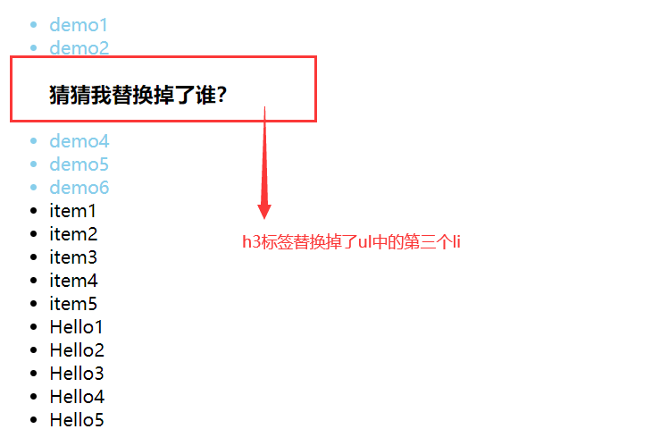
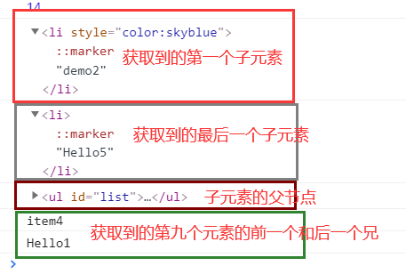

# js 中的构造函数与常用的 dom 元素操作(dom 元素的增删改查)

## 一、构造函数与原型

js 是一门面向对象的编程语言，但是在 js 中是没有类和继承的概念的，ES6 之前都是基于原型的继承模式，而在 ES6 中开始正式的支持类和继承，不过，ES6 的类都仅仅是封装了 ES5.1 构造函数加原型继承的语法糖，所以说，js 是基于原型的继承。

### 1.构造函数

构造函数是对象工厂，是用来创建对象的，js 中没有类的概念，它是基于原型的，所以简单的将构造函数当成“类”。构造函数必须使用关键字 “new” 来调用，普通函数则不用。new 的过程就是类的实例化过程，就是创建一个对象的过程。

我们先来看看原来工厂函数创建一个对象的方式

```js
function createUser(name, age) {
  let o = new Object();
  o.name = name;
  o.age = age;
  o.look = function () {
    return "这是" + this.name;
  };
  return o;
}

let user1 = createUser("小花", 18);
let user2 = createUser("小白", 20);
```

工厂函数已经可以解决创建多个类似对象的方式，就像是其他面向对像中的类，不过它都是基于 Object 的对象模型，无法解决对象标识问题（即新创建的对象是什么类型）

我们接着用构造函数来写上边的例子：

```js
function User(name, age) {
  // 1. 创建一个新对象，用this来表示(伪代码，系统自动执行)
  // const this = new User;
  // 2.初始化对象，给对象添加一些自定义属性，用来和其他实例进行区分
  this.name = name;
  this.age = age;
  // 3. 返回这个对象
  // return this;
  this.look = function () {
    return "这是" + this.name;
  };
}
const user = new User("小花", 18);
console.log(user instanceof User);

// 打印的结果为true
```

可以看到的是构造函数可以自定义对象的类型，即给使用某一构造函数的一个标签，不在只是单一的 Object，构造函数相对于工厂函数没有显式的创建对象，它将属性和方法都直接赋给了 this，也没有返回值 return。

### 2.构造原型 prototype 与对象原型**proto**

任何一个函数都有一个原型属性：`prototype`（箭头函数除外）,只要创建一个函数，就会为这个函数创建一个`prototype`属性，而使用构造函数创建一个实例时，这个实例内部的`prototype`指针就会被赋值为构造函数上的原型对象。在一些浏览器上，对于对象的原型属性设置为`__proto__`，我们拿上边的实例 user 与构造函数做个演示

```js
// 在对象的原型属性上添加一个属性gender
user.__proto__.gender = "女";

// 在构造函数的原型属性上添加一个方法show()
User.prototype.show = function () {
  return { name: this.name, age: this.age, gender: this.gender };
};
console.log(user);
console.dir(User);
console.log(user.__proto__ === User.prototype);
//返回结果为true
```


可以看到的是`对象中的原型属性__proto__ === prototype(构造函数中的原型)`,实例的原型永远指向它的构造函数的原型，实例的原型从构造函数的原型中继承成员（属性/方法）,可以理解为：实例与构造函数原型有直接联系，但实例与构造函数之间没有。所以说，需要被所以实例共享的成员，应该被写到构造函数的原型上，属性通常是不应该共享的，它是区分不同对象实例的标志，共享的应该是方法。

`calss（类）一种基于原型和构造函数的语法糖结构`

与函数类型相似，定义类也有两种主要方式：；类声明和类表达式。

- 类声明：class User{}

- 类表达式：const User = class{};

在下边我们将使用类声明的方式声明一个类

```js
class User1 {
  // 构造方法
  constructor(name, age) {
    this.name = name;
    this.age = age;
  }
  // 原型方法，必须要使用类实例调用
  show() {
    console.log("这里是父类");
    return { name: this.name, age: this.age, phone: this.#phone };
  }

  // 静态方法：不需要对象实例调用，直接用类调用
  static fetch() {
    // 静态方法中的 this 是指当前类，不是类实例
    // 静态方法中访问的都应该是静态成员
    this.hi(this.str);
    return "这是静态方法";
  }
  static str = "这是静态成员";
  static hi(name) {
    console.log("hi" + name);
    return 0;
  }

  // 私有成员，只能在类中使用，类外，子类都不能使用
  #phone = 110;
  // 声明为私有主要是为了访问限制
  // 访问器属性可以设置，修改私有成员
  // 获取
  get age() {
    return this.#phone;
  }
  // 修改
  set age(value) {
    this.#phone = value;
  }
}
// 调用原型方法
const user1 = new User1("小红", 18);
console.log(user1.show());
// 静态方法直接使用类调用
console.log(User1.fetch());
```

在类中，原型方法是只有创建了类实例也就是对象之后，由对象才能进行调用的，而静态方法是只有类才能进行调用的，私有属性在类作用域外是不能被访问到的，不过可以通过访问器属性进行获取修改来实现对私有属性的外部访问。

## 二、dom 元素操作（增删改查）

### 1. 获取 dom 元素

通常获取 dom 元素是使用 css 选择器来获取的。

这里通过介绍两种通用的获取方法来进行演示，其他的 dom 操作会列出来，但是不会进行演示操作。

下边我使用一组列表来进行 dom 元素获取操作的演示

```html
<!DOCTYPE html>
<html lang="zh-CN">
  <head>
    <meta charset="UTF-8" />
    <meta name="viewport" content="width=device-width, initial-scale=1.0" />
    <title>dom操作：获取dom元素</title>
  </head>
  <body>
    <!-- 使用列表演示元素获取 -->
    <ul id="list">
      <li class="item">item1</li>
      <li class="item">item2</li>
      <li class="item">item3</li>
      <li class="item">item4</li>
      <li class="item">item5</li>
    </ul>
  </body>
</html>
```

- 获取满足条件的所有元素:`document.querySelectorAll("selector");`

例如要获取到所有的 li

```js
const lies = document.querySelectorAll("#list li");
console.log(lies);
```

已经拿到了所有的 li。可以来看一下结果是否正确


可以看到的是获取到的数据是 Nodelist 类型，它是浏览器内置的集合类型，属于类数组。可以使用 Array.from()方法或者...rest 归并方法，可以将 Nodelist 类型改为数组类型。

```js
let arr = Array.from(lies);
console.log(arr);
let larr = [...lies];
console.log(larr);
```

不过 Nodelist 类型数据自带 forEach()方法，可以直接用 forEach()进行遍历操作。

- 获取满足条件的第一个元素:`document.querySelector("selector")`

例如要获取到第一个 li（当然使用第一种也是可以办到的）

```js
// 使用第一种方式获取第一个li
let firstItem = document.querySelectorAll("#list li:first-of-type");
// 不管获取几个元素，它的返回值都是一个集合Nodelist,以通过添加索引的方法拿到里边的值
console.log(firstItem[0]);
let first = document.querySelector("#list li");
console.log(first);
// first === firstItem;
```

使用`document.querySelector("selector")`获取到的值是一个正常值，没有外壳，可以直接拿来使用。

下边介绍一些针对性的传统方式获取 dom 元素

```js
// 传统方式
//根据id获取
console.log(document.getElementById());
// 根据标签名获取
console.log(document.getElementsByTagName());
// 获取表单元素
console.log(document.getElementsByName());
// 根据类名获取
console.log(document.getElementsByClassName());

// 有几个快捷方式，用来快速获取某一个或者某一类元素
// html
console.log(document.documentElement);
// head
console.log(document.head);
// body
console.log(document.body);
// title
console.log(document.title);
// forms(获取所有表单元素)
console.log(document.forms);
// imgs(拿到所有图片)
console.log(document.images);
//anchors(拿到所有的链接)
console.log(document.anchors);
```

### 2. 创建一个元素

仍旧使用上边的列表元素来演示创建元素的方法

创建一个元素:`document.createElement("html元素");`

```js
// 获取到当前li的父节点ul
const ul = document.querySelector("#list");
//可以使用parent.appendChild(newEl)方法，在父元素上调用
ul.appendChild(li);
// 直接添加文本内容
li.innerText = "item6";
// li.innerHTML = "item6"
```


```js
// innerHTML和innerText的区别是：是否解析html文档
// 也可以直接使用一个html文档的字符串来进行添加
let htmlStr = "<li>item6</li>";
// 将html字符串直接解析为dom元素
//   ul.insertAdjacentHTML(位置，html字符串)；
ul.insertAdjacentHTML("beforeEnd", htmlStr);
```

效果和上边的一样

如果需要大量添加元素，为了减少 dom 操作，应该使用文档片段完成

```js
// 创建一个文档片段
//   const frag = document.createDocumentFragment();
const frag = new DocumentFragment();
// 使用for 循环进行添加
for (let i = 0; i < 5; i++) {
  const li = document.createElement("li");
  li.textContent = "Hello" + (i + 1);
  // 将生成的节点先临时挂载到文档片段中去
  frag.appendChild(li);
}
// 将文档片段挂载到页面中
ul.appendChild(frag);
// 也可以使用写好的html文档字符串进行多个添加,然后使用insertAdjacentHTML()
htmlStr = `
      <li style="color:skyblue">demo1</li>
      <li style="color:skyblue">demo2</li>
      <li style="color:skyblue">demo3</li>
      <li style="color:skyblue">demo4</li>
      <li style="color:skyblue">demo5</li>
      <li style="color:skyblue">demo6</li>
      `;
// 关键字after/before,Begin/End
ul.insertAdjacentHTML("afterBegin", htmlStr);
```


### 3. 更新操作

更新替换原来的元素:同层级的替换`document.querySelector("selector").replaceWith(要替换的元素)`;从父级替换掉子元素`parent.replaceChild(要替换的元素, document.querySelector("selector"))`。

```js
// 更新操作
let h3 = document.createElement("h3");
h3.innerHTML = "猜猜我替换掉了谁？";
// 将第三个元素替换掉

// 同层级替换
document.querySelector("li:nth-of-type(3)").replaceWith(h3);
// 在父级元素替换掉子元素
ul.replaceChild(h3, document.querySelector("li:first-of-type"));
```




### 4.移除操作

移除元素:`ul.removeChild(document.querySelector("子元素"));`

```js
// 移除掉ul中的标签
ul.removeChild(document.querySelector("#list h3"));
```


### 5. 遍历查询操作

获取所有子元素，在父节点下使用，获取当前父节点下所有子元素

```js
let lies = ul.children;
console.log(lies);
// 获取子元素数量
let liesNums = ul.children.length;
console.log(liesNums);
// 这个也是获取子元素数量
liesNums = ul.childElementCount;
console.log(liesNums);
```


还有获取子元素的语法糖系列

```js
// 语法糖系列

// 拿到第一个子元素
console.log(ul.firstElementChild);
//最后一个子元素
console.log(ul.lastElementChild);
// 父节点
console.log(ul.lastElementChild.parentElement);
// 前一个兄弟
// 需要获取当前元素的位置
const ninth = document.querySelector("#list li:nth-of-type(9)");
// ninth.style.color = "red";
const eight = ninth.previousElementSibling;
console.log(eight.innerHTML);

// 后一个兄弟
const ten = ninth.nextElementSibling;
console.log(ten.innerHTML);
```


