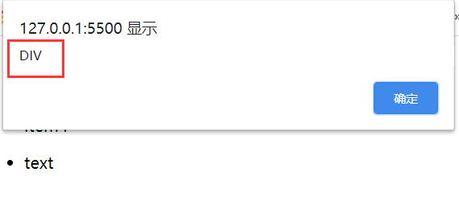

# 常用的字符串方法介绍以及使用事件代理实现一个留言板

## 一、常用的字符串方法

1.concat()方法:字符串拼接，在大量的生成 html 代码时用处很大，而且可以自动类型转换

```js
let str = " html ".concat(" css ", " js ", " ! ", 666);
console.log(str);
// str = "html css js ! 666";
```

2.slice(起始位置，结束位置)方法:取子串

```js
// 支持负数操作
str = "hello world!";
let str1 = str.slice(0, 5);
console.log(str1);
// str1 = "hello";
// 省略第二个参数就是从当前起始位置一直到字符串结束

// 从倒数第一个字符开始往前数，也就是-1开始
str1 = str.slice(-6);
console.log(str1);
// str1 = world!
```

3.substr(起始位置，获取的长度)方法：取子串

```js
let str2 = str.substr(0, 7);
console.log(str2);
// str2 = "hello w";

// 同样支持负数操作,取操作是从左至右
str2 = str.substr(-6, 3);
console.log(str2);
// str2 = "wor";
```

4.trim()方法:删除两端空格

```js
let psd = "   root123456   ";
console.log(psd.length);
// psd = "   root123456   ";
// psd.length = 16;

// 去空格
console.log(psd.trim().length);
// psd = "root123456";
// psd.length = 10;
```

5.split()方法:将字符串打包成数组

```js
let res = str.split("");
console.log(res);
//res = ["h", "e", "l", "l", "o", " ", "w", "o", "r", "l", "d", "!"];
// 用途：比如说从邮箱中解析出用户名和邮箱地址

res = "admin@admin.com".split("@");
console.log(res);
// res = ["admin", "admin.com"];
```

6.charAt(n)方法:从字符串中获取单个字符，n 代表字符串中字符的索引值

```js
let cat = "cat";
console.log(cat.charAt(1));
// cat.charAt(1) = 'a';

// 将字符串当成一个类数组使用
console.log(cat[1]);
// cat[1] = 'a';
```

7.toLowerCase()方法:将字符串全部转换成小写

```js
let str = "Hello world";
let res = str.toLowerCase();
console.log(res);
// res = "hello world";
```

8.toUpperCase()方法:将字符串转换为大写

```js
let str = "hello world";
let res = str.toUpperCase();
console.log(res);
// res = "HELLO WORLD";
```

9.includes()方法:判断一个字符串是否包含另一个字符串,返回结果是布尔值

```js
let str = "Hello World";
console.log(str.include("hello"));
// 返回值为false,因为include方法是区分大小写的
```

10.replace()方法:替换掉字符串中的一段

```js
let str = "HELLO World";
let res = str.replace("HELLO", "Hello");
console.log(res);
// res = "Hello World";
```

## 二、事件代理机制，以及使用事件代理完成一个简单的留言板案例

事件代理，又称之为事件委托。是 JS 中常用绑定事件的技巧。“事件代理”是把原本需要绑定在子元素的响应事件（click、keydown......）委托给父元素，让父元素担当事件监听的职务。事件代理的原理是 DOM 元素的事件冒泡。

想要知道事件代理，首先需要知道的是事件传递。事件的传递行为分为两种，一种是捕获，另一种就是冒泡。捕获行为：从最外层元素，逐级向内捕获，直到事件的绑定者/触发者（从模糊到清晰的过程）;冒泡行为:从目标由内向外逐级向上直到最外层元素（从清晰到模糊的过程）,冒泡行为是事件传递过程中的默认行为。

冒泡行为的演示：

```html
<!DOCTYPE html>
<html lang="zh-CN">
  <head>
    <meta charset="UTF-8" />
    <meta name="viewport" content="width=device-width, initial-scale=1.0" />
    <title>事件冒泡</title>
  </head>
  <body onclick="alert(this.tagName)">
    <div onclick="alert(this.tagName)">
      <ul onclick="alert(this.tagName)">
        <li onclick="alert(this.tagName)">text</li>
      </ul>
    </div>
  </body>
</html>
```

通过给每个元素添加了点击事件来模拟一下事件的冒泡行为，点击一下 text





而事件代理是基于事件的冒泡行为来完成的，在事件代理中，事件的触发者(ev.target)通常是事件绑定者(ev.currentTarget)的的子元素，因为这样会让事件的传递效率更加的高效。

使用事件代理来完成一个简单的留言板案例

```html
<!DOCTYPE html>
<html lang="zh-CN">
  <head>
    <meta charset="UTF-8" />
    <title>留言板</title>
  </head>
  <body>
    <label>留言板:&nbsp;&nbsp;<input type="text" name="messageBoard" /></label>
    <ol id="list"></ol>
    <script>
      // 获取元素
      const msg = document.querySelector("input");
      const lists = document.querySelector("#list");

      // 创建事件，当内容输入文本框时，将其打印到下边
      msg.onkeydown = (ev) => {
        // 键盘事件中的key属性，表示按下的键名
        // console.log(ev.key);
        if (ev.key === "Enter") {
          // 非空判断
          if (ev.currentTarget.value.length === 0) {
            alert("内容为空");
            msg.focus();
          } else {
            // 将留言内容添加到列表中
            // 创建留言
            let olStr = `<div><li>${ev.currentTarget.value}</li><button onclick="del(this)">删除</button></div>`;
            // 应该将最新的信息放在第一条
            lists.insertAdjacentHTML("afterBegin", olStr);
            // 按下回车后，清空留言板
            ev.currentTarget.value = null;
          }
        }
      };

      // 删除留言
      function del(ele) {
        // DOM接口的outerHTML属性获取描述元素（包括其后代）的序列化HTML片段。它也可以设置为用从给定字符串解析的节点替换元素。
        // 返回时，内容包含描述元素及其后代的序列化HTML片段。
        return confirm("是否删除?") ? (ele.parentNode.outerHTML = null) : false;
      }
    </script>
  </body>
</html>
```

显示效果如下：


由于设置的是每次都是将最新的留言置顶，所以会让原来的留言自动向下排列


点击删除按钮，会弹窗提示，然后确认后会删除，如果是删除的中间的留言，会将后边的留言顺序自动调整一位。
