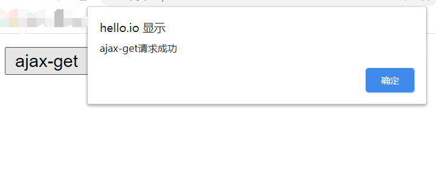
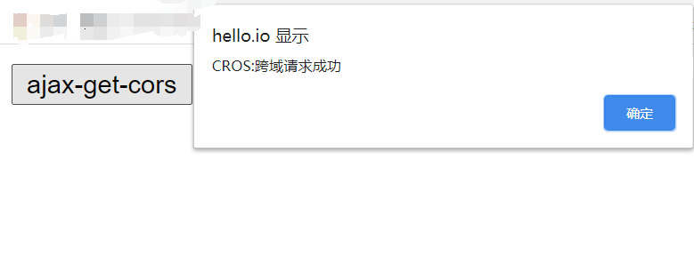
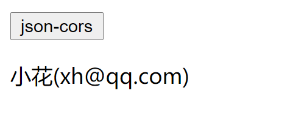

# js 中数组常用方法介绍以及 JSON 对象的两个方法展示和跨域请求问题解决方案

## 一、js 中数组常用方法

1.push()方法:在数组的尾部插入一个元素

```js
let arr = [];
arr.push(1);
arr.push(2);
arr.push(3);
console.log(arr);
// arr = [1, 2, 3];
```

2.pop()方法:从数组的尾部进行弹出操作，返回值是弹出的值，进行 pop 操作后，数组中相对应位置的值会删除

```js
console.log(arr.pop());
//3
console.log(arr.pop());
//2
console.log(arr.pop());
//1
```

3.unshift()方法:在数组的头部插入一个元素

```js
arr.unshift(1);
arr.unshift(2);
arr.unshift(3);
console.log(arr);
// arr = [3,2,1];
```

4.shift()方法:从数组的头部弹出一个元素

```js
console.log(arr.shift());
//3
console.log(arr.shift());
//2
console.log(arr.shift());
//1
```

5.join()方法：与字符串的 split()方法相反，它是将数组转为字符串返回一个新的字符串

```js
arr = ["电脑", "手机", "耳机", "手表", "折刀"];
let res = arr.join();
// join()的默认参数是 ',' ,使用逗号将数组元素隔开
console.log(res);
// res = "电脑,手机,耳机,手表,折刀";
res = arr.join("和");
console.log(res);
// res = "电脑和手机和耳机和手表和折刀";
// js中的字符串是可以当数组一样使用的，支持索引取字符串中的字符
```

6.concat()方法:数组合并

```js
console.log([1, 2, 3].concat([4, 5], [6, 7]));
// [1, 2, 3, 4, 5, 6, 7];
// concat()方法中的参数不一定是数组类型，其他的都可以
console.log([1, 2, 3].concat(456, "小花", true, { a: 1, b: 2 }));
//[1, 2, 3, 456, "小花", true, {…}];
// 可以看到的是，它会将所有的数据全部合并到一个数组中，其中每项都是数组的一个元素
// concat()方法的返回一定是一个一维数组，它里边的参数如果包含一个数组，或是多个数组，它并不会生成一个多维数组，而是将里边的数组参数展开，然后进行合并
```

7.slice(起始位置，选取的数量)方法:获取数组中的部分成员

```js
// 创建数组副本使用，支持负数操作，取值方向是从左至右
arr = [1, 2, 3, 4, 5];
// 数组的深拷贝方式，和使用for循环添加的性质相似
res = arr.slice(0);
console.log(res);
//[1, 2, 3, 4, 5];
```

8.splice(开始索引，删除的数量，插入的数据...)方法:数组的增删改,它的主要工作是删除元素

```js
// 删除
// 从索引是2的元素开始删除，没有第二个参数，就代表从当前开始一直删完，它的返回值是删除的元素
res = arr.splice(2);
console.log(res);
console.log(arr);

// 更新操作
arr = [1, 2, 3, 4, 5];
// 例如将2，3更新成22，33
// res = arr.splice(1, 2, 22, 33);
// 第三个参数不支持数组传参，不管是多少个值，都必须写成单值，不过可以使用...rest合并参数方法进行简写
res = arr.splice(1, 2, ...[22, 33]);
console.log(res);
console.log(arr);

// 新增操作
arr = [1, 2, 3, 4, 5];
// 将第二个参数设置为0,这样就不会有元素被删除
res = arr.splice(1, 0, ...[22, 33]);
console.log(res);
console.log(arr);
```

9.sort()方法:对数组中的元素进行排序

```js
arr = ["a", "s", "i", "y"];
console.log(arr);
console.log(arr.sort());
// 如果说，数组中出现其它类型的数据，就会报错
arr = [47, 79, 4, 2, 8, 83, 2];
console.log(arr);
console.log(arr.sort());
// 使用自定义方式来进行

// 这里使用回调函数的方式来自定义
//升序
console.log(arr.sort((a, b) => a - b));
//降序
console.log(arr.sort((a, b) => b - a));
```

10.filter()方法:进行数组中的元素过滤筛选

```js
arr = [1, 2, 3, 4, 5];
// filter()方法中的参数是过滤规则
res = arr.filter((item) => item % 2);
console.log(res);
//[1, 3, 5];
res = arr.filter((item) => !(item % 2));
console.log(res);
//[2, 4];
```

## 二、JSON 对象的两个方法

JSON: JavaScript Object Notation(JS 对象表示法)，它独立于任何编程语言, 几乎所有编程语言都提供了访问 JSON 数据的 API 接口，JSON 是一种语法,用来序列化其它语言创建的数据类型。

JSON 对象中的两个方法分别是:
1.JOSN.stringify(data(js 数据),replacer(对数据的处理方式), space(限定输出格式)):将 js 数据转为 JSON
2.JSON.parse(str, reviver),将 JSON 转为 js 对象

`1.JOSN.stringify()方法`：将 JS 数据转换成 JSON 类型

JSON.stringify() 方法将一个 JS 对象或值转换为 JSON 字符串，如果指定了一个 replacer 函数，则可以选择性地替换值，或者指定的 replacer 是数组，则可选择性地仅包含数组指定的属性。

```js
console.log(JSON.stringify(555), typeof JSON.stringify(555));
//555 string;
// JSON中字符串要加引号
console.log(JSON.stringify("aaa"), typeof JSON.stringify("aaa"));
//"aaa" string;
console.log(JSON.stringify(true), typeof JSON.stringify(true));
//true string;
console.log(JSON.stringify(null), typeof JSON.stringify(null));
//null string;
// JSON中对象的属性必须加双引号，字符串也一样
console.log(
  JSON.stringify({ a: 1, b: 2 }),
  typeof JSON.stringify({ a: 1, b: 2 })
);
//{"a":1,"b":2} string;
console.log(JSON.stringify([1, 2, 3]), typeof JSON.stringify([1, 2, 3]));
//[1,2,3] string;

// 第二个参数支持数组和函数
// 数组
console.log(JSON.stringify({ a: 1, b: 2, c: 3 }, ["a", "b"]));
//{"a":1,"b":2};

// 函数
console.log(
  JSON.stringify({ a: 1, b: 2, c: 3 }, (k, v) => {
    if (v < 2) return undefined;
    return v;
  })
);
//{"b":2,"c":3};

// 第三个参数，用来格式化输出JSON字符串
// 第三个参数默认是空格输出，可以输入数字来控制空格数量，也可以输入自定义字符串
console.log(JSON.stringify({ a: 1, b: 2, c: 3 }, null, "111"));
//{111"a": 1,
//111"b": 2,
//111"c": 3
//};
```

JSON 其实不是数据类型，只是一个具有特殊格式的字符串而已,由上边的示例可以看到的是，JSON 对象中只支持数值，字符串，null，布尔值，对象和数组这几种数据类型，并且所有 js 的数据转换成 JSON 对象都是字符串类型。

`2.JSON.parse(str, reviver)方法`：将 JSON 转换为 JS 对象

JSON.parse() 方法用来解析 JSON 字符串，构造由字符串描述的 JavaScript 值或对象。提供可选的 reviver 函数用以在返回之前对所得到的对象执行变换(操作)。

```js
let obj = JSON.parse(`{"a":1,"b":2}`);
//   console.log(obj);
// 第二个参数控制哪些参数返回哪些不返回
obj = JSON.parse(`{"a":1,"b":2}`, (k, v) => {
  // JSON对象解析是由内向外的
  if (k === "") return v;
  return v * 2;
});
console.log(obj);
// {a: 2, b: 4};
```

## 三、跨域请求问题解决方案

### 1. Ajax (Asynchronus JavaScript+XML,即异步 JavaScript 加 XML) 异步请求技术

- **同步与异步**
  以 "前端请求,后端响应" 为例

  - 同步: 前端发请求, 必须等到后端响应完成,才允许发送另一个请求
  - 异步: 前端发请求后不等待后端响应结果继续执行,后端响应完成通过事件通知前端处理

- XHR 对象: **XMLHttpRequest** 对象
  XHR 为发送服务器请求和获取响应提供了合理的接口，这个接口可以可以实现异步从服务器获取额外的数据，意味着用户点击不用页面刷新也可以从服务器获取数据。通过 XHR 对象获取数据之后，可以使用 DOM 方法将数据插入网页。

**注意**:`XMLHttpRequest`是浏览器对象,而非 JS 内置对象

- 使用 XHR 对象实现 Ajax 异步请求操作

1. 创建 xhr 对象: `const xhr = new XMLHttpRequest()`
2. 配置 xhr 参数: `xhr.open(type, url)`
3. 处理 xhr 响应: `xhr.onload = (...) => {...}`
4. 发送 xhr 请求: `xhr.send(...)`

- xhr 对象常用属性

| 序号 | 方法           | 描述         |
| ---- | -------------- | ------------ |
| 1    | `responseType` | 设置响应类型 |
| 2    | `response`     | 响应正文     |

- xhr 对象常用方法

| 序号 | 方法              | 描述         |
| ---- | ----------------- | ------------ |
| 1    | `open(type,url)`  | 配置请求参数 |
| 2    | `send(data/null)` | 发送请求     |

- xhr 对象常用事件

| 序号 | 事件      | 描述     |
| ---- | --------- | -------- |
| 1    | `load()`  | 请求成功 |
| 2    | `error()` | 请求失败 |

示例: 1.实现 Ajax 的异步 GET 请求

```js
<!DOCTYPE html>
<html lang="zh-CN">
  <head>
    <meta charset="UTF-8" />
    <title>Ajax-GET异步请求</title>
  </head>
  <body>
    <button>ajax-get</button>
    <p></p>
    <script>
      const btn = document.querySelector("button");
      btn.onclick = () => {
        //1. 创建 xhr 对象:
        const xhr = new XMLHttpRequest();
        //2. 配置 xhr 参数:
        // open(请求类型，url)
        xhr.open("get", "test1.php?id=1");
        // 设置响应返回的数据类型为JSON
        xhr.responseType = "json";
        //3. 处理 xhr 响应:
        // 成功
        xhr.onload = () => {
          console.log(xhr.response);
          alert("ajax-get请求成功");
          // 返回成功，将响应结果渲染到页面中：进行dom操作
          let user = `${xhr.response.name}:(${xhr.response.email})`;
          document.querySelector("p").innerHTML = user;
        };
        // 失败
        xhr.onerror = () => {
          console.log("Error");
          document.querySelector("p").innerHTML = `请求失败`;
        };
        //4. 发送 xhr 请求:
        xhr.send(null);
      };
    </script>
  </body>
</html>
```

测试返回结果


对于异步的 POST 请求原理是一样的，在第二步配置 xhr 参数的时候将第一个参数改成'post'就行了，不过 POST 请求一般是对表单数据进行操作，POST 请求的数据是携带在请求体中的，所以在第四步发送 xhr 请求的时候，需要对表单数据进行序列化处理，这时，可以使用`FormData`对象对表单数据进行处理。

- `FormData` 对象

`FormData`是表单数据构造器

| 序号 | 方法                 | 描述     |
| ---- | -------------------- | -------- |
| 1    | `append(name,value)` | 请求成功 |
| 2    | `delete(name)`       | 请求失败 |

除了使用 append 方法添加数据之外，还可以直接传入一个表单元素，直接就将表单元素中的数据作为键/值对填充进去。

所以异步的 POST 操作仅仅需要修改两个部分： 1.在将实现步骤中的第二步配置 xhr 参数的时候，将第一个参数变为"post"; 2.第四步的发送 xhr 请求时，将发送的数据使用`FormData 对象`进行序列化

### 2. 跨域请求问题解决方案

通过 XHR 进行 Ajax 通信的一个主要限制是跨源安全策略。默认情况下，XHR 只能访问与发起请求的页面在同一个域内的资源(同源指：协议相同，域名（主机名）相同，端口号相同)。这个安全限制可以防止某些恶意行为。

- 跨域资源共享( CORS, Cross-Origin Resource Sharing) 定义了浏览器与服务器如何跨源通信。
  CORS 的基本思路是使用自定义的 HTTP 头部允许浏览器和服务器互相了解，以确定请求或响应应该成功或失败。

1. 通过在服务器端添加响应验证信息来实现跨域操作

对于简单的请求，比如说 GET 或者 POST 请求，没有自定义头部，而且请求体是 text/plain 类型，这样的请求在发送时会有一个额外的头部叫 `Origin`。 `Origin`头部包含发送请求的页面的源（协议，域名和端口），以便服务器确定是否为其提供响应。下面是`Origin`头部的一个示例：（这个示例是我所创建的一个本地的服务器）
`Origin: http://hello.io`
如果服务器决定响应请求，那么应该发送`Access-Control-Allow-Origin`头部，包含相同的源，如果资源是公开的，那么头部信息包含就应该为 "\*"关键字。这个关键字就代表这允许所有的页面进行访问，比如说，我想要服务器允许上边的域名 hello.io 进行访问,那么头部信息就应该为：`header('Access-Control-Allow-Origin: http://hello.io');`

所以说，GET 或者 POST 请求也是可以实现跨域资源访问的，只需要将服务端器设置成允许状态（服务器端 herder 头部信息包含 GET 或者 POST 请求页面的源）。

示例：使用 get 方法进行跨域操作

浏览器端代码

```html
<!DOCTYPE html>
<html lang="zh-CN">
  <head>
    <meta charset="UTF-8" />
    <title>Ajax-GET请求跨域操作</title>
  </head>
  <body>
    <button>ajax-get-cors</button>
    <p></p>
    <script>
      // cors: 跨域资源共享
      // 同源策略：为了请求的安全，浏览器禁止通过脚本发起一个跨域的请求
      // 只允许脚本发起基于同源的请求
      const btn = document.querySelector("button");
      btn.onclick = (ev) => {
        // ev.preventDefault();
        //1. 创建 xhr 对象:
        const xhr = new XMLHttpRequest();
        //2. 配置 xhr 参数:
        xhr.open("get", "http://world.io/cors1.php");
        //3. 处理 xhr 响应:
        xhr.onload = () =>
          // document.querySelector("p").innerHTML = xhr.response;
          alert(xhr.response);
        //4. 发送 xhr 请求:get请求使用默认参数null，post请求要使用表单数据构造器FormData
        xhr.send(null);
      };
    </script>
  </body>
</html>
```

服务器端代码

```php
<?php

// 在服务器端开启跨域请求
header('Access-Control-Allow-Origin: http://hello.io');
// *： 表示任何来源都可以
// header('Access-Control-Allow-Origin: *');

echo 'CROS:跨域请求成功';
```

我设置的浏览器端的域名是 hello.io，服务器端的域名是 world.io，两者并不同源。

得到的效果:


2.使用 JSONP 来进行跨域操作

首先我们要知道能够直接跨域操作不受访问限制的成员都有
`<script src="......"></script>`:script 标签的 src 属性
``: img 标签的 src 属性
`<link rel="stylesheet" href=".....">`: link 标签的 href 属性
`<a href="..."></a>`: a 标签的 href 属性
而 JSONP 就是利用了 script 标签中的 src 属性完成的跨域资源共享。

JSONP：JSON with padding, 它是 Web 服务上的一种 JSON 变体，是将 json 数据包含在一个函数调用中。它包括两部分: 回调函数 + json 数组。它实现跨域资源共享的原理是利用了 script 标签发起的请求不受跨域限制的特征，将跨域请求的 url 做为 script 的 src 属性值,实现不需要服务器授权的跨域请求（jsonp 只能完成 get 请求）

示例：使用 JSONP 实现跨域资源访问

```html
<!DOCTYPE html>
<html lang="zh-CN">
  <head>
    <meta charset="UTF-8" />
    <title>jsonp跨域资源共享</title>
  </head>
  <body>
    <button>json-cors</button>
    <p></p>
    <script>
      //1. jsonp的原理模拟

      function getUser(data) {
        let user = `${data.name}(${data.email})`;
        document.querySelector("p").innerHTML = user;
      }

      const btn = document.querySelector("button");
      btn.onclick = () => {
        //1. 生成一个允许跨域请求的html元素
        let script = document.createElement("script");
        // 2. 将跨域请求的url添加到src属性上
        script.src = "http://world.io/cors3.php?jsonp=getUser";
        // 3. 将script挂载到页面中
        document.body.insertBefore(script, document.body.firstElementChild);
      };
      // jsonp进行跨域主要是通过在服务器端生成一条js函数调用
    </script>
  </body>
</html>
```

```php
<?php

// jsonp 不需要授权给前端
// 只需要返回一个使用json作为参数的函数调用语句
// 将前端需要的数据以json格式放到函数的参数中

// 必须要知道前端js需要调用的js函数名称

$jsonp = $_GET['jsonp'];

// 服务器中需要返回的数据

$data = '{ "name": "小花", "email": "xh@xh,com" }';

// 对返回的函数进行拼接
echo $jsonp . '(' .$data .')';
```

返回的结果显示


JSONP 的缺点：
1.JSONP 是从不同的域拉取可执行代码，如果这个域并不可信，则可能在响应中加入恶意内容，此时除了完全删除 JSONP 没有任何办法。  
2.不能准确的判断 JSONP 请求是否失败。
