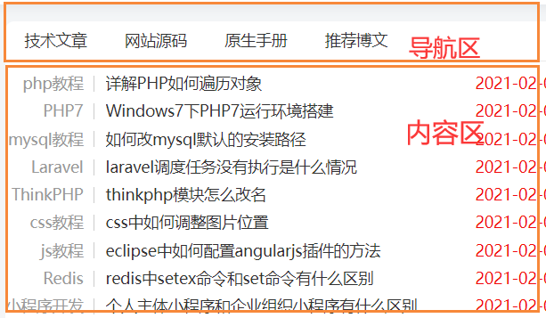
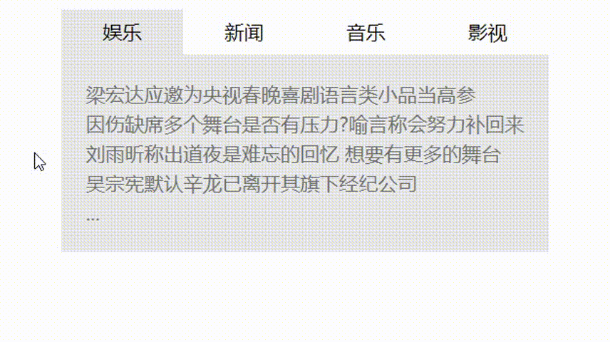
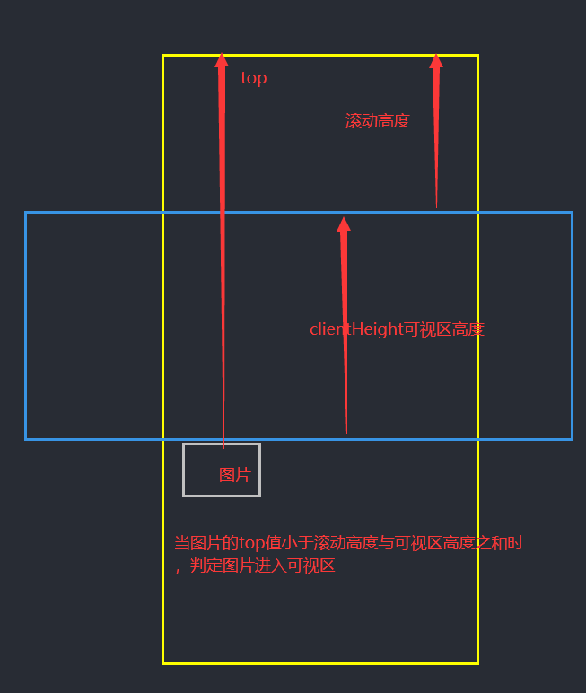
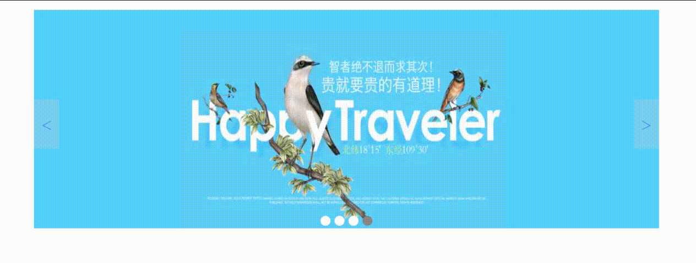

# 使用原生 js 实现选项卡、一键更换背景图片、图片懒加载和轮播图

## 一、选项卡的实现

项卡是由两部分组成，头部是导航部分，内容区是主要内容部分，一下使用 php 中文网主页的一个截图作为示例



选项卡的设计思路:
通过给每个导航区的 li 添加自定义属性，然后让相关联的内容区设置相同的自定义属性,在点击/悬浮在一个 li 上的时候，将其他的内容区内容隐藏起来。

在这里我将导航区下的第一个 li 和其对应的内容区的内容设置为默认打开，即每次刷新时，它都会回到这个默认选项上。

选项卡的内容结构

```html
<body>
  <!-- 设置一个选项卡的内容区块 -->
  <div class="tabs">
    <!-- 导航区 -->
    <ul class="tab">
      <!-- 给每个li定义自定义属然后对应到内容区 -->
      <li class="active" data-index="1">娱乐</li>
      <li data-index="2">新闻</li>
      <li data-index="3">音乐</li>
      <li data-index="4">影视</li>
    </ul>
    <!-- 内容区 -->
    <ul data-index="1" class="item active">
      <li><a href="">梁宏达应邀为央视春晚喜剧语言类小品当高参</a></li>
      <li><a href="">因伤缺席多个舞台是否有压力?喻言称会努力补回来</a></li>
      <li><a href="">刘雨昕称出道夜是难忘的回忆 想要有更多的舞台</a></li>
      <li><a href="">吴宗宪默认辛龙已离开其旗下经纪公司</a></li>
      <li><a href="">...</a></li>
    </ul>
    <ul data-index="2" class="item">
      <li><a href="">如何开好局起好步 习近平这样要求全党</a></li>
      <li><a href="">现场！山东省委书记喊话被困金矿工人 无人回应</a></li>
      <li><a href="">组装原子弹的工程师90岁还要学网购 原来是因为爱情</a></li>
      <li><a href="">抱走佩洛西讲台的男子被捕后 交2.5万美元保释</a></li>
      <li><a href="">...</a></li>
    </ul>
    <ul data-index="3" class="item">
      <li><a href="">后弦原创单曲《铠甲之下》上线 诠释燃魂之心</a></li>
      <li><a href="">王嘉尔宣布将开启个人活动 GOT7解散后成员各自飞</a></li>
      <li><a href="">张学友为石家庄加油：中国抗疫成绩是世界认可的</a></li>
      <li><a href="">韩女团IZONE有望延长活动期限 合同将于4月结束</a></li>
      <li><a href="">...</a></li>
    </ul>
    <ul data-index="4" class="item">
      <li><a href="">阿弗莱克有望执导迪士尼《失落城市的守护者》</a></li>
      <li><a href="">沈腾马丽齐帮忙！常远为何要拍《温暖的抱抱》？</a></li>
      <li><a href="">“性手枪”史蒂夫·琼斯回忆录《手枪》将开拍</a></li>
      <li><a href="">哥谭独立电影奖颁发 《无依之地》获最佳影片</a></li>
      <li><a href="">...</a></li>
    </ul>
  </div>
</body>
```

由于这个是以前写的，所以新闻并不是很新颖，将就看哈，就是随意找的，并没有什么代表性。

css 样式表可以随你自己设计

```css
/* 样式初始化 */
* {
  margin: 0;
  padding: 0;
  box-sizing: border-box;
}

/* 去掉li和a样式 */
li {
  list-style-type: none;
  line-height: 1.5rem;
}
li:hover {
  cursor: default;
}
a {
  color: #717171;
  text-decoration: none;
}
a:hover {
  text-decoration: underline;
  color: orange;
}

/* 设置选项卡块的背景颜色以及其他设置 */
.tabs {
  /* border: 1px solid #000; */
  width: 400px;
  margin: 30px auto;
  background-color: #e6e6e6;

  display: flex;
  flex-direction: column;
}

/* 设置导航区 */
.tab {
  height: 36px;
  display: flex;
}
.tab li {
  flex: auto;
  text-align: center;
  line-height: 36px;
  background-color: #fff;
}

.tab li.active {
  background-color: #e6e6e6;
}
.tab li:hover {
  cursor: pointer;
}

/* 默认所有选项卡只有一个显示,其它隐藏 */
.item {
  padding: 20px;
  display: none;
}
.item.active {
  display: block;
}
```

接下来就是重头戏，DOM 操作，实现选项卡的逻辑
首先要考虑到的是要读取的事件，我们点击事件/鼠标悬浮事件的触发者是 li，但是它是一个子元素，它会冒泡到 ul 上面去，所以我们可以采用事件代理。

```js
// 使用事件代理来对导航区的li操作
const tab = document.querySelector(".tab");

// 获取到内容区的所有列表
const items = document.querySelectorAll(".item");

tab.addEventListener("mouseover", mouseOver);

function mouseOver(ev) {
  //   需要两步：
  //   1. 将之前所有处于的激活状态的选项卡清空，并将当前点击对象激活

  //   我们需要的只是ul下的所有li
  [...tab.children].forEach((item) => {
    // classList更换类样式。使用classList中的remove方法，
    // 移除掉当前导航下的所有li标签class属性的active
    // 然后使用classList中的add方法给事件触发者的class属性添加active
    item.classList.remove("active");
    ev.target.classList.add("active");
  });

  //   2.根据自定义属性data-index找到对应的列表，然后显示出来
  items.forEach((item) => {
    item.classList.remove("active");
    // dataset对象:用户自定义属性
    [...items]
      .filter((item) => item.dataset.index === ev.target.dataset.index)[0]
      .classList.add("active");
  });
  //   console.log([...items][0].dataset.index === 1);
  //   进行筛选，找到当前点击事件data-inex和内容区data-index相同的内容
  //   因为filter返回值是一个数组，所以需要用索引将它取出
}
```

示例的结果显示如下：



## 二、一键更换背景图片

一键更换背景图片的原理很简单，就是使用当前的事件触发者图片的 src 换掉 body 标签中 style 属性的`backgroundImage`的值就行,同样是使用事件代理的方式对其进行 DOM 操作。

就一段代码就设置完了

html 文档结构

```html
<body>
  <div class="container">
    
    
    
    
  </div>
</body>
```

css 样式表可以自己设计哈，想弄啥样弄啥样

```css
.container {
  width: 400px;
  display: grid;
  grid-template-columns: repeat(4, 1fr);
  column-gap: 10px;
}
.container > img {
  width: 100%;
  border: 3px solid #fff;
  opacity: 0.6;
}
.container > img:active {
  opacity: 1;
}
.container > img:hover {
  opacity: 1;
  cursor: pointer;
  width: 105%;
}
body {
  /* 默认背景为第一个图片 */
  background-image: url("../img/hf/1.jpg");
  width: 100%;
  height: 100%;
  /* 背景图垂直、水平均居中 */
  background-position: center center;
  /* 背景图不平铺 */
  background-repeat: no-repeat;
  /* 当内容高度大于图片高度时，背景图像的位置相对于viewport固定 */
  background-attachment: fixed;
  /* 让背景图基于容器大小伸缩 */
  background-size: cover;
}
```

```js
// 事件代理，不需要给每个图片的缩略图添加点击事件，只需要给它的父级添加就可以了
document.querySelector(".container").onclick = (ev) =>
  (document.body.style.backgroundImage = `url(${ev.target.src})`);
```

成品图如下示例：（示例图片是我在彼岸图网上下载的，小姐姐都很好看）


## 三、图片懒加载

图片懒加载的原理：在图片进入到用户可视区时，让自定义的 data-src 的值代替 src 的值
图片懒加载的目的：打开一个网页时，不至于被卡死。图片懒加载只加载当前视口所展现的内容中的图片

当前浏览器执行懒加载过程



html 文档结构
这个图片懒加载需要的图片有点多，就不列出来了，大致的 DOM 结构给出来就行了。

```html
<body>
    <div class="container">
      
      <!-- 下边是一大串图片 -->
</body>
```

css 样式表就不写了

重头戏是 js 代码

```js
// 获取当前所有图片
const imgs = document.querySelectorAll(".container img");
//   console.log(imgs);

// 拿到当前可视区高度
const clientHeight = document.documentElement.clientHeight;
// 监听当前窗口的滚动事件
window.addEventListener("scroll", lazyLoad);
// 在一进入页面就执行这个操作
window.addEventListener("load", lazyLoad);

// 懒加载函数
function lazyLoad() {
  //拿到滚动高度
  let scrollTop = document.documentElement.scrollTop;

  // 遍历图片并判断是否进入可视区
  imgs.forEach((img) => {
    // 只要当前图片距离文档顶部的偏移量小于可视区高度与滚动高度之和，则将这个图片显示出来
    // Ev.offsetTop:表示元素到文档顶部的偏移量
    // clientHeight是可视区高度，这是一个相对固定的值.scrollTop是滚动高度，它是一个动态的值
    if (img.offsetTop < clientHeight + scrollTop) {
      // 为了显示效果明显，可以设置定时器，让它半秒执行一次
      setTimeout(() => (img.src = img.dataset.src), 500);
    }
  });
}
```

浏览器显示结果（全都是好看的小姐姐哦）


## 四、轮播图

轮播图要求的功能：

- 鼠标滑过小按钮，图片随之移动

- 鼠标点击左右两端的翻页按钮，图片能随着变化

- 一但打开页面轮播图中图片每隔 2 秒自动播放，鼠标移入轮播图，图片停止变动，鼠标移除轮播图，图片又开始每隔 2 秒自动播放。

设计思路是将所有图片定位到一个容器上，所有图片共享同一个容器，所有图片设置隐藏状态，然后将第一张图片设为默认图片，图片下方的小按钮根据图片的数量自动生成，小按钮和图片通过自定义属性进行绑定。整体操作通过 dom 完成。

html 文档结构

```html
<body>
  <div class="container">
    <!-- 1.图片组 -->
    <nav class="imgs">
      <a href=""
        ></a>
      <a href=""
        ></a>
      <a href=""
        ></a>
      <a href=""
        ></a>
    </nav>

    <!-- 2. 图片小按钮 -->
    <nav class="btns">
      <!-- 按钮应该根据图片数量自动生成 -->
    </nav>

    <!-- 3.翻页按钮 -->
    <nav class="skip">
      <a href="#" class="prev">&lt;</a>
      <a href="#" class="next">&gt;</a>
    </nav>
  </div>
</body>
```

css 样式表的设计，对于图片一开始的默认设置是在 css 样式表中完成的

```css
/* 初始化 */
* {
  padding: 0;
  margin: 0;
  box-sizing: border-box;
}
a {
  text-decoration: none;
}
/* 轮播图的容器 */
.container {
  width: 62.5em;
  height: 22em;
  margin: 1em auto;
  /* 转为定位元素/定位父级 */
  position: relative;
}

/* 图片设置 */
.container .imgs img {
  /* 默认设置为全部隐藏 */
  display: none;
  /* 宽度和高度完全适应容器大小 */
  width: 100%;
  height: 100%;
  /* 将所有图片进行定位，所有图片共享一个容器 */
  position: absolute;
  top: 0;
  left: 0;
}
/* 设置默认显示的图片 */
.container .imgs img.active {
  display: block;
}

/* 按钮设置 */
.container .btns {
  /* 将按钮定位到容器的底部 */
  position: absolute;
  left: 0;
  right: 0;
  bottom: 0;
  text-align: center;
}

.container .btns a {
  /* 转成行内块元素: 既能水平排列,还支持宽度设置 */
  display: inline-block;
  /* 用padding撑开内容 */
  padding: 0.5em;
  margin: 0 0.2em;
  background-color: #fff;
  border-radius: 50%;
}

/* 默认选中设置背景色 */
.container .btns a.active {
  background-color: #888;
}
.container .btns a:hover {
  cursor: pointer;
}

/* 翻页按钮设置 */

.container .skip a {
  position: absolute;
  width: 2.5rem;
  height: 5rem;
  line-height: 5rem;
  text-align: center;
  opacity: 0.3;
  top: 9rem;
  font-weight: lighter;

  font-size: 2rem;
  background-color: #ccc;
}
.container .skip .prev {
  left: 0;
}
.container .skip .next {
  right: 0;
}
.container .skip *:hover {
  opacity: 0.6;
  color: #666;
}
```

js 来进行 dom 操作，让轮播图动起来

```js
// 拿到所有图片
const imgs = document.querySelectorAll(".container > .imgs img");

// 拿到按钮组
const btnGroup = document.querySelector(".container > .btns");

// 拿到翻页按钮
const skip = document.querySelector(".container > .skip");

// 创建一组与图片对应的小按钮
//为了减少dom操作，所以使用文档碎片的方式进行添加
// 函数中的参数分别是父级元素，图片的数量
function autoCreateBtns(ele, imgLength) {
  //采用文档碎片
  const frag = document.createDocumentFragment();
  // 进行a标签的创建
  for (let i = 0; i < imgLength; i++) {
    const a = document.createElement("a");
    a.herf = "#";
    a.dataset.index = i + 1;
    if (i === 0) a.classList.add("active");
    frag.appendChild(a);
  }
  ele.appendChild(frag);
}
//调用创建小按钮的函数
autoCreateBtns(btnGroup, imgs.length);

// 获取到刚刚生成的四个小按钮
const btns = document.querySelectorAll(".container > .btns > *");

// 声明两个公共函数
// 1.获取到当前激活的元素
function getActiveEle(ele) {
  let activeEles = [...ele].filter((img) => img.classList.contains("active"));
  return activeEles.pop();
}
//   getActiveEle(imgs);

// 2.设置激活元素,函数参数是按钮的索引值，根据按钮索引更换显示的图片
function setActiveEle(btnIndex) {
  [imgs, btns].forEach((arr) => {
    //将之前的状态全部清空
    getActiveEle(arr).classList.remove("active");
    // 判断当前事件的索引值是否和传进来的索引值相等，若相等，设置激活
    arr.forEach((item) => {
      if (item.dataset.index === btnIndex) item.classList.add("active");
    });
  });
}

// 为每个小按钮添加事件
btns.forEach((ele) =>
  ele.addEventListener("mouseover", (ev) =>
    setActiveEle(ev.target.dataset.index)
  )
);

skip.addEventListener("click", skipImg, false);

// console.log(skip.children[1]);

// 将前后翻页,使用一个回调统一处理
function skipImg(ev) {
  // 当前激活的图片,实际上这里用不到它,而应该用它的父级<a>来判断是否存在兄弟节点
  let currentImg = getActiveEle(imgs);
  // 当前图片组父元素,注意父级是<a>,<a>的父级才是需要的父节点
  let parentEle = currentImg.parentElement.parentElement;
  // 当前元素的前一个兄弟节点:previousElementSibling;
  let prevEle = currentImg.parentElement.previousElementSibling;
  // console.log(prevEle);
  // 当前元素的下一个兄弟节点:nextElementSibling;
  let nextEle = currentImg.parentElement.nextElementSibling;
  // console.log(nextEle);
  // 第一张图片, firstElementChild第一个子元素
  let firstImg = parentEle.firstElementChild.firstElementChild;
  // 最后一张图片, firstElementChild, 最后一个子元素
  let lastImg = parentEle.lastElementChild.firstElementChild;
  // console.log(lastImg);

  let activeImg = currentImg;
  // console.log(activeImg);
  // 向前翻页
  if (ev.target.classList.contains("prev")) {
    // console.log(ev.target.classList.contains("prev"));
    // 如果存在前一张图片,就使用它,否则就使用最后一张图片来更新它,形成循环显示的效果
    let activeImg = prevEle !== null ? prevEle.firstElementChild : lastImg;
    // 使用激活元素来同步更新图片与按钮
    // console.log(activeImg.dataset.index);
    setActiveEle(activeImg.dataset.index);
  }
  // 向后翻页
  if (ev.target.classList.contains("next")) {
    // 如果不存在下一张图片,就用第一张图片更新它
    let activeImg = nextEle !== null ? nextEle.firstElementChild : firstImg;
    setActiveEle(activeImg.dataset.index);
  }
}

// 让图片每隔2秒进行自动播放（使用定时器，事件自动派发）
// 单独写一个事件监听器,为后面的事件自动派发做准备
skip.children[1].addEventListener("load", skipImg, false);
let timer = null;
const slider = document.querySelector(".container");
slider.addEventListener("mouseout", startTimer, false);
window.addEventListener("load", startTimer);
slider.addEventListener("mouseover", clearTimer, false);

// 启动定时器
function startTimer() {
  // 创建自定义事件对象
  const clickEvent = new Event("load");
  timer = setInterval(() => skip.children[1].dispatchEvent(clickEvent), 2000);
}

// 清除定时器

function clearTimer() {
  clearInterval(timer);
}
```

**注意**：在事件派发准备这块儿时，不要定义前边已经在当前 DOM 元素上定义过的事件，否则在进行事件触发时，会一次性触发两次，在这里的让轮播图动起来，是使用定时器来操作的。

显示效果：


