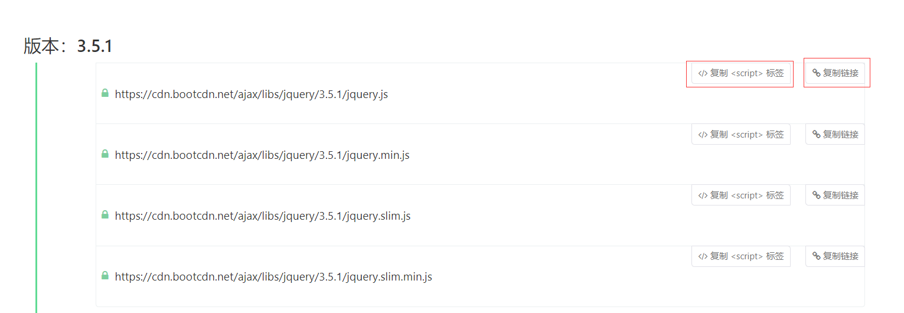
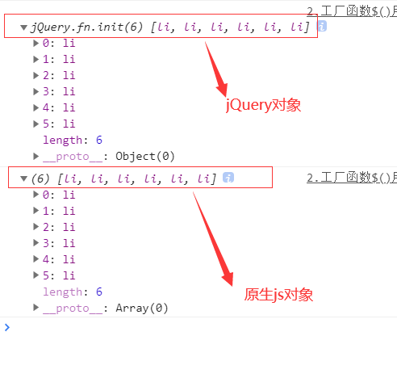
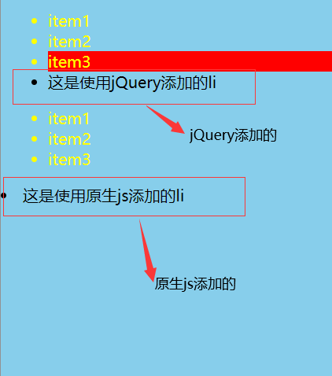
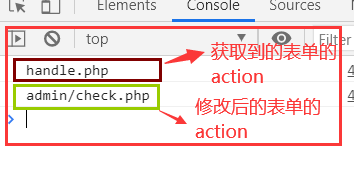
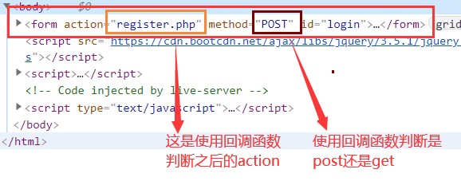
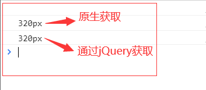
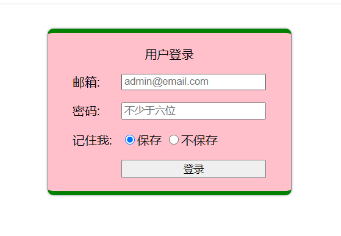
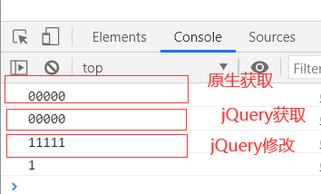
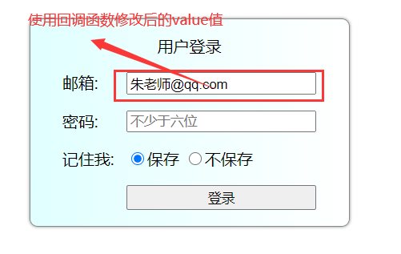
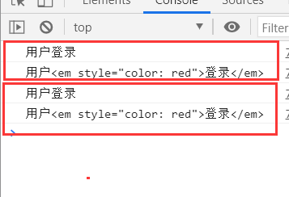

# 初识 jQuery 与$()工厂函数的四种用法，四种好用的 getter/setter 方法

## 一、jQuery 的导入方式与工厂函数$()的四种用法

`jQuery`: jQuery 是一个快速，小型且功能丰富的 JavaScript 库。通过易于使用的 API（可在多种浏览器中使用），它使 HTML 文档的遍历和操作，事件处理，动画和 Ajax 等事情变得更加简单。兼具多功能性和可扩展性，jQuery 改变了数百万人编写 JavaScript 的方式。

导入方式有两种

- 导入 js 本地源码，这个 jQuery 源码可以在[github 远程库](jquery-3.5.1.js)上下载。


导入形式

> \<script src="jquery-3.5.1.js">\</script>

- 采用远程源码库 cdn，这个导入方式不需要下载源码，直接通过 src 导入就行可以在[cdn](https://www.bootcdn.cn/jquery/)上面选择版本，然后选择要导入的方式



导入形式

> \<script src="https://cdn.bootcdn.net/ajax/libs/jquery/3.5.1/jquery.js">\</script>

`$()`: 工厂函数，在 jQuery 中是全局函数，同时也是 jQuery 的别名。如果在 js 中声明了一个变量为 '$' ,那么就不能使用 '$' 来创建 jQuery 对象，就要使用 jQuery 来创建了

```js
let $;
// 此时的 '$' 就被占用，不能使用 '$' 来创建jQuery对象
// 在 '$' 没有被占用前，jQuery('body') === $('body');
// 使用jquery来完成背景颜色添加
jQuery("body").css("background", "skyblue");
```

**工厂函数`$()`的四种用法**

| 序号 | 参数类型  | 用处                                     |
| ---- | --------- | ---------------------------------------- |
| 1    | 选择器    | 获取 dom 元素                            |
| 2    | js 对象   | 将 js 对象转为 jQuery 对象               |
| 3    | html 文本 | 生成 dom 元素                            |
| 4    | 回调函数  | 在页面加载完成，dom 树创建成功后自动调用 |

以下工厂函数的例子都在一个 html 文档结构中展示(同时所有的涉及 jQuery 的语句都是导入了 jQuery 库之后才可以使用的)

```html
<script src="https://cdn.bootcdn.net/ajax/libs/jquery/3.5.1/jquery.js"></script>
<body>
  <ul id="first">
    <li>item1</li>
    <li>item2</li>
    <li>item3</li>
  </ul>
  <ul id="second">
    <li>item1</li>
    <li>item2</li>
    <li>item3</li>
  </ul>
</body>
```

1.$(选择器 selector, 上下文 context): 获取元素

```js
//原生语法,将所有的li标签的字体颜色都设置成红色
document.querySelectorAll("li").forEach((ele) => (ele.style.color = "red"));

// jquery实现，将所有li标签的字体颜色都设置成绿色
$("li").css("color", "green");

// 只将id="first"下的li字体颜色设置成绿色
// $("li", "#first").css("color", "green");
```

对于 css 选择器来说，并没有必要传递第二个参数，直接在第一个参数中直接就可以写完上下文关系 `$("li", "#first") === $("#first li")`

2.$(js 对象):jQuery 包装器，js 对象是原生的 js 对象，作用就是将原生的 js 对象转为 jquery 对象，目的是为了使用 jQuery 中的非常丰富的方法或属性

分别使用原生 js 和 jQuery 来对 css 内联样式进行设置

```js
// 原生js设置内联样式
document.body.style.backgroundColor = "yellow";
// 使用jQuery中的css方法来设置内联样式style
$(document.body).css("background", "skyblue");

// 原生js转为jQuery对象
console.log($(document.querySelectorAll("li")));
// jQuery转为原生js对象集合
// 使用...spread扩展,...rest归并
console.log([...$(document.querySelectorAll("li"))]);
```



3.$(html 文本)：生成 dom 元素

```js
// 原生js语法
document.body.insertAdjacentHTML("afterEnd", "<li>这是使用原生js添加的li</li>");

// jQuery语法
$("<li>这是使用jQuery添加的li</li>").appendTo(document.querySelector("#first"));
```



4.$(callback 回调函数):传一个回调当参数，当页面加载完成后会自动调用它(在页面加载完成，dom 树创建成功后自动调用)

如果将 jQuery 语句写在 dom 树创建之前，对于 dom 操作部分的语句是会失效的，如果是将 dom 操作的语句写在一个函数中，然后以参数的形式传入`$()`工厂函数中，就会在 dom 树创建完成之后自动调用这个函数，不必担心 jQuery 语句的位置问题

## 二、四种好用的 getter/setter 方法

为什么叫这些方法是`getter/setter`方法呢？因为在使用这些方法的时候，和原生 js 中的访问器属性`get/set`非常的相似，`get`方法获取，`set`方法设置。

| 序号 | getter/setter 方法 | 用途                              |
| ---- | ------------------ | --------------------------------- |
| 1    | attr()             | 获取/设置元素属性                 |
| 2    | css()              | 获取/设置元素的行内样式           |
| 3    | val()              | 获取/设置表单控件的 value 值      |
| 4    | html()/text()      | 获取/修改 html 文档/获取/修改文档 |

下面的方法的示例都是在一个 html 文档结构中完成

```html
<form action="handle.php" method="POST" id="login">
  <label class="title">用户登录</label>
  <label for="email">邮箱:</label>
  <input type="email" id="email" placeholder="admin@email.com" />
  <label for="password">密码:</label>
  <input type="password" id="password" placeholder="不少于六位" />
  <label for="confirm">记住我:</label>
  <div>
    <input type="radio" name="save" id="confirm" value="1" checked /><label
      for="confirm"
      >保存</label
    >
    <input type="radio" name="save" id="cancel" value="0" /><label for="cancel"
      >不保存</label
    >
  </div>
  <button name="submit">登录</button>
</form>
```

1.attr():获取/设置元素属性

```js
// 拿到表单
// 原生js方法
// const form = document.forms;

// console.log(form);
// jQuery方法
const form = $("form");
// $("form").submit((ev) => ev.preventDefault());
form.submit((ev) => ev.preventDefault());
// document.querySelector("form").onsubmit = (ev) => ev.preventDefault();
// 查询form的action属性
console.log(form.attr("action"));
form.attr("action", "admin/check.php");
console.log(form.attr("action"));

// 第二个参数支持使用回调函数
form.attr("action", () => {
  // 进行字符串统一格式
  let method = form.attr("method").toLowerCase();
  return method === "get" ? "query.php?id=2" : "register.php";
});
```





attr()方法是支持第二个参数为回调函数的

2.css():获取元素的样式/设置元素的内联样式

css()方法可以获取到当前元素的样式属性，不管是在样式表中的还是行内样式，而原生 js 就得使用计算样式才能获取到样式表中的样式属性

```js
const form = $("form");

// 使用原生的方式获取当前元素的宽度
// 使用style只能获取到内联样式，样式表中的样式是拿不到的
// 必须使用计算样式才能获取
console.log(document.querySelector("form").style.width);
// 使用计算样式获取当前元素样式表中的样式
console.log(
  window
    .getComputedStyle(document.querySelector("form"), null)
    .getPropertyValue("width")
);

// 使用jquery的css()方式来拿到当前元素的宽度
console.log(form.css("width"));
// 可以看到的是很简洁，很方便

// 使用css()来设置css属性
form.css("border-top", "6px solid green");
// css(obj)
form.css({
  "border-bottom": "6px solid green",
  "background-color": "yellow",
});

// 第二个参数支持回调函数
// Math数学函数,Math.radom()生成随机数,Math.floor()向下取整
form.css("background-color", () => {
  const color = ["pink", "lightblue", "lime", "yellow"];
  // 四个元素，对应的索引是0，1，2，3
  let i = Math.floor(Math.random() * color.length);
  return color[i];
});
```

可以看到的是，使用原生 js 获取到样式表中的样式属性是很麻烦的，而使用 jQuery 对象中的 css()就很容易的拿到了样式表中的样式属性



通过回调函数给表单设置随机的背景色，每一次刷新都有可能换成不同的颜色（这里给定了四种颜色）



3.val():获取表单控件的 value 属性

```js
const form = $("form");

// 使用原生方法读取到控件的value值
console.log(document.forms["login"].email.value);

// 使用jquery获取
console.log($('input[type="email"]').val());

$('input[type="email"]').val("11111");
console.log($('input[type="email"]').val());

console.log($("input:radio:checked").val());

// val(callback)
$("input[type='email']").val(() => "朱老师@qq.com");
```

在一开始的时候，我给邮箱控件中的 value 设置了初值"00000"。后边是分别通过原生 js 和 jQuery 获取到的 value 值。



`$(selector).val()`是获取 value，如果要修改 value，则在 val()方法中传入参数就可以修改了，它同样是支持回调函数的。（上边例子中的回调函数中什么都没有做，仅仅是返回了一个字符串）



4.html():innerHTML (text():innerText / TextContent)

jQuery 中的 html()方法相当于原生 js 中的 innerHtml，它可以获取到 html 文档，text()方法和元素 js 中的 innerText / textContent 作用相同，是获取到纯文本信息。

```js
// 原生
console.log(document.querySelector(".title").textContent);
console.log(document.querySelector(".title").innerHTML);

// jQuery
// text()只获取纯文本
console.log($(".title").text());
// html()获取标签加文本
console.log($(".title").html());
```

由于单纯的看文本是一样的，所以将标题那块修改成了`<label class="title">用户<em style="color: red">登录</em></label>`,这样就可以看出html()方法和text()方法的不同



图示中上边的是原生js中的textContent和innerHtml获取到的信息，下边的是jQuery中的text()方法和html()方法获取到的信息。
