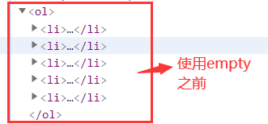
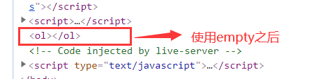
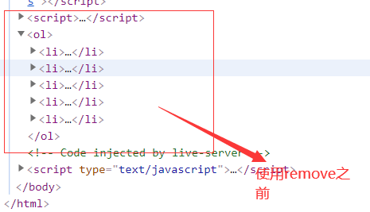
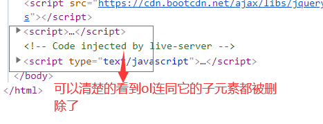
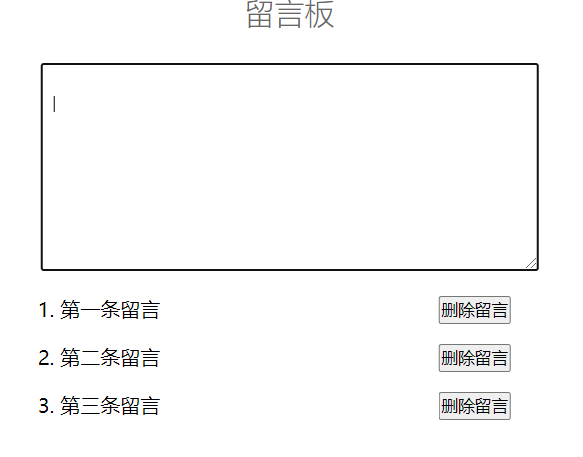
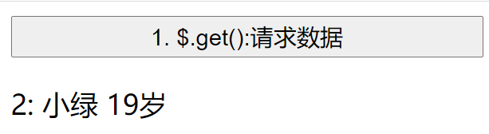
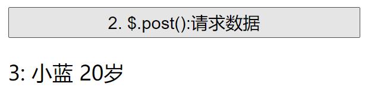
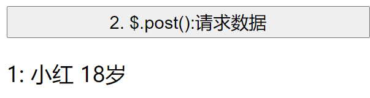
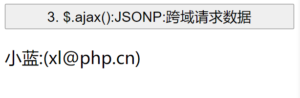

# jQuery 中常用的 DOM 操作以及使用 jQuery 完成跨域请求操作

## 一、jQuery 中常用的 DOM 操作

使用 jQuery 库一定不能忘了导入

```js
<script src="https://cdn.bootcdn.net/ajax/libs/jquery/3.5.1/jquery.js"></script>
```

**1.添加元素**
通过和原生 js 的对比来进行元素添加操作

```js
// 原生方式
const h2 = document.createElement("h2");
h2.textContent = "原生js往页面中添加dom元素之元素添加";
document.body.appendChild(h2);

document.body.insertAdjacentHTML(
  "afterbegin",
  "<h2>原生js往页面添加dom元素之html字符串添加</h2>"
);

// jQuery方式
$("<h2>jQuery添加dom元素</h2>").appendTo(document.body);
$("<h2>").text("jQuery添加dom元素之子元素添加").appendTo(document.body);
// 子元素.appendTo(父元素)
$("body").append("<h2>jQuery添加dom元素之父元素添加</h2>");
// 父元素.append(子元素)
$("body").append("<ol></ol>");
$("ol").append(() => {
  let str = "";
  for (let i = 0; i < 5; i++) {
    str += `<li><a href="">通过append添加的列表:${i + 1}</a></li>`;
  }
  return str;
});
```

**2.删除元素**
删除元素的方法在 jQuery 中有很多，比较常用的有 empty()方法、remove()方法
`empoty()`方法
`$("ol").empty()`:把 ol 下的的子元素包括文本节点全部删除
可以通过两张图片来观察 empty()方法的作用

这张图是没有使用 empty()方法时候的 html 文档结构



这张图片是使用了 empty()方法之后的 html 文档结构



`remove()`方法: 从 dom 中把所有段落删除,包括本身
`$("ol").remove()`:将 ol 下的子元素包括文本节点全部删除，包括 ol 本身也会删掉
下面通过两张图片对比来看出 remove()的强大

这张图是没有使用 remove()方法时候的 html 文档结构



这张图片是使用了 remove()方法之后的 html 文档结构



**使用 jQuery 事件操作完成一个简单的留言板**
留言板案例在以前的博客中有提到过，是用原生完成的一个简单的留言板，现在只不过是使用 jQuery 中的一些事件以及 dom 操作方法来将原生的一些东西替代掉

```js
// 获取元素
const msg = $("textarea");
const lists = $("#list");

// 创建事件，当内容输入文本框时，将其打印到下边
msg.keydown((ev) => {
  // 键盘事件中的key属性，表示按下的键名
  // console.log(ev.key);
  if (ev.key === "Enter") {
    // 非空判断
    //   console.log(ev.currentTarget.value);
    if (ev.currentTarget.value.length === 0) {
      alert("内容为空");
      msg.focus();
    } else {
      // 将留言内容添加到列表中
      // 创建留言
      let olStr = `<div><li>${ev.currentTarget.value}</li><button onclick="del(this)">删除留言</button></div>`;
      // 应该将最新的信息放在第一条
      lists.append(olStr);
      // 按下回车后，清空留言板
      ev.currentTarget.value = null;
    }
  }
});

// 删除留言
function del(ele) {
  // DOM接口的outerHTML属性获取描述元素（包括其后代）的序列化HTML片段。它也可以设置为用从给定字符串解析的节点替换元素。
  // 返回时，内容包含描述元素及其后代的序列化HTML片段。
  return confirm("是否删除?") ? (ele.parentNode.outerHTML = null) : false;
}
```



## 二、jQuery 完成跨域请求操作

使用 jQuery 完成 ajax 异步请求操作和 jsonp 跨域操作是使用 jQuery 对象的$.get(),$.post()和$.ajax()方法完成的，其中$.get()和$.post()都是$.ajax()方法的快捷操作，他们的参数都是`(url请求地址,qs查询参数,callback回调函数)`.

**1.$.get(url 请求地址,qs 查询参数,callback 回调函数)请求**
在这里我使用的是 php 作为后端代码，users.php 中是使用二维数组模拟数据表的查询结果

```js
$(".get").click(function (ev) {
  $.get("users.php", { id: 2 }, function (data) {
    // console.log(data);
    // console.log(ev.target);
    $(ev.target).after("<div></div>").next().html(data);
  });
});
```

查询结果



**2.$.post(url 请求地址,qs 查询参数,callback 回调函数)请求**
post 请求和 get 一样，只不过是查询参数设置不同

```js
$(".post").click(function (ev) {
  $.post("users.php", { id: 3 }, function (data) {
    // console.log(data);
    // console.log(ev.target);
    $(ev.target).after("<div></div>").next().html(data);
  });
});
```

请求结果



使用$.ajax()方法同样可以完成上边两个请求的操作

```js
$(".post").click(function (ev) {
  $.ajax({
    type: "post",
    url: "users.php",
    data: { id: 1 },
    dataType: "html",
    success: function (data) {
      $(ev.target).after("<div></div>").next().html(data);
    },
  });
});
```

请求结果



**3. $.ajax()实现jsonp跨域**
$.ajax()方法实现的跨域操作其实也是利用的 jsonp 的原理，和原生js中的差不多。

```js
$(".jsonp").click(function (ev) {
  $.ajax({
    type: "get",
    url: "http://world.io/text.php?id=2&jsonp=?",
    dataType: "jsonp",
    // 告诉跨域访问的服务器，前端需要返回的函数名
    jsonpCallback: "show",
  });
});

function show(data) {
  console.log(data);
  $(".jsonp").after("<div></div>").next().html(`${data.name}:(${data.email})`);
}
```

跨域查询结果


