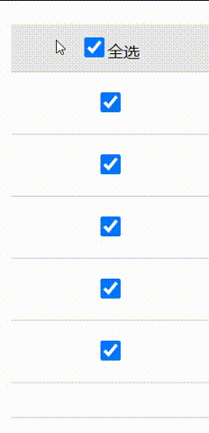

# 使用原生 js 完成一个购物车页面和 ES6 中模块的导入问题

## 一、实现一个购物车

购物车要实现的功能

1. 全选框选中时，底下的单个商品复选框按钮要全部选中

2. 单个商品复选框中只要有一个没有被选中，则全选复选框取消选中

3. 改变商品数量的时候，后边的金额会自动进行加减

4. 总价和总数量中只计算当前勾选的商品，但是没有勾选的商品中数量和金额可以变动

整个购物车的简陋样子如下：


先完成功能 1，2（功能 1，2 后边会和 3，4 进行一下合并）

首先要做的就是拿到全选复选框和全部的单选复选框，然后对复选框添加 "change" 事件。完成 1，2 功能

```js
// 1.获取全选复选框，所有单品的复选框
const checkAll = document.querySelector("#check-all");
// console.log(checkAll);
const checkItems = document.querySelectorAll('input[name="item"]');
// console.log(checkItems);

// 2.为全选复选框按钮添加事件：change,当前值改变会触发事件
checkAll.onchange = (ev) => {
  // console.log(ev.target.checked);
  // 当全选复选框是checked时，对每个单品复选框都要进行checked选中
  checkItems.forEach((item) => (item.checked = ev.target.checked));
};

// 为每个单独的复选框添加事件：change
checkItems.forEach(
  // 对单个复选框状态进行判断，如果有一个不为checked状态，则全选复选框不选中
  (item) =>
    (item.onchange = () =>
      (checkAll.checked = [...checkItems].every((item) => item.checked)))
);

// 使用jQuery完成上边的内容，逻辑思路和原生js相同
$("#check-all").on("change", (ev) => {
  // 对全选复选框添加change事件
  // 当全选复选框的值改变时，对所有的单品复选框进行同步更新它的选中情况
  $('input[name="item"]').each(function () {
    // change事件发生时，对每个单品的选中情况进行同步
    this.checked = ev.target.checked;
  });
});
$('input[name="item"]').each(function () {
  // 对每个单品的复选框添加change事件
  // 对这个单品复选框集合的checked情况进行every()筛选，
  // 当所有的单品复选框都选中时，匹配全选复选框
  this.onchange = function () {
    // console.log($("#check-all")[0].checked);
    // console.log([...$('input[name="item"]')]);
    $("#check-all")[0].checked = [...$('input[name="item"]')].every(
      (item) => item.checked
    );
  };
});
```

效果如图



接下来完成功能 3，4，将功能 3，4 涉及到的内容写到一个函数中，因为 3，4 中的功能涉及到功能 1，2，所以后边还需要做一次整合

```js
// 自动计算函数
function autoCalculate() {
  // 对后边数量以及单价，总计进行自动计算
  // 需要获取到所有的数量，以及所有的单价
  // 因为拿到的数据都是string，所以需要想办法转换成数值
  // const prices = document.querySelectorAll(".price");
  // 因为数据进行运算的时候是会发生类型转换的，所以可以直接进行转换它
  // 也可以使用parseInt()方法，将字符串转为数值

  // 获取到当前的单价数组，为后面的计算金额
  const priceArr = [...document.querySelectorAll(".price")].map(
    (item) => item.textContent * 1
  );
  // console.log(priceArr);

  // 获取到被选中事件的索引值
  // const checkedArr = [];
  // [...checkItems].forEach((ev, index) => {
  //   if (ev.checked === true) {
  //     checkedArr.push(index);
  //   }
  // });
  // console.log(checkedArr);

  // const numbers = document.querySelectorAll('input[type="number"]');
  // console.log(numbers[0].value);

  // 对商品的复选框状态进行判断，从而获取商品的总数和总金额

  // 对当前的数量数组进行获取
  const numArr = [...document.querySelectorAll('input[type="number"]')].map(
    (item) => item.value * 1
  );
  // console.log(numArr);

  // 使用filter()方法，以当前价格的复选框状态作为判断条件，获取到所有的checked为true的单价
  const checkedPrice = priceArr.filter(
    (item, index) => [...checkItems][index].checked
  );
  // console.log(totalPrice);
  // 获取到所有checked为true的数量
  const checkedNum = numArr.filter(
    (item, index) => [...checkItems][index].checked
  );
  // console.log(totalNum);

  // 商品总数的获取，可以使用reduce()方法进行累加操作
  // console.log(numArr.reduce((pre, cur) => pre + cur));
  // 当reduce()中的参数值为空时，reduce()方法会报错，所以需要进行判断
  let sum = 0;
  if (checkedNum.length !== 0) {
    sum = checkedNum.reduce((pre, cur) => pre + cur);
  }

  // 计算商品的金额：单价 * 数量，还是使用reduce()方法进行计算
  // 商品的金额是不随复选框的变动而变动的，它只和数量的变动相关
  const amountArr = [priceArr, numArr].reduce((total, curr) =>
    total.map((item, index) => item * curr[index])
  );

  // 计算已选中商品的金额数组
  const checkedAmount = amountArr.filter(
    (item, index) => [...checkItems][index].checked
  );
  // console.log(checkedAmount);
  // console.log(amount);

  // 计算已选中商品的总金额
  let totalAmount = 0;
  if (checkedAmount.length !== 0) {
    totalAmount = checkedAmount.reduce((pre, cur) => pre + cur);
  }
  // console.log(totalAmount);

  // 将计算结果渲染到购物车中
  // 总数量
  document.querySelector("#sum").textContent = sum;
  // 总金额
  document.querySelector("#total-amount").textContent = totalAmount;
  // 每个商品的金额
  // 根据当前商品的索引和amountArr商品价格数组的索引对应，然后填充到内容中
  document
    .querySelectorAll(".amount")
    .forEach((item, index) => (item.textContent = amountArr[index]));
}

// 获取到所有的数量控件
const numInput = document.querySelectorAll('input[type="number"]');
// console.log(numInput);
// 用户更新数量时触发自动计算，添加change事件
numInput.forEach((ev) => (ev.onchange = autoCalculate));
// 刚加载时，也应该触发自动计算事件
window.onload = autoCalculate;

// 在这块儿对前边的复选框功能做了一下整合，所以只需要这一段代码就好，前边的可以注释掉
// 当取消单个选中时，触发计算事件
checkItems.forEach((item) =>
  item.addEventListener("change", function () {
    checkAll.checked = [...checkItems].every((item) => item.checked);
    autoCalculate();
  })
);
// 当全选复选框值发生变动时，自动计算被触发
checkAll.addEventListener("change", function (ev) {
  checkItems.forEach((item) => (item.checked = ev.target.checked));
  autoCalculate();
});
```

因为要完成功能 3，4，涉及到功能 1，2 中的复选框的 change 事件，所以进行了整合，前边功能 1，2 的代码可以注释掉

完成的效果图如下


## 二、ES6 中模块导入问题

首先要知道什么是模块？模块就是一个 js 代码块。一个封装成模块的 js 文件,内部成员对外不见,除非导出来。模块要写到一个独立 的 js 文件中,并使用一些特别的语法和关键字

其次是模块解决了什么问题？

1. 可维护性: 每个模块是独立的,各写各个互不影响,出错直接定位责任人

2. 可复用性: 只需要一条 import 指令就可以导入

3. 避免污染全局空间: 模块处在自己的命名空间内

4. 模块解决了 js 的模块化开发与代码封装问题

**模块的导入**
在 ES6 之前的模块导入方式是利用 script 标签的 src 属性

```html
<script src="module1.js"></script>
```

ES6 之后的模块导入方式

```html
<!-- 导入模块时，必须让type类型为module -->
<script type="module">
  // 导入语句，import
  // 前面的./不能省略
  import { userName, hello, User } from "./module1.js";
</script>
```

在模块中将想要对外部访问的成员前边加上`export`关键字，就可以在需要导入的地方使用 import 语句进行导入，除了单个的成员前边加上`export`关键字之外，还可以对需要导出的所有成员进行统一导出

```js
// 导出语句 export

// export let userName = "小红";

let userName = "小红";

function hello(name) {
  return "Hello" + name;
}

class User {
  constructor(name, age) {
    this.name = name;
    this.age = age;
  }
  show() {
    return this.name + "今年" + this.age + "了";
  }
}
// 模块中的私有成员，不能被外部访问
let gender = "男";

// 统一导出

export { userName, hello, User };
```

导入模块之后就可以去使用模块中定义的成员了。

**模块中的别名导出导入**
为什么要进行别名导入呢？因为有时候会在当前作用域中定义和模块中同名的变量，别名的导入导出是为了不与当前作用域的变量重名。

模块中成员的导出过程

```js
// 在统一导出的时候进行别名化
export { userName as name, hello as hi, User };
```

脚本中对于模块的导入过程（如果导入的成员在模块中已经进行了别名化处理，那么在使用 import 语句导入的时候，就必须使用别名导入，不然无效）

```html
<script type="module">
  // import语句不允许写在后边
  // import { userName, hello } from "./module2.js";
  // 如果模块中定义了别名，再导入的时候就只能使用别名导入
  //   import { userName, echo } from "./module2.js";
  //   import { name, echo } from "./module2.js";
  //   console.log(name);
  //   let userName;

  // 别名导入
  import { name as firstName, echo } from "./module2.js";
  // 别名的导入导出是为了不与当前作用域的变量重名
</script>
```

在对别名的导入过程中，如果当前作用域还是有同名成员时，还可以进行别名处理

**模块中默认成员的导入导出**
模块中默认成员与普通成员的区别：

- 单一成员导出区别：

```js
// default可以视为一个变量，default = userName;相当于赋值
// 默认成员
export default userName = "小红";
// 一个模块中只允许一个默认导出

// 一般成员
export function hello(name) {
  return "Hello" + name;
}
```

- 统一导出的区别

```js
// 将成员导出，将hello视为默认成员导出，其他成员为普通成员
export { userName, hello as default, gender };
```

- 模块中默认成员与普通成员的导入的区别

```html
<script type="module">
  //   默认模块导入
  // 导入默认成员与普通模块的最大区别在于没有大括号
  // 导入既有默认成员，又有非默认成员
  import hello, { userName, gender } from "./module3.js";
</script>
```

**模块命名空间的作用**
命名空间：是一个容器，内部可以包含任何类型的数据，命名空间是一个对象，可以挂载到当前的全局中。

使用一般的导入模块方式和使用命名空间导入模块的方式

一般方式

```html
<script type="module">
  // 使用一般方式导入
  import { userName, hello, User } from "./module1.js";
</script>
```

使用命名空间的方式导入

```html
<script type="module">
  // 使用命名空间来导入
  import * as nameSpace from "./module1.js";
  // 可以在当前作用域随便声明变量，不怕与模块中成员同名，因为命名空间是一个对象
  let userName;
  let hello = () => {};
  class User {}
  // 查看/使用模块中的成员
  console.log(nameSpace);
  console.log(nameSpace.userName);
  console.log(nameSpace.hello(nameSpace.userName));
  console.log(new nameSpace.User("小兰", 18).show());
</script>
```
