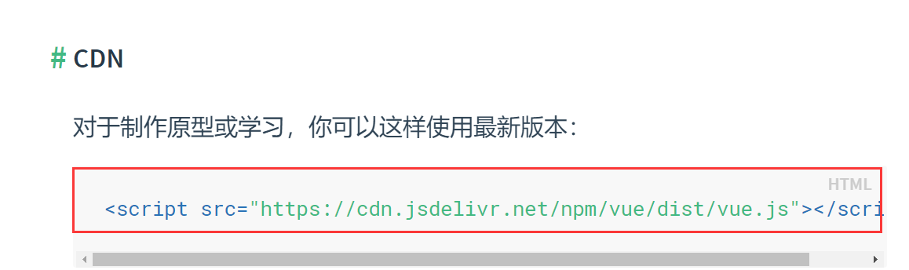
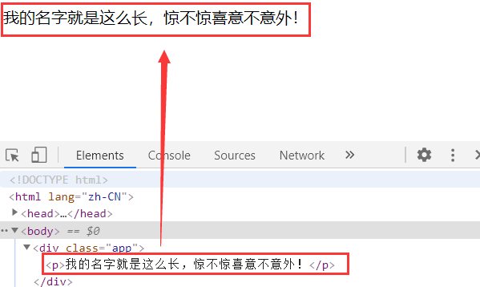
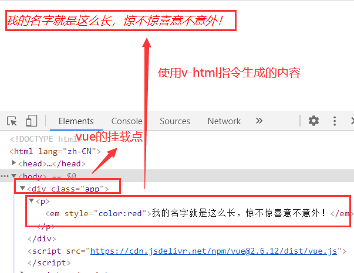
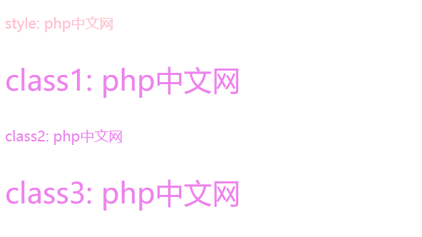
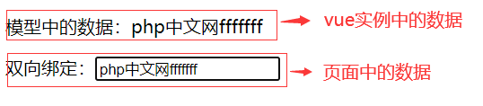

# 初识 vue 以及几个常用的 v-指令的介绍

## 一、导入 vue

使用 vue 渲染页面要先进行 vue 库的导入，和 jQuery 一样，可以通过 script 标签引入，可以在[vue 官网](https://cn.vuejs.org/v2/guide/installation.html)上找到



```html
<script src="https://cdn.jsdelivr.net/npm/vue/dist/vue.js"></script>
```

使用 vue 进行页面渲染时第一步时先将 vue 加载进来，上边已经做过了，接下来在 html 文档中创建一个 Vue 根节点

```html
<h2 class="title">{{words}}</h2>
```

然后使用 vue 对页面进行渲染

```html
<script>
  // 创建一个vue实例
  const vm = new Vue({
    // 当前Vue的配置项
    // 挂载点
    // el: document.querySelector('.app'),
    // Vue中可以识别选择器的
    el: ".app",

    // 数据注入
    data: {
      words: "Hello World!",
    },
  });
</script>
```

如果说是需要对 vue 中的原始数据进行访问，则需要通过在数据前加上 "$" 来进行访问，比如说是要访问上边例子中的 data 里边的 words 数据

```html
<script>
  console.log(vm.$data.words);
  // 输出 "Hello World!";
</script>
```

**使用 vue 对页面进行渲染时，dom 元素中是不会存在文本的，所有的文本数据都是通过 vue 实例添加上去的。所以当 vue 中的数据发生变化时，相应的页面中的数据也会发生变化。vue 中数据渲染到页面上的过程叫做 "数据注入"。**

## 二、vue 中几个常用到的 v-指令

**1. v-text, v-html 指令**
使用以下示例作为演示

```html
<div class="app">
  <p></p>
</div>
<script>
  const vm = new Vue({
    // 转换效率最高
    // el:document.querySelector('.app'),
    el: ".app",
    // vue的挂载点不能挂到body或者html上，因为他们具有唯一性
    data: {
      userName: "我的名字就是这么长，惊不惊喜意不意外！",
    },
  });
</script>
```

v-text, v-html 在 html 中是不存在这样的属性的，它是专门由 Vue 实例管理的自定义属性，称之为“指令”。

v-text 指令 ====> innerText，textContent,它会覆盖掉原来的文本内容。

```html
<p v-text="userName"></p>
```

可以看到的是，当前的 html 文档中是没有文本存在的，所有的文本数据都是从 vue 实例中添加进去的。



v-html 指令 ====> innerHTML, 它里边就不仅仅是纯文本了，还可以是 html 字符串

```html
<p v-text="userName"></p>
<script>
  vm.userName =
    "<em style='color:red'>我的名字就是这么长，惊不惊喜意不意外！</em>";
</script>
```

使用 v-html 指令，它里边的内容可以是纯文本，也可以是 html 字符串



**2. v-bind, v-on 指令**
v-bind 指令是一个高频指令，它的作用是动态地绑定一个或多个 属性，或一个组件 prop 到表达式。它可以简写成 ":"。

示例

```html
<style>
  .active {
    color: violet;
  }
  .bigger {
    font-size: 2rem;
  }
</style>
<body>
  <div class="app">
    <!-- <p style="color: pink">style: {{site}}</p> -->
    <!-- v-bind不仅可以绑定行内样式，对于类样式也是可以绑定的 -->
    <p :style="style">style: {{site}}</p>

    <!-- 绑定类class属性 -->
    <p :class="class1">class1: {{site}}</p>
    <p :class="{active : isActive, bigger : isBigger}">class2: {{site}}</p>
    <p :class="[`active`, `bigger`]">class3: {{site}}</p>
  </div>

  <script>
    const vm = new Vue({
      el: ".app",
      // 数据
      data: {
        site: "php中文网",
        style: "color: pink",
        class1: "active bigger",
        isActive: true,
        isBigger: false,
      },
    });
  </script>
</body>
```



v-on 指令：绑定事件监听器。事件类型由参数指定。表达式可以是一个方法的名字或一个内联语句，如果没有修饰符也可以省略。v-on 指令同样是一个高频指令，它可以简写成 "@"

示例

```html
<body>
  <div class="app">
    <p>
      <a href="https://php.cn" @click.prevent="show"
        >显示网站名称,阻止默认行为</a
      >
    </p>
    <p>
      <a href="https://php.cn" @click.prevent="show"
        >显示网站名称,冒泡行为演示</a
      >
    </p>
    <!-- 事件修饰符stop：阻止冒泡行为 -->
    <p>
      <a href="https://php.cn" @click.prevent.stop="show"
        >显示网站名称,阻止冒泡行为</a
      >
    </p>
    <!-- 事件的回调函数仅允许执行一次 -->
    <p>
      <a href="https://php.cn" @click.once.stop.prevent="show"
        >显示网站名称,事件的回调函数仅允许执行一次</a
      >
    </p>

    <!-- 事件方法的传参 -->
    <!-- 事件对象的参数名必须是 $event -->
    <button @click="handle($event,1,2)">click</button>
  </div>
  <script>
    const vm = new Vue({
      el: ".app",
      // 数据
      data: {
        site: "php中文网",
        style: "color: pink",
        class1: "active bigger",
        isActive: true,
        isBigger: false,
      },
      // 方法（函数）
      methods: {
        show() {
          // 在当前的Vue实例中，this就是vue实例对象
          alert(this.site);
        },
        handle(ev, a, b) {
          console.log(ev.type, ev.target);
          console.log("a + b = %d", a + b);
        },
      },
    });
  </script>
</body>
```

事件修饰符

- .stop

调用 event.stopPropagation(),阻止冒泡行为;

- .prevent

调用 event.preventDefault(),禁用事件的默认行为;

- .once

只触发一次回调;

除了这几个还有好多的事件修饰符，具体请到[vue 官网](https://cn.vuejs.org/v2/api/#v-bind)中查看

**3. v-model 双向绑定指令**
一般情况下页面上的数据都是响应式的，也就是单向绑定，就是页面中的数据随着 vue 实例中的数据变化而变化，而 v-model 指令的作用就是在表单控件或者组件上创建双向绑定。只要任何一方的数据发生变动，另一方的数据也会发生变化。

示例

```html
<body>
  <div class="app">
    <!-- 页面中的数据 -->
    <!-- 响应式：当前页面中的数据始终跟着模型数据的变化而变化 -->
    <p>模型中的数据：{{site}}</p>
    <>双向绑定：<input type="text" v-model="site" /></>
    <!-- 懒加载事件修饰符lazy，防止页面刷新频繁 -->
  </div>
  <script src="https://cdn.jsdelivr.net/npm/vue@2.6.12/dist/vue.js"></script>
  <script>
    const vm = new Vue({
      el: ".app",
      data: {
        // 模型中的数据
        site: "php中文网",
        num: 0,
      },
    });
    // vm.site = "php.cn";
  </script>
</body>
```

这样在页面端的数据发生变化时，vue 实例中的数据也会发生变化



**4. v-for**
v-for:简单来说就是遍历一个数组/对象，不过在 vue 中的 v-for 不是那么简单，它可以用来动态的生成列表。
v-for 的默认行为会尝试原地修改元素而不是移动它们。要强制其重新排序元素，你需要用特殊属性 key 来提供一个排序提示。key 只能是整数或是不重复的字符串，只有唯一，它才可以作为排序时的关键信息。

示例

```html
<!DOCTYPE html>
<html lang="zh-CN">
  <head>
    <meta charset="UTF-8" />
    <title>v-for,key指令</title>
  </head>
  <body>
    <div class="app">
      <!-- key指令可以干涉diff算法，key一定是稳定且唯一的，vue通过key来判断这个节点是否需要重新渲染，以提升效率 -->

      <!-- 遍历一个数组 -->
      <ul>
        <li v-for="(item,index) in items" :key="index">{{index}}--{{item}}</li>
      </ul>

      <!-- 遍历一个对象 -->
      <ul>
        <li v-for="(item,prop,index) in user" :key="index">
          {{prop}}--{{index}}--{{item}}
        </li>
      </ul>
      <!-- key只能是整数或是不重复的字符串 -->

      <!-- 遍历一个对象数组 -->
      <ul>
        <li v-for="(user,index) in users" :key="user.id">
          {{user.id}}--{{user.name}}--{{user.age}}
        </li>
      </ul>

      <span v-for="n in 10">{{n}}</span>
    </div>
    <script src="https://cdn.jsdelivr.net/npm/vue@2.6.12/dist/vue.js"></script>
    <script>
      const vm = new Vue({
        el: ".app",
        data: {
          //数组
          items: ["小红", "小绿", "小蓝"],
          // 对象
          user: {
            name: "小兰",
            age: 18,
          },
          // 对象数组，使用最频繁的，数据表的查询结果就是一个这样的二维JSON
          users: [
            { id: 1, name: "皮卡丘", age: 2 },
            { id: 2, name: "喷火龙", age: 4 },
            { id: 3, name: "皮皮虾", age: 6 },
          ],
        },
      });
    </script>
  </body>
</html>
```

下图是对 vue 中数据的遍历情况


下图是生成的元素与遍历情况的对应


