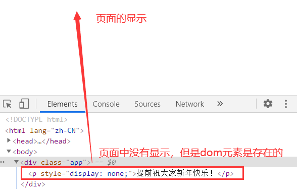

# 在 vue 中使用条件渲染语句实现 todolist，以及 vue 中的计算属性和侦听器属性介绍

## 一、vue 中的条件渲染

条件渲染指令`v-if`，`v-show`。

`v-if` 指令: v-if 指令和原生 js 中的 if 语句的功能是一样的，作为条件约束，执行哪些功能。同样有作为单分支和多分支条件的语句。
`v-show` 指令: v-show 指令和 v-if 指令的功能差不多，区别最大的一点是使用 v-dom 的元素，在 dom 树加载完成之后就会存在，只是显示不显示的问题，而 v-if 语句则不一样，它是根据条件判断，然后再从 vue 中渲染到页面上。v-show 的用处是可以定时的显示一些准备好的东西。好处是比起 v-if 来说，v-show 是本来就存在的 dom 元素，页面不会进行多次的渲染刷新。

实例演示条件渲染

```html
<!DOCTYPE html>
<html lang="zh-CN">
  <head>
    <meta charset="UTF-8" />
    <title>条件渲染：v-if,v-show</title>
    <script src="https://cdn.jsdelivr.net/npm/vue@2.6.12/dist/vue.js"></script>
  </head>
  <body>
    <div class="app">
      <!-- 单分支结构 -->
      <p v-if="flag">{{msg}}</p>
      <button
        v-text="tips = flag ? '隐藏' : '显示'"
        @click="flag = !flag"
      ></button>
    </div>
    <script>
      // v-if:决定元素是否添加到页面上
      // v-show:元素是否显示出来(元素已经在dom结构中了)
      const vm = new Vue({
        el: ".app",
        data() {
          return {
            msg: "当flag为true的时候我会显示出来",
            flag: true,
          };
        },
      });
    </script>
  </body>
</html>
```

上述示例演示的是一个简单的由 v-if 指令完成的单分支的条件渲染，默认设置的是 flag=true, 可以看到的是 vue 的挂载点中的`<p v-if="flag">{{msg}}</p>`，作用是判断 flag 的值，然后选择要不要进行渲染，底下的 button 中的点击事件，给了一个可以改变 flag 的操作。

效果如下


在 html 文档中的显示是这样的

点击之前 dom 结构


点击之后 dom 结构


可以清楚的看到页面中的 dom 变化，所以每一次的 v-if 渲染都是对页面的一次刷新。

使用 v-show 来对页面进行渲染

```html
<!DOCTYPE html>
<html lang="zh-CN">
  <head>
    <meta charset="UTF-8" />
    <meta name="viewport" content="width=device-width, initial-scale=1.0" />
    <title>条件渲染：v-if,v-show</title>
    <script src="https://cdn.jsdelivr.net/npm/vue@2.6.12/dist/vue.js"></script>
  </head>
  <body>
    <div class="app">
      <!-- v-show操作 -->
      <p v-show="status">提前祝大家新年快乐！</p>
      <!-- v-show操作的用处：可以定时的显示一些准备好的东西，比起v-if来说，v-show是本来就存在的dom元素，页面不会进行多次的渲染刷新 -->
    </div>
    <script>
      // v-if:决定元素是否添加到页面上
      // v-show:元素是否显示出来(元素已经在dom结构中了)
      const vm = new Vue({
        el: ".app",
        data() {
          return {
            status: false,
          };
        },
      });
    </script>
  </body>
</html>
```

可以看到的是当前我设置的是 false 状态，所以在页面中是不显示的可以看下执行结果和 dom 结构



然后再将 status 置为 true 状态，`vm.$data.status = true;`


可以看到的是，v-show 是在 dom 元素创建之后就存在了，只是显示不显示的决定在你，你可以设置什么时候显示，这样在一些活动倒计时的情况中，就直接可以更换页面，而不显得突兀，也不需要页面刷新。

不过 v-if 的条件渲染功能更加强大，v-show 则是实时性更加的好。

**使用条件渲染完成 todolist**
todolist，就是一个简单的留言功能

使用 vue 实现时，可以使用很多的事件修饰符和按键修饰符，可以省很多事

```html
<!DOCTYPE html>
<html lang="zh-CN">
  <head>
    <meta charset="UTF-8" />
    <meta name="viewport" content="width=device-width, initial-scale=1.0" />
    <title>todolist</title>
    <script src="https://cdn.jsdelivr.net/npm/vue@2.6.12/dist/vue.js"></script>
  </head>
  <body>
    <div class="app">
      <input type="text" name="" @keyup.enter="show($event)" />
      <ul v-if="list.length">
        <li v-for="(item, index) in list" :key="index" v-text="item"></li>
      </ul>
    </div>
    <script>
      // vue实现
      const vm = new Vue({
        el: ".app",
        data() {
          return {
            list: [],
          };
        },
        methods: {
          show(ev) {
            // console.log(ev.target.value);
            if (ev.target.value.trim().length === 0) {
              alert("输入内容不能为空！");
            } else {
              this.list.unshift(ev.target.value);
              ev.target.value = null;
            }
          },
        },
      });

      // 原生实现

      // // 获取事件
      // const input = document.querySelector('input[type="text"]');
      // const ul = document.querySelector("ul");

      // // 为input添加事件
      // input.onkeyup = (ev) => {
      //   // 查看键盘输入
      //   // console.log(ev.key);
      //   if (ev.key === "Enter") {
      //     // 去掉输入字符串两端的空格，然后判断字符串长度是否为0
      //     if (input.value.trim().length === 0) {
      //       alert("内容不能为空！");
      //     } else {
      //       let str = `<li>${input.value}</li>`;
      //       ul.insertAdjacentHTML("afterbegin", str);
      //       input.value = null;
      //     }
      //   }
      // };
    </script>
  </body>
</html>
```

在上边的示例中使用了按键修饰符.enter，将它添加在事件的后边，则等同于原生中的`if (ev.key === "Enter")`条件判断语句

## 二、计算属性和侦听器属性

计算属性使用 computed 声明，本质上就是访问器属性，最终会和 data 合并，所以不要和 data 中已有属性重名。

示例

```html
<!DOCTYPE html>
<html lang="zh-CN">
  <head>
    <meta charset="UTF-8" />
    <title>计算属性</title>
    <script src="https://cdn.jsdelivr.net/npm/vue@2.6.12/dist/vue.js"></script>
  </head>
  <body>
    <div class="app">
      <p>
        数量：<input type="number" v-model="num" style="width: 5em" min="0" />
      </p>
      <p>单价：{{price}} 元</p>
      <p>金额：{{amount}} 元</p>
    </div>
    <script>
      const vm = new Vue({
        el: ".app",
        data() {
          return {
            num: 0,
            price: 50,
            res: 0,
          };
        },

        // 计算属性，使用computed声明
        computed: {
          //   amount() {
          //     return this.num * this.price;
          //   },

          // 访问器属性有getter和setter
          // 计算属性默认是getter
          amount: {
            get() {
              return this.num * this.price;
            },
            set(value) {
              console.log(value);
            },
          },
        },
      });
      vm.amount = 1100;
    </script>
  </body>
</html>
```


侦听器属性使用 watch 声明,它侦听的是某一个属性的值的变化，它的属性名与 data 中要监听的属性同名。侦听器属性更加注重的是实时性，但是它没有计算属性灵活.

比如还是上边计算属性的例子，使用侦听器属性实现

```html
<!DOCTYPE html>
<html lang="zh-CN">
  <head>
    <meta charset="UTF-8" />
    <meta name="viewport" content="width=device-width, initial-scale=1.0" />
    <title>计算属性</title>
    <script src="https://cdn.jsdelivr.net/npm/vue@2.6.12/dist/vue.js"></script>
  </head>
  <body>
    <div class="app">
      <!-- <p>
        数量：
        <input
          type="number"
          v-model="num"
          style="width: 5em"
          min="0"
          @change="calc"
        />
      </p>
      <p>单价：{{price}} 元</p>
      <p>金额：{{res}} 元</p> -->
      <p>
        数量：<input type="number" v-model="num" style="width: 5em" min="0" />
      </p>
      <p>单价：{{price}} 元</p>
      <!-- 计算属性，本质上就是访问器属性 -->
      <p>金额：{{res}} 元</p>
    </div>
    <script>
      const vm = new Vue({
        el: ".app",
        data() {
          return {
            num: 0,
            price: 50,
            res: 0,
          };
        },
        // 侦听器属性，使用watch声明
        watch: {
          // 侦听num属性的变化，num中的参数分别是变化的值，变化前的值
          num(newValue, oldValue) {
            // console.log(newValue, oldValue);
            this.res = newValue * this.price;
          },
        },
      });
    </script>
  </body>
</html>
```

使用侦听器也同样可以完成相同的功能


计算属性是重新生成一个属性，相当于原生 js 中的访问器属性，只是访问和修改是和属性一样的方式，本质上还是一个方法。对于任何复杂逻辑，都应当使用计算属性去声明。侦听器属性的目的是观察和响应 Vue 实例上的数据变动，当需要在数据变化时执行异步或开销较大的操作时，这个方式是最有用的。
