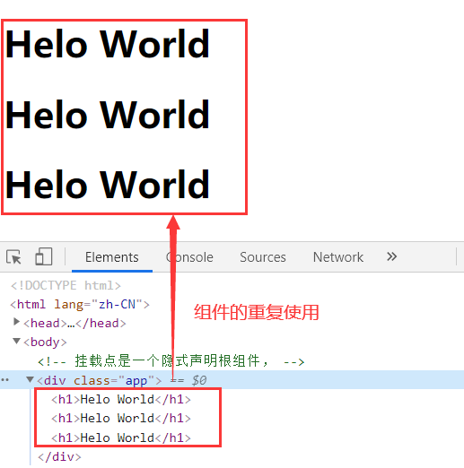
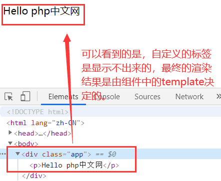
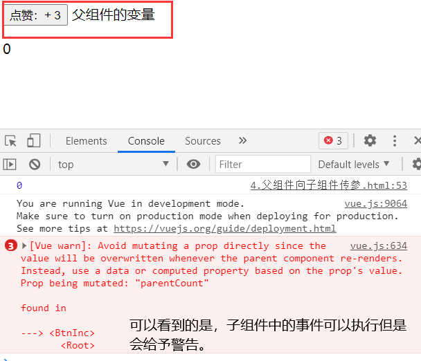

# 组件与组件之间的通信

## 一、组件知识

组件，从形式上看，组件就是一个自定义的 html 标签;组件本质上来看是一个可复用的 Vue 实例，是构造函数 Vue 的一个子类;组件实现了代码复用。从组件的层面上来理解，Vue 的挂载点就是一个组件，不过它是一个隐式声明根组件。

创建一个组件需要进行两个步骤

1. 创建组件,定义一个名字为`child-component`的新组件（使用 Vue.component 创建的组件为全局组件）

```html
<!-- 创建一个新组件 -->
<script>
  Vue.component("child-component", {
    template: `<h1>Helo World</h1>`,
    data() {
      return {};
    },
  });
</script>
```

其中 "child-component" 是创建的组件的名字（用户自定义的 html 标签），后边的对象`{}`中的内容是组件的配置项，其中 `template` 中的内容是一个字符串模板，作为 Vue 实例的标识使用。模板将会替换挂载的元素，也就是挂载点上的`<child-component></child-component>`这一对自定义 html 标签。挂载元素的内容都将被忽略，除非模板的内容有分发插槽。由于组件是一个 Vue 的子类，所以它的属性也是由一个函数`data(){return{}}`返回一个对象来实现的。

2.挂载，将自定义的 html 标签放到 Vue 挂载点的子结点上

```html
<body>
  <!-- 挂载点是一个隐式声明根组件， -->
  <div class="app">
    <!-- 自定义html标签 -->
    <child-component></child-component>
  </div>
  <script>
    // 将组件名放到挂载点的子结点中

    const vm = new Vue({
      el: ".app",
      data() {
        return {};
      },
    });
  </script>
</body>
```

声明组件的目的就是实现代码复用，将这个组件可以重复的放置在已经挂载好的根节点中

例如

```html
<body>
  <!-- 挂载点是一个隐式声明根组件， -->
  <div class="app">
    <!-- 自定义html标签 -->
    <child-component></child-component>
    <child-component></child-component>
    <child-component></child-component>
  </div>
</body>
```



上述示例中，组件的创建是通过`Vue.component`来实现的。这样声明的组件是全局组件，它在全局可见，声明在 Vue 实例外部，全局组件可以在多个 Vue 实例中共享，不过尽可能不要去声明一个全局组件，减少全局污染。因为通常一个项目只有一个 Vue 实例，所以尽可能不要用全局组件，而应该使用局部组件代替。

**局部组件的声明**
局部组件是属于 Vue 实例的，使用 components 声明。

```html
<body>
  <div class="app">
    <child-hello></child-hello>
  </div>
  <script>
    const vm = new Vue({
      el: ".app",

      data() {
        return {};
      },
      // 声明一个局部组件
      components: {
      childHello: {
      template: `<p>Hello {{site}}</p>`,
      data() {
        return {
          site: "php中文网",
        };
      },
      },
    });
  </script>
</body>
```

`<child-hello></child-hello>`，是定义的局部组件。但是在 dom 结构中是找不到的。


## 二、组件之间的通信

**父组件向子组件传参**
父组件是通过自定义属性的方式将参数传到子组件中的, 然后子组件中用固定属性名称 props 来接收父组件自定义的属性名。

现在我们来声明一个子组件，将其放到挂载点下，然后在子组件中不进行属性声明，所有的属性在父组件中声明定义，然后试着将这些父组件中的属性传递到子组件中。

```html
<body>
  <script src="https://cdn.jsdelivr.net/npm/vue@2.6.12/dist/vue.js"></script>
  <div id="app">
    <!-- 父组件，父组件是通过自定义属性的方式将参数传到子组件中的 -->
    <btn-inc :user-name="username" :parent-count="count"></btn-inc>
    <p>{{count}}</p>
  </div>
  <script>
    const vm = new Vue({
      el: "#app",
      data() {
        return {
          username: "父组件的变量",
          count: 0,
        };
      },
      // 局部组件
      components: {
        btnInc: {
          // 使用固定属性名称props来接收父组件自定义的属性名
          props: ["userName", "parentCount"],

          // 组件之间的数据传递是单向的，不允许在子组件中更新父组件中的数据
          template: `<div>
                <button @click="num++">点赞：+ {{num}}</button>
                <span>{{userName}}</span>
                </div>`,
          data() {
            return {
              num: this.parentCount,
            };
          },
        },
      },
    });

    // 子组件中的数据变化更新父组件的数据,通过消息传递（事件）实现
    console.log(vm.count);
  </script>
</body>
```

父组件中的自定义属性的值可以来自根组件的 data,不过如果使用根组件上的变量就要对自定义属性进行 v-bind 绑定，父组件中的自定义属性名尽量写成":user-name"，而在子组件中接收的时候应该写成"userName"的形式。

试着直接使用父组件`data`中的`count`直接使用在子组件的`template`，会发现根本就不可以进行渲染，根本就识别不出来。只能通过父组件自定义属性绑定到父组件上，然后再传参才可以在子组件中拿到父组件中的数据。而且父组件中的数据拿过来之后，也就是通过`props`获取到之后，不能对其进行修改，如果想要进行改变值的操作，就只能在子组件的`data`中重新定义一个变量接收，然后对这个变量进行修改，如果不这样做，Vue 就会报错。

在子组件的`template`中直接使用父组件的属性进行修改，会出现如下报错情况。

> template: `<div> <button @click="parentCount++">点赞：+ {{parentCount}}</button> <span>{{userName}}</span> </div>`,

报错情况



而且改变之后，对于父组件中的 count 是没有影响的。

**子组件向父组件传参**
子组件中的数据变化更新父组件的数据,通过消息传递（事件）实现,子组件向父组件传参是通过声明同名事件来实现的。
在子组件的`template`html 字符串中定义事件，必须对事件使用$emit()事件方法，`$emit(父组件中要使用的方法名称,子组件要传给父组件的值)`。

现在来列举一个子组件向父组件传参的例子

```html
<body>
  <div id="app">
    <btn-inc
      :user-name="username"
      :parent-count="count"
      @click-count="handle"
    ></btn-inc>
  </div>
  <script>
    const vm = new Vue({
      el: "#app",
      data() {
        return {
          username: "父组件的变量",
          count: 0,
        };
      },
      // 局部组件
      components: {
        btnInc: {
          // 使用固定属性名称props来接收父组件自定义的属性名
          props: ["userName", "parentCount"],

          // 必须使用$emit()事件方法
          // $emit(父组件中要使用的方法名称,子组件要传给父组件的值)
          template: `<div>
                  <button @click="$emit('click-count',num)">点赞：+ {{parentCount}}</button>
                  <span>{{userName}}</span>
                  </div>`,
          data() {
            return {
              num: 1,
            };
          },
        },
      },

      // 父组件更新数据的方法
      methods: {
        handle(value) {
          console.log(this.count);
          this.count += value;
        },
      },
    });
  </script>
</body>
```

父组件中通过定义同名事件，来对子组件中的数据进行接收，另外，这个子组件传递的参数可以是任何类型。

**总结：**

1. 父组件向子组件传参：通过自定义属性
2. 子组件向父组件传参：通过自定义方法
