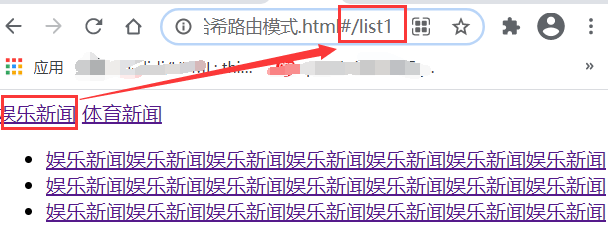
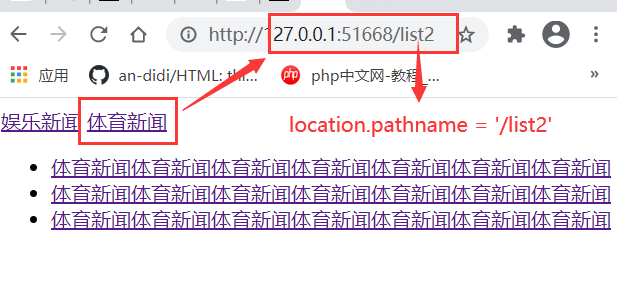
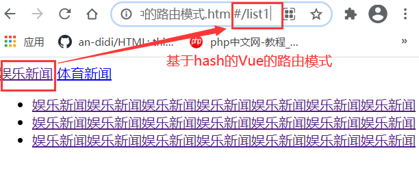

# 使用原生 js 和 Vue 路由模块分别实现一个前端路由

前端路由：通过动态改变 url 实现，并不会和后端服务器发生交互，前端路由不同于传统路由，它不需要服务器来进行解析，而是通过一个 hash 函数或者 H5 提供的 history API 来实现。
前端路由的优势：页面刷新速度快。由于前端路由不需要和后端服务器发生交互，省略了请求的过程，且不会受到网络延迟的影响，所以它的刷新速度快，用户体验好。

## 使用原生 js 完成前端路由

**1.基于锚点的哈希路由**
通过\<a>标签改变 URL，然后使用 hashchange 事件监听 URL 的变动，hash 是 URL 中 hash (#) 及后面的那部分，常用作锚点在页面内进行导航，改变 URL 中的 hash 部分不会引起页面刷新。

html

```html
<body>
  <nav>
    <!-- 此时的#list1，#list2就是锚点 -->
    <a href="#/list1">娱乐新闻</a>
    <a href="#/list2">体育新闻</a>
  </nav>

  <!-- 该区域专用于显示路由的内容 -->
  <div class="route-view"></div>
</body>
```

js

```js
// 获取路由内容显示区元素
const routeView = document.querySelector(".route-view");

// 锚点使用 location.hash
// window.location: 描述的是当前url信息
//   console.log(location.hash);
// hashchange事件：url中的锚点变化时会自动触发这个事件

window.addEventListener("hashchange", show);

// load事件：要等js执行完成和图片加载完成才能触发
//   window.addEventListener("load", show);

// DOMContentLoaded事件: 只要dom树创建完成就会触发
window.addEventListener("DOMContentLoaded", show);

let list1 = `
            <ul>
            <li><a href="">娱乐新闻娱乐新闻娱乐新闻娱乐新闻娱乐新闻娱乐新闻娱乐新闻</a></li>
            <li><a href="">娱乐新闻娱乐新闻娱乐新闻娱乐新闻娱乐新闻娱乐新闻娱乐新闻</a></li>
            <li><a href="">娱乐新闻娱乐新闻娱乐新闻娱乐新闻娱乐新闻娱乐新闻娱乐新闻</a></li>
            </ul>`;

let list2 = `<ul>
                <li><a href="">体育新闻体育新闻体育新闻体育新闻体育新闻体育新闻体育新闻</a></li>
                <li><a href="">体育新闻体育新闻体育新闻体育新闻体育新闻体育新闻体育新闻</a></li>
                <li><a href="">体育新闻体育新闻体育新闻体育新闻体育新闻体育新闻体育新闻</a></li>
            </ul>`;

function show() {
  console.log(location.hash);
  switch (location.hash) {
    case "#/list1":
      routeView.innerHTML = list1;
      break;
    case "#/list2":
      routeView.innerHTML = list2;
      break;
    default:
      routeView.innerHTML = list1;
  }
}
```

实现效果



**2.基于历史记录的路由**
在 H5 中提供了 history API，通过 history 的 pushState 方法来实现。

html

```html
<body>
  <nav class="app">
    <a href="/list1">娱乐新闻</a>
    <a href="/list2">体育新闻</a>
  </nav>
  <div class="router-view"></div>
</body>
```

js

```js
const list1 = `
            <ul>
            <li><a href="">娱乐新闻娱乐新闻娱乐新闻娱乐新闻娱乐新闻娱乐新闻娱乐新闻</a></li>
            <li><a href="">娱乐新闻娱乐新闻娱乐新闻娱乐新闻娱乐新闻娱乐新闻娱乐新闻</a></li>
            <li><a href="">娱乐新闻娱乐新闻娱乐新闻娱乐新闻娱乐新闻娱乐新闻娱乐新闻</a></li>
            </ul>`;
const list2 = `<ul>
                <li><a href="">体育新闻体育新闻体育新闻体育新闻体育新闻体育新闻体育新闻</a></li>
                <li><a href="">体育新闻体育新闻体育新闻体育新闻体育新闻体育新闻体育新闻</a></li>
                <li><a href="">体育新闻体育新闻体育新闻体育新闻体育新闻体育新闻体育新闻</a></li>
                </ul>`;
const routerView = document.querySelector(".router-view");

// 获取到所有的a.href
const links = document.querySelectorAll(".app a[href]");
//   console.log(links);
links.forEach(
  (link) =>
    (link.onclick = (ev) => {
      // 禁用掉a标签的默认行为
      ev.preventDefault();

      // history对象，history.pushState(data状态对象,title标题, url)
      history.pushState(null, "", link.href);
      // 手工更新了url,但是popstate事件监听不到这个变化，需要这里调用一个函数
      show();
    })
);
window.addEventListener("DOMContentLoaded", show);
// 当整个页面及所有依赖资源如样式表和图片都已完成加载时，将触发load事件。
// 它与DOMContentLoaded不同，后者只要页面DOM加载完成就触发，无需等待依赖资源的加载。
function show() {
  console.log(location.pathname);
  switch (location.pathname) {
    case "/list1":
      routerView.innerHTML = list1;
      break;
    case "/list2":
      routerView.innerHTML = list2;
      break;
    default:
      routerView.innerHTML = list1;
  }
}
```

运行结果



## 使用 Vue 路由模块分别实现一个前端路由

vue 路由是基于 hash 实现的，是用 a 标签的锚点来实现的。在原生 js 中是通过 a 标签的 href 属性来跳转，而在 vue 中则是通过 to 属性来跳转。

使用 Vue 的路由模块来实现路由，首先需要的是下载好路由模块，在[github](https://github.com/vuejs/vue-router)上下载下来。然后通过 script 标签导入路由模块。然后创建一个路由，再将这个路由挂载到Vue的挂载点上。

html

```html
<!DOCTYPE html>
<html lang="zh-CN">
  <head>
    <meta charset="UTF-8" />
    <meta name="viewport" content="width=device-width, initial-scale=1.0" />
    <title>vue路由原理与实现</title>
    <!-- 加载vue框架 -->
    <script src="https://cdn.jsdelivr.net/npm/vue@2.6.12/dist/vue.js"></script>

    <!-- 加载路由模块 -->
    <script src="../vue-router-dev/dist/vue-router.js"></script>
  </head>
  <body>
    <nav class="app">
      <router-link to="/list1">娱乐新闻</router-link>
      <router-link to="/list2">体育新闻</router-link>

      <!-- 路由到的资源显示区域 -->
      <router-view></router-view>
    </nav>
    <script>
      const list1 = {
        // 组件模板字面量
        template: `
                    <ul>
                    <li><a href="">娱乐新闻娱乐新闻娱乐新闻娱乐新闻娱乐新闻娱乐新闻娱乐新闻</a></li>
                    <li><a href="">娱乐新闻娱乐新闻娱乐新闻娱乐新闻娱乐新闻娱乐新闻娱乐新闻</a></li>
                    <li><a href="">娱乐新闻娱乐新闻娱乐新闻娱乐新闻娱乐新闻娱乐新闻娱乐新闻</a></li>
                    </ul>`,
      };
      const list2 = {
        template: `<ul>
                    <li><a href="">体育新闻体育新闻体育新闻体育新闻体育新闻体育新闻体育新闻</a></li>
                    <li><a href="">体育新闻体育新闻体育新闻体育新闻体育新闻体育新闻体育新闻</a></li>
                    <li><a href="">体育新闻体育新闻体育新闻体育新闻体育新闻体育新闻体育新闻</a></li>
                    </ul>`,
      };
      // 1.创建路由对象
      const router = new VueRouter({
        // 路由配置项
        routes: [
          // 每一个路由都是一个对象，每个对象对应着一个路由地址
          {
            // path：路由路径
            path: "/list1",

            // 路由组件
            component: list1,
          },
          {
            path: "/list2",
            component: list2,
          },
        ],
      });

      // 2. 注册路由
      new Vue({
        el: ".app",
        router: router,
      }).$mount(".app");
    </script>
  </body>
</html>
```



在设置路由配置项时，routes是一个对象数组，里边的元素都是以对象的方式存在的，每一个对象就是一个路由，每个对象也都对应着一个路由地址。
